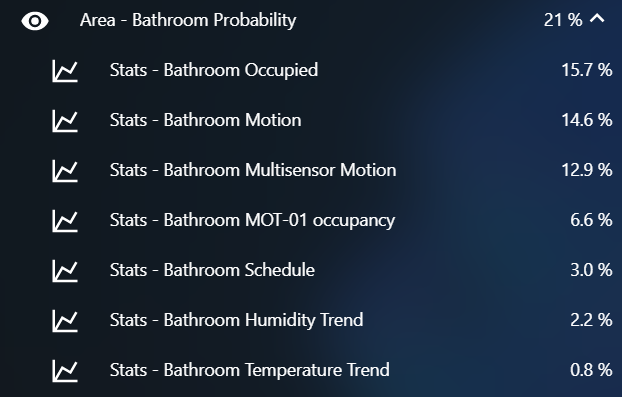

# Smart Home with Home Assistant

The ultimate goal, as with any smart home is to have something like J.A.R.V.I.S running your home, so you can focus on builidng the Iron Man suit, naturally. In lieu of a super intelligent near sentient AI, get as close as possible :)

I've written a lot here! Hopefully you find something useful, feel free to reach out if you want to chat

**Home Dashboard**

**Occupancy Dashboard**

**System Dashboard**


## Software

<a href="https://www.home-assistant.io/"></a>

It all starts and ends with Home Assistant, free, open-source home automation, this is the glue that holds it all together!

### Home Assistant Add-Ons (Docker Containers)

|||
|---|---|
|  | [MQTT Broker](https://www.home-assistant.io/docs/mqtt/broker#run-your-own) is THE way to collect realtime data from IoT devices, allows you to receive messages (little bits of data) and publish messages back, including commands to those devices in some cases. I've tried a lot of things, MQTT has been bulletproof. |
|  | [Room Assistant](https://www.room-assistant.io/) uses Bluetooth, Bluetooth Low Energy, Thermal Sensors, Motion and any other input to track room presence, this is key to getting accurate automations.|
|| More to list in future...|

<a href="https://unraid.net/"></a>

Man I love Unraid, it's a VM host, Docker host and manager, and first and foremost a NAS that doesn't need raid to keep your data safe!

### Unraid Servers and Docker Containers

|||
|---|---|
|    | [Frigate](https://blakeblackshear.github.io/frigate/) is a local Network Video Recorder (NVR) designed for HomeAssistant with AI object detection. Uses OpenCV and Tensorflow to perform realtime object detection locally for IP cameras. |
|    | [MariaDB](https://forums.unraid.net/topic/40737-support-linuxserverio-mariadb/) is a database! This is the target of the Home Assistant recorder and stores all the state changes for later analysis and is used for history and statistics sensors. |
|  | [Unraid API](https://github.com/ElectricBrainUK/UnraidAPI) is great little container that sends realtime stats about my Unraid server to MQTT (and therefore Home Assistant).|
|| More to list in future...|

---

## Presence Detection Principals

This is easily the most important part of any good smart home!

In a nutshell the most important questions to answer are

1. Is there someone in this area?
2. If there is, should the light (or whatever) be on?

The first is the most difficult to answer, in this instance, data is king (lots of sensors), but all that data is useless if it can't be applied in a simple way.

On my smart home journey I have made a few key realisations, first of all, what actually changes when someone enters a room?

- Does the TV get turned on when we go into the lounge?
- Does the humidity and temperature go up because the shower is on in the Bathroom?
- Is some music casted to a speaker or TV?
- Do I turn on my PC?
- Is my phone or smartwatch with me?

These all seem kinda obvious when laid out here, but as you work through your own own you find little things that are unique to how your family does things or your house is laid out or whatever. Figuring out what these are will make your setup much more intelligent.

Naturally there are then some more direct presence detection options

- Motion (PIR) Sensors
- BLE Beacons (from your phone or smartwatch)
- Cameras + AI Object Detection

Ideally you want a combination (I have all three of the above implemented)

Next, don't create a million automations from all of this mountain of sensor data, bring it together first, and simplify it.

- **Use Groups & Areas** - Group what you can, so if you have 2 temperature sensors in a room, group them, now you have one average temperature for that whole room.
- **Know where everything is, and what it's called** - I decided that incoming "raw" sensors and entities have something more like an asset tag e.g. MOT-01 (Motion Sensor 1). While anything that represents the area itself (like those temperatures we averaged) are named based on the area e.g. Area - Lounge Temperature
- **Create sensors** - Home Assistant's template sensors are great for this e.g. can I make an assumption based on data I already have from other sensors?

Okay so now we have a bunch of data about a particular Area. The next part is putting it to use. There is no perfect way for one sensor or method to know for sure that someone is in a room (without being invasive, you don't want a camera in the bathroom). So instead lets use the collection of data we have to check if we EXPECT someone to be there.

From our work above, we have set up the following 'area' sensors for the Lounge with a little description and how it is configured:

Area - Lounge Motion (a group with the result of multiple motion sensors):

```yaml
group:
  lounge_motion:
    name: Area - Lounge Motion
    entities:
      - binary_sensor.lounge_mot_02_occupancy # First zigbee motion (PIR) sensor
      - binary_sensor.lounge_mot_03_occupancy # Second zigbee motion (PIR) sensor
      - binary_sensor.lounge_person_motion # Result of camera object recognition
```

Area - Lounge Doors (my house's back door is double doors out of my lounge so there is a sensor on each door)

```yaml
group:
  lounge_doors:
    name: Area - Lounge Doors
    icon: mdi:door
    entities:
      - binary_sensor.lounge_dor_01_contact
      - binary_sensor.lounge_dor_02_contact
```

Area - Lounge Illuminance (a min_max sensor set up to provide an average):

```yaml
sensor:
  # Tip, the value type AND the unit_of_measurement must be exactly the same for all entities in a min_max sensor
  - platform: min_max
    name: Area - Lounge Illuminance
    type: mean # Use mean to find the average between the sensor values
    round_digits: 1 # Make sure the value is rounded so we don't end up with lots of decimal places
    entity_ids:
      - sensor.hall_lux_07_illuminance_lux # First zigbee illuminance sensor
      - sensor.lounge_lux_08_illuminance_lux # Second zigbee illuminance sensor
```

There are two other sensors that work the same as illuminance (averages):

- Area - Lounge Humidity
- Area - Lounge Temperature

I have these defined in my config even if there is only one sensor and nothing to average, this keeps the 'area' sensor definitions consistent.

## Presence by Probability

Okay so now we have a bunch of data, individual sensors (raw) data and grouped area sensors. So there is no perfect sensor, but there is a level of **probability** that something is happening.

This is where the magic of Bayesian sensors come in, they use Bayes thereom (clever maths) to determine the probability that something will happen based upon multiple observations (all our raw sensors and area groups).

Home Assistant has Bayesian Sensors built-in, we can define one like the below there are two elements, first defining the sensor itself, then giving the sensor some inputs and chances.

```yaml
binary_sensor:
  # Define the sensor
  - platform: bayesian
    name: Area - Bathroom Occupied
    prior: 0.1 # The 'prior' is the chance that this event happens
    device_class: occupancy
    probability_threshold: 0.7 # The threshold is the minimum probability that the sensor turns on
    observations:
      - platform: "state"
        entity_id: "binary_sensor.bathroom_humidity_trend"
        prob_given_true: 0.1 # What is the chance that the Bathroom is occupied if the humidity is high?
        prob_given_false: 0.002 # What is the chance that the Bathroom is occupied if the humidity is low?
        to_state: "on"
      - platform: "state"
        entity_id: "binary_sensor.bathroom_temperature_trend"
        prob_given_true: 0.03 # What is the chance that the Bathroom is occupied if the temperature is high?
        prob_given_false: 0.002 # What is the chance that the Bathroom is occupied if the temperature is low?
        to_state: "on"
      - platform: "state"
        entity_id: "binary_sensor.bathroom_motion"
        prob_given_true: 0.7 # What is the chance that the Bathroom is occupied if the motion sensor is on?
        prob_given_false: 0.05 # What is the chance that the Bathroom is occupied if the motion sensor is off?
        to_state: "on"
```

I've just put 3 sensors above to simplify the example, you can add as many inputs as you wish.

Now you are asking, **how on earth do I figure out what the chance is for each of those?**

There is the easy way (less accurate), and the hard way (but more accurate):

### The Easy Way

Guess! I bet if you have a good think, you will have an idea of how long someone is in a room in a day (this is your prior). So, for the Bathroom, I might spend 1 hour a day in there, have a shower, morning routine, evening routine etc. But so does my partner, so 2 hours a day, there is someone in the Bathroom. I will add a bit extra to be sure so 2.5 hours. 24 Hours / 2.5 Hours = 0.1 (10% chance). So my prior is 0.1!

For each of the sensors and probabilities you need to do this little thought experiment.

### The Hard Way

Measure it! There are many ways you can do this, use a stopwatch to time how long you are in a room? Might a bit impracticle...

The way I do it is using the History Statistics sensor to tell me! So here is an example of how to configure one:

```yaml
sensor:
  - platform: history_stats
    name: Stats - Bathroom Motion
    entity_id: binary_sensor.bathroom_motion
    state: "on"
    type: ratio # This outputs a percentage of how often this sensor has been on
    end: "{{ now() }}" # Up to right now
    duration:
      days: 7 # This will average over the last week to account for weekends
```

So now we have a number to work with, we can create one of these for each input we need to measure. I have then put these in a dashboard to see the outputs, giving me the info I need to configure my Bayesian sensors.



This is showing me how often a sensor actually is on, I can use this to then factor into how I configure my Bayesian sensors. (I actually built a spreadsheet to do this for me, when I get a burst of energy I'll link it here)

---

## Hardware

### Home Assistant Host

| Spec    | Description       |
| ------- | ----------------- |
| SBC     | ODROID N2+        |
| CPU     | Cortex-A73 2.4Ghz |
| Memory  | 4GB DDR4          |
| Storage | 120GB eMMC        |
| USB     | Bluetooth Adapter |

### Unraid Server

| Spec        | Description                   |
| ----------- | ----------------------------- |
| Motherboard | MSI MPG X570 Gaming Edge WiFi |
| CPU         | AMD Ryzen 7 3800X             |
| Memory      | 64GB Corsair Vengence LPX     |
| GPU         | Nvidia GTX 970                |
| Storage     | 4x 4TB WD RED                 |
| Cache       | 1TB Samsung NVME SSD          |

### Zigbee2MQTT Host

| Spec        | Description              |
| ----------- | ------------------------ |
| Motherboard | Raspberry Pi 4 Model B   |
| CPU         | Quad core Cortex-A72     |
| Memory      | 4GB                      |
| USB         | Electrolama ZZH CC2652R1 |

### Other Devices

| Spec                   | Description            |
| ---------------------- | ---------------------- |
| Room Assistant Beacons | 4x Raspberry Pi Zero W |

---

## Statistics

Below is a summary of the integrations, sensors and domains in use in my Home Assistant install

| Description | Qty |
| ----------- | --- |
| Entities    | 981 |
| Sensors     | 524 |

| Type            | Qty |
| --------------- | --- |
| Automations     | 16  |
| Binary Sensors  | 124 |
| Cameras         | 14  |
| Device Trackers | 8   |
| Groups          | 18  |
| Input Booleans  | 17  |
| Input Datetimes | 3   |
| Lights          | 23  |
| Media Players   | 26  |
| Scripts         | 3   |
| Sensors         | 524 |
| Sun             | 1   |
| Switches        | 133 |
| Weather         | 2   |
| Zones           | 24  |

## HACS installed components

### Integrations

- [Alexa Media Player](https://github.com/custom-components/alexa_media_player)
- [Climate Group](https://github.com/daenny/climate_group)
- [Entities Calendar](https://github.com/gadgetchnnel/entities_calendar)
- [Frigate](https://github.com/blakeblackshear/frigate-hass-integration)
- [HACS](https://github.com/hacs/integration)
- [Octopus Agile](https://github.com/markgdev/home-assistant_OctopusAgile)
- [Scheduler Component](https://github.com/nielsfaber/scheduler-component)
- [Tapo: Cameras Control](https://github.com/JurajNyiri/HomeAssistant-Tapo-Control)
- [Webrtc Camera](https://github.com/AlexxIT/WebRTC)

### Frontend

- [Auto Entities](https://github.com/thomasloven/lovelace-auto-entities)
- [Bar Card](https://github.com/custom-cards/bar-card)
- [Button Card](https://github.com/custom-cards/button-card)
- [Card Mod](https://github.com/thomasloven/lovelace-card-mod)
- [Card Tools](https://github.com/thomasloven/lovelace-card-tools)
- [Fold Entity Row](https://github.com/thomasloven/lovelace-fold-entity-row)
- [Frigate Card](https://github.com/dermotduffy/frigate-hass-card)
- [Kiosk Mode](https://github.com/maykar/kiosk-mode)
- [Layout Card](https://github.com/thomasloven/lovelace-layout-card)
- [Mini Graph Card](https://github.com/kalkih/mini-graph-card)
- [Mini Media Player](https://github.com/kalkih/mini-media-player)
- [Multiple Entity Row](https://github.com/benct/lovelace-multiple-entity-row)
- [Scheduler Card](https://github.com/nielsfaber/scheduler-card)
- [Secondaryinfo Entity Row](https://github.com/custom-cards/secondaryinfo-entity-row)
- [Slider Button Card](https://github.com/mattieha/slider-button-card)
- [Spotify Lovelace Card](https://github.com/custom-cards/spotify-card)
- [Uptime Card](https://github.com/dylandoamaral/uptime-card)
- [Vertical Stack In Card](https://github.com/ofekashery/vertical-stack-in-card)
