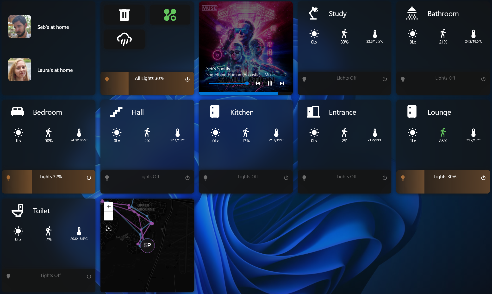
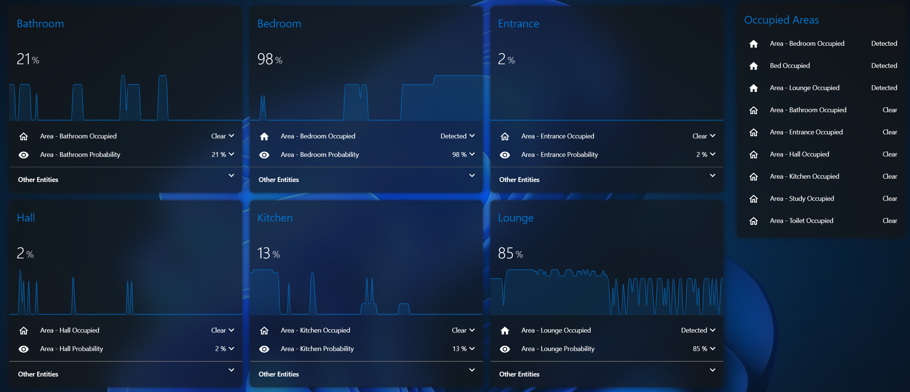
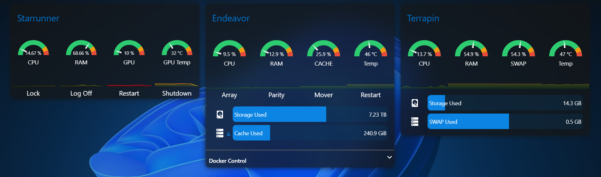

This file is a merged representation of the entire codebase, combining all repository files into a single document.
Generated by Repomix on: 2024-11-16T08:06:55.824Z

# File Summary

## Purpose
This file contains a packed representation of the entire repository's contents.
It is designed to be easily consumable by AI systems for analysis, code review,
or other automated processes.

## File Format
The content is organized as follows:
1. This summary section
2. Repository information
3. Repository structure
4. Multiple file entries, each consisting of:
  a. A header with the file path (## File: path/to/file)
  b. The full contents of the file in a code block

## Usage Guidelines
- This file should be treated as read-only. Any changes should be made to the
  original repository files, not this packed version.
- When processing this file, use the file path to distinguish
  between different files in the repository.
- Be aware that this file may contain sensitive information. Handle it with
  the same level of security as you would the original repository.

## Notes
- Some files may have been excluded based on .gitignore rules and Repomix's
  configuration.
- Binary files are not included in this packed representation. Please refer to
  the Repository Structure section for a complete list of file paths, including
  binary files.

## Additional Info

For more information about Repomix, visit: https://github.com/yamadashy/repomix

# Repository Structure
```
.HA_VERSION
automations.yaml
configuration.yaml
configuration/Areas/Area_Templates.yaml
configuration/Areas/Bathroom/configuration.yaml
configuration/Areas/Bedroom/configuration.yaml
configuration/Areas/Entrance/configuration.yaml
configuration/Areas/Front Drive/configuration.yaml
configuration/Areas/Garden/configuration.yaml
configuration/Areas/Hall/configuration.yaml
configuration/Areas/Home/configuration.yaml
configuration/Areas/Kitchen/configuration.yaml
configuration/Areas/Lounge/configuration.yaml
configuration/Areas/Outside/configuration.yaml
configuration/Areas/Shed/configuration.yaml
configuration/Areas/Stairs/configuration.yaml
configuration/Areas/Study/configuration.yaml
configuration/Areas/Toilet/configuration.yaml
configuration/Areas/Wardrobe/configuration.yaml
configuration/System/calendars.yaml
configuration/System/configuration.yaml
configuration/System/Experimental_Templates.yaml
configuration/System/rest_sensors.yaml
configuration/System/statistics.yaml
configuration/System/templates.yaml
go2rtc.yaml
python_scripts/export_entities.py
python_scripts/get_entities.py
python_scripts/ha_overview.py
README.md
scripts.yaml
templates/README.j2
themes/Home.yaml
ui-lovelace.yaml
```

# Repository Files

## File: .HA_VERSION
```
2024.11.1
```

## File: automations.yaml
```yaml
- id: d0cf70f1-cd8e-43ca-af88-d12a8a0ee241
  alias: Home - Bin Collection Reminder
  description: Sends a reminder message to mobiles one day before the bin collection
    day.
  trigger:
  - platform: time
    at: input_datetime.bin_reminder
  condition:
  - condition: state
    entity_id: input_boolean.home_automations
    state: 'on'
  action:
  - service: notify.mobiles
    data:
      message: 'There will be a {{ state_attr(''calendar.bin_collection_calendar'',
        ''message'') | lower }} tomorrow. Have you put them out?

        '
      data:
        ttl: 0
        priority: high
  mode: single
- id: c87f8826-584c-4459-ac6e-8d3615702dad
  alias: Lights
  description: ''
  trigger:
  - platform: state
    entity_id:
    - binary_sensor.bathroom_occupied
    - input_boolean.bathroom_automations
    - binary_sensor.upstairs_sleep_mode
    - binary_sensor.people_home
    from: 'off'
    to: 'on'
  - platform: state
    entity_id:
    - binary_sensor.bathroom_occupied
    - input_boolean.bathroom_automations
    - binary_sensor.upstairs_sleep_mode
    - binary_sensor.people_home
    from: 'on'
    to: 'off'
  condition:
  - condition: state
    entity_id: input_boolean.bathroom_automations
    state: 'on'
  action:
  - if:
    - condition: state
      entity_id: binary_sensor.bathroom_occupied
      state: 'on'
    - condition: state
      entity_id: binary_sensor.bathroom_bright
      state: 'off'
    - condition: state
      entity_id: binary_sensor.people_home
      state: 'on'
    then:
    - if:
      - condition: state
        entity_id: binary_sensor.upstairs_sleep_mode
        state: 'on'
      then:
      - if:
        - condition: time
          after: 06:00:00
        then:
        - data:
            transition: 2
            brightness_pct: 100
          target:
            area_id: bathroom
          action: light.turn_on
        else:
        - data:
            transition: 2
            brightness_pct: 10
          target:
            entity_id: light.bathroom
          action: light.turn_on
      else:
      - data:
          transition: 2
          brightness_pct: 100
        target:
          entity_id: light.bathroom
        action: light.turn_on
    else:
    - delay:
        hours: 0
        minutes: 2
        seconds: 0
        milliseconds: 0
    - if:
      - condition: state
        entity_id: binary_sensor.upstairs_sleep_mode
        state: 'on'
      then:
      - data:
          transition: 10
        target:
          entity_id: light.bathroom
        action: light.turn_off
      else:
      - data:
          transition: 10
          brightness_pct: 50
        target:
          entity_id: light.bathroom
        action: light.turn_on
      - delay:
          hours: 0
          minutes: 1
          seconds: 0
          milliseconds: 0
      - data:
          transition: 5
        target:
          entity_id: light.bathroom
        action: light.turn_off
  mode: restart
- id: bf065214-cd47-43f8-a537-d39686045b26
  alias: Bedroom - Lights
  description: ''
  trigger:
  - platform: state
    entity_id:
    - binary_sensor.bedroom_occupied
    id: Occupied
  - platform: state
    entity_id:
    - binary_sensor.bedroom_tv_state
    id: TV
  - platform: state
    entity_id:
    - binary_sensor.people_home
    id: PeopleHome
  - platform: state
    entity_id:
    - input_boolean.bedroom_sleep_mode
    id: SleepMode
  - platform: state
    entity_id:
    - input_boolean.bedroom_automations
    id: Automations
  - platform: state
    entity_id:
    - binary_sensor.bedroom_bright
    id: Bright
  condition:
  - condition: state
    entity_id: input_boolean.bedroom_automations
    state: 'on'
  action:
  - if:
    - condition: state
      entity_id: binary_sensor.bedroom_occupied
      state: 'on'
    - condition: state
      entity_id: binary_sensor.bedroom_bright
      state: 'off'
    - condition: state
      entity_id: binary_sensor.people_home
      state: 'on'
    - condition: state
      entity_id: input_boolean.bedroom_sleep_mode
      state: 'off'
    then:
    - if:
      - condition: state
        entity_id: binary_sensor.bedroom_tv_state
        state: 'on'
      then:
      - service: light.turn_on
        data:
          transition: 5
          brightness_pct: 10
          color_temp: 454
        target:
          entity_id: light.bedroom
      - service: light.turn_on
        data:
          transition: 5
          color_temp: 500
          brightness_pct: 10
        target:
          entity_id: light.bed_lights
      else:
      - if:
        - condition: template
          value_template: '{{ (((now() | as_timestamp) | int(0) / 60) | round(0, ''floor'')
            - ((states.binary_sensor.bedroom_tv_state.last_changed | as_timestamp(now()))
            | int(0) / 60) | round(0, ''floor'')) < 5 and is_state(''binary_sensor.bedroom_tv_state'',
            ''off'') }}'
        then:
        - service: light.turn_on
          data:
            transition: 20
            brightness_pct: 100
          target:
            entity_id: light.bedroom
        else:
        - service: light.turn_on
          data:
            transition: 3
            brightness_pct: 100
          target:
            entity_id: light.bedroom
        - service: light.turn_on
          data:
            transition: 3
            rgb_color:
            - 255
            - 255
            - 255
            brightness_pct: 70
          target:
            entity_id: light.bed_lights
    else:
    - if:
      - condition: state
        entity_id: binary_sensor.bedroom_bright
        state: 'off'
      then:
      - if:
        - condition: state
          entity_id: input_boolean.bedroom_sleep_mode
          state: 'on'
        then:
        - service: light.turn_off
          data:
            transition: 10
          target:
            entity_id: light.bedroom
        - service: light.turn_off
          data: {}
          target:
            entity_id: light.bed_lights
        else:
        - delay:
            minutes: 2
        - service: light.turn_on
          data:
            brightness_pct: 50
            transition: 10
          target:
            entity_id: light.bedroom
        - service: light.turn_on
          data:
            transition: 10
            color_temp: 500
            brightness_pct: 5
          target:
            entity_id: light.bed_lights
        - delay:
            minutes: 2
        - service: light.turn_off
          data:
            transition: 5
          target:
            entity_id: light.bedroom
        - service: light.turn_off
          data:
            transition: 5
          target:
            entity_id: light.bed_lights
  mode: restart
- id: d7b2ff77-0e4f-4efb-820f-9a4b67399a3b
  alias: Wardrobe - Lights
  description: ''
  trigger:
  - platform: state
    entity_id:
    - binary_sensor.wardrobe_motion
    from:
  - platform: state
    entity_id:
    - binary_sensor.people_home
  - platform: state
    entity_id:
    - input_boolean.bedroom_sleep_mode
  condition:
  - condition: state
    entity_id: input_boolean.bedroom_automations
    state: 'on'
  action:
  - if:
    - condition: state
      entity_id: binary_sensor.wardrobe_occupied
      state: 'on'
    - condition: state
      entity_id: binary_sensor.people_home
      state: 'on'
    then:
    - if:
      - condition: state
        entity_id: input_boolean.bedroom_sleep_mode
        state: 'on'
      then:
      - if:
        - condition: time
          after: 06:30:00
        then:
        - service: light.turn_on
          data:
            transition: 1
            brightness_pct: 50
            color_temp: 500
          target:
            entity_id: light.wardrobe
      else:
      - service: light.turn_on
        data:
          color_temp: 153
          brightness_pct: 100
        target:
          area_id: wardrobe
    else:
    - delay:
        hours: 0
        minutes: 0
        seconds: 5
        milliseconds: 0
    - service: light.turn_off
      data: {}
      target:
        entity_id: light.wardrobe
  mode: restart
- id: f26a8757-9178-4334-b2dc-07fda3f01c30
  alias: Entrance - Lights
  description: ''
  trigger:
  - platform: state
    entity_id:
    - binary_sensor.entrance_occupied
    - input_boolean.entrance_automations
    - binary_sensor.downstairs_sleep_mode
    - binary_sensor.people_home
    from: 'off'
    to: 'on'
  - platform: state
    entity_id:
    - binary_sensor.entrance_occupied
    - input_boolean.entrance_automations
    - binary_sensor.downstairs_sleep_mode
    - binary_sensor.people_home
    from: 'on'
    to: 'off'
  condition:
  - condition: state
    entity_id: input_boolean.entrance_automations
    state: 'on'
  action:
  - if:
    - condition: state
      entity_id: binary_sensor.entrance_occupied
      state: 'on'
    - condition: state
      entity_id: binary_sensor.entrance_bright
      state: 'off'
    - condition: state
      entity_id: binary_sensor.people_home
      state: 'on'
    - condition: state
      entity_id: binary_sensor.downstairs_sleep_mode
      state: 'off'
    then:
    - service: light.turn_on
      data:
        transition: 2
        brightness_pct: 100
      target:
        entity_id: light.entrance
    else:
    - delay:
        hours: 0
        minutes: 0
        seconds: 30
        milliseconds: 0
    - service: light.turn_off
      data:
        transition: 5
      target:
        entity_id: light.entrance
  mode: restart
- id: d0cccb19-ad9a-407e-9e5b-e5bb81f23cc9
  alias: Hall - Lights
  description: ''
  trigger:
  - platform: state
    entity_id:
    - binary_sensor.hall_occupied
    - binary_sensor.hall_motion
    - input_boolean.hall_automations
    - binary_sensor.upstairs_sleep_mode
    - binary_sensor.people_home
  condition:
  - condition: state
    entity_id: input_boolean.hall_automations
    state: 'on'
  action:
  - if:
    - condition: state
      entity_id: binary_sensor.hall_occupied
      state: 'on'
    - condition: state
      entity_id: binary_sensor.hall_bright
      state: 'off'
    - condition: state
      entity_id: binary_sensor.people_home
      state: 'on'
    then:
    - if:
      - condition: state
        entity_id: binary_sensor.upstairs_sleep_mode
        state: 'on'
      then:
      - service: light.turn_on
        data:
          transition: 2
          brightness_pct: 10
        target:
          entity_id: light.hall
      else:
      - service: light.turn_on
        data:
          transition: 2
          brightness_pct: 100
        target:
          entity_id: light.hall
    else:
    - if:
      - condition: state
        entity_id: binary_sensor.upstairs_sleep_mode
        state: 'on'
      then:
      - service: light.turn_off
        data:
          transition: 2
        target:
          entity_id: light.hall
      else:
      - delay:
          hours: 0
          minutes: 0
          seconds: 15
          milliseconds: 0
      - service: light.turn_off
        data:
          transition: 5
        target:
          entity_id: light.hall
  mode: restart
- id: 027c7b02-12e8-4d99-8154-05b903a2e8dc
  alias: Lounge - Lights
  description: ''
  trigger:
  - platform: state
    entity_id:
    - binary_sensor.lounge_occupied
    - input_boolean.lounge_automations
    - binary_sensor.people_home
    - binary_sensor.lounge_bright
    - binary_sensor.downstairs_sleep_mode
    - binary_sensor.lounge_tv_state
  condition:
  - condition: state
    entity_id: input_boolean.lounge_automations
    state: 'on'
  action:
  - if:
    - condition: state
      entity_id: binary_sensor.lounge_occupied
      state: 'on'
    - condition: state
      entity_id: binary_sensor.lounge_bright
      state: 'off'
    - condition: state
      entity_id: binary_sensor.people_home
      state: 'on'
    - condition: state
      entity_id: binary_sensor.downstairs_sleep_mode
      state: 'off'
    then:
    - if:
      - condition: state
        entity_id: binary_sensor.lounge_tv_state
        state: 'on'
      then:
      - service: light.turn_on
        data:
          transition: 10
          brightness_pct: 10
        target:
          entity_id: light.lounge
      else:
      - service: light.turn_on
        data:
          transition: 3
          brightness_pct: 100
        target:
          entity_id: light.lounge
    else:
    - if:
      - condition: state
        entity_id: binary_sensor.downstairs_sleep_mode
        state: 'on'
      then:
      - service: light.turn_off
        data:
          transition: 5
        target:
          entity_id: light.lounge
      else:
      - delay:
          hours: 0
          minutes: 1
          seconds: 0
          milliseconds: 0
      - service: light.turn_off
        data:
          transition: 5
        target:
          entity_id: light.lounge
  mode: restart
- id: 436d5a1c-3313-46f5-91af-c7964998b2a0
  alias: Study - Lights
  description: ''
  trigger:
  - platform: state
    entity_id:
    - binary_sensor.study_occupied
    - input_boolean.study_automations
    - input_boolean.study_sleep_mode
    - binary_sensor.people_home
    - binary_sensor.study_bright
  condition:
  - condition: state
    entity_id: input_boolean.study_automations
    state: 'on'
  action:
  - if:
    - condition: state
      entity_id: binary_sensor.study_occupied
      state: 'on'
    - condition: state
      entity_id: binary_sensor.study_bright
      state: 'off'
    - condition: state
      entity_id: binary_sensor.people_home
      state: 'on'
    - condition: state
      entity_id: input_boolean.study_sleep_mode
      state: 'off'
    then:
    - service: light.turn_on
      data:
        transition: 3
        brightness_pct: 100
      target:
        entity_id: light.study
    else:
    - if:
      - condition: state
        entity_id: input_boolean.study_sleep_mode
        state: 'on'
      then:
      - service: light.turn_off
        data:
          transition: 5
        target:
          entity_id: light.study
      else:
      - delay:
          hours: 0
          minutes: 0
          seconds: 30
          milliseconds: 0
      - service: light.turn_off
        data:
          transition: 5
        target:
          entity_id: light.study
  mode: restart
- id: '1638260394889'
  alias: System - Auto Snapshot and Backup
  description: ''
  trigger:
  - platform: time
    at: '12:00'
  condition:
  - condition: template
    value_template: '{{ now().strftime(''%A'') == "Wednesday" }}'
  action:
  - service: hassio.addon_start
    data:
      addon: 3490a758_remote_backup
  - service: notify.mobile_app_seb_phone
    data:
      title: Backup Successful!
      message: Home Assistant Backup Complete
  mode: single
- id: '1638536955468'
  alias: Bedroom - Sleep
  description: ''
  trigger:
  - platform: state
    entity_id: input_boolean.bedroom_sleep_mode
  condition: []
  action:
  - choose:
    - conditions:
      - condition: state
        entity_id: input_boolean.bedroom_sleep_mode
        state: 'on'
      sequence:
      - service: mass.play_media
        target:
          device_id: b2a0723816d8eb3013e90880816945e6
        data:
          media_type: track
          media_id: Rain Sounds
      - condition: not
        conditions:
        - condition: state
          entity_id: binary_sensor.bedroom_tv_state
          state: 'off'
      - service: media_player.turn_off
        data: {}
        target:
          device_id: d1aee826b1078df78bcf94d6b4087662
    default: []
  mode: single
- id: '1639919897579'
  alias: Garden - Lights
  description: ''
  trigger:
  - platform: state
    entity_id:
    - binary_sensor.garden_motion
    - sun.sun
  condition:
  - condition: state
    entity_id: input_boolean.outside_automations
    state: 'on'
  action:
  - if:
    - condition: state
      entity_id: sun.sun
      state: below_horizon
    - condition: state
      entity_id: binary_sensor.garden_motion
      state: 'on'
    then:
    - service: light.turn_on
      target:
        entity_id: light.garden
      data:
        brightness_pct: 100
        transition: 3
    else:
    - delay:
        seconds: 30
    - service: light.turn_off
      target:
        entity_id: light.garden
      data:
        transition: 5
  mode: restart
- id: '1639919894839'
  alias: Front Drive - Lights
  description: ''
  trigger:
  - platform: state
    entity_id:
    - binary_sensor.front_drive_motion
    - sun.sun
  condition:
  - condition: state
    entity_id: input_boolean.outside_automations
    state: 'on'
  action:
  - if:
    - condition: state
      entity_id: sun.sun
      state: below_horizon
    - condition: state
      entity_id: binary_sensor.front_drive_motion
      state: 'on'
    then:
    - service: light.turn_on
      target:
        entity_id: light.front_drive
      data:
        brightness_pct: 100
        transition: 3
    else:
    - delay:
        seconds: 30
    - service: light.turn_off
      target:
        entity_id: light.front_drive
      data:
        transition: 5
  mode: restart
- id: '1640022711823'
  alias: Cameras Privacy Mode
  description: ''
  trigger:
  - platform: state
    entity_id: input_boolean.cameras_privacy
  condition: []
  action:
  - choose:
    - conditions:
      - condition: state
        entity_id: input_boolean.cameras_privacy
        state: 'off'
      sequence:
      - service: switch.turn_on
        target:
          entity_id:
          - switch.entrance_privacy
          - switch.garden_privacy
          - switch.kitchen_privacy
          - switch.sofa_privacy
          - switch.hall_privacy
          - switch.lounge_privacy
        data: {}
    - conditions:
      - condition: state
        entity_id: input_boolean.cameras_privacy
        state: 'on'
      sequence:
      - service: switch.turn_off
        target:
          entity_id:
          - switch.entrance_privacy
          - switch.garden_privacy
          - switch.kitchen_privacy
          - switch.sofa_privacy
          - switch.hall_privacy
          - switch.lounge_privacy
        data: {}
    default: []
  mode: single
- id: '1644169913326'
  alias: Home - Bin Reminder Update
  description: ''
  trigger:
  - platform: state
    entity_id: calendar.bin_collection_calendar
  condition: []
  action:
  - service: input_datetime.set_datetime
    data:
      datetime: '{{ strptime(state_attr(''calendar.bin_collection_calendar'', ''start_time''),''%Y-%m-%d
        %H:%M:%S'') - timedelta( hours = 6 ) }}'
    target:
      entity_id: input_datetime.bin_reminder
  mode: single
- id: '1653422118985'
  alias: Bathroom - Shower
  description: ''
  trigger:
  - platform: numeric_state
    entity_id: sensor.bathroom_humidity_change
    above: '20'
  - platform: numeric_state
    entity_id: sensor.bathroom_humidity
    below: 70
  - platform: homeassistant
    event: start
  - platform: event
    event_type: automation_reloaded
  - platform: state
    entity_id:
    - binary_sensor.bathroom_humidity_falling_trend
  condition:
  - condition: state
    entity_id: input_boolean.bathroom_automations
    state: 'on'
  action:
  - if:
    - condition: numeric_state
      entity_id: sensor.bathroom_humidity_change
      above: '20'
    then:
    - service: fan.turn_on
      data: {}
      target:
        entity_id: fan.bathroom
    - service: input_boolean.turn_on
      data: {}
      target:
        entity_id: input_boolean.shower_occupied
    else: []
  - if:
    - condition: state
      entity_id: binary_sensor.bathroom_humidity_falling_trend
      state: 'on'
    then:
    - service: input_boolean.turn_off
      data: {}
      target:
        entity_id: input_boolean.shower_occupied
  - if:
    - condition: numeric_state
      entity_id: sensor.bathroom_humidity
      below: 75
    then:
    - service: fan.turn_off
      data: {}
      target:
        entity_id: fan.bathroom
  mode: restart
- id: '1655066044340'
  alias: Low Battery Warning
  description: ''
  use_blueprint:
    path: sbyx/low-battery-level-detection-notification-for-all-battery-sensors.yaml
    input:
      threshold: 10
      time: '12:00:00'
      exclude:
        entity_id: []
        device_id:
        - da47f4fa0127541729a0c62bc2326a46
        - c35c9387d9ffeaf1b895990142ebf628
        - 71ab4d3902bd04a49082d09d4b8a1d48
      actions:
      - device_id: c35c9387d9ffeaf1b895990142ebf628
        domain: mobile_app
        type: notify
        title: Low Sensor Battery
        message: 'The following devices have less than 10% battery: {{sensors}}'
- id: '1655145771065'
  alias: Kitchen - Lights
  description: ''
  trigger:
  - platform: state
    entity_id:
    - binary_sensor.kitchen_occupied
    - input_boolean.kitchen_automations
    - binary_sensor.downstairs_sleep_mode
    - binary_sensor.people_home
    - binary_sensor.kitchen_bright
    from: 'off'
    to: 'on'
  - platform: state
    entity_id:
    - binary_sensor.kitchen_occupied
    - input_boolean.kitchen_automations
    - binary_sensor.downstairs_sleep_mode
    - binary_sensor.people_home
    - binary_sensor.kitchen_bright
    from: 'on'
    to: 'off'
  condition:
  - condition: state
    entity_id: input_boolean.kitchen_automations
    state: 'on'
  action:
  - if:
    - condition: state
      entity_id: binary_sensor.kitchen_occupied
      state: 'on'
    - condition: state
      entity_id: binary_sensor.kitchen_bright
      state: 'off'
    - condition: state
      entity_id: binary_sensor.people_home
      state: 'on'
    - condition: state
      entity_id: binary_sensor.downstairs_sleep_mode
      state: 'off'
    then:
    - if:
      - condition: state
        entity_id: binary_sensor.lounge_tv_state
        state: 'on'
      then:
      - service: light.turn_on
        data:
          transition: 15
          brightness_pct: 100
        target:
          entity_id: light.kitchen
      else:
      - service: light.turn_on
        data:
          transition: 2
          brightness_pct: 100
        target:
          entity_id: light.kitchen
    else:
    - if:
      - condition: state
        entity_id: binary_sensor.downstairs_sleep_mode
        state: 'on'
      then:
      - service: light.turn_off
        data:
          transition: 10
        target:
          entity_id: light.kitchen
      - service: light.turn_off
        data: {}
        target:
          entity_id: light.kitchen_side_lights
      else:
      - delay:
          hours: 0
          minutes: 1
          seconds: 0
          milliseconds: 0
      - service: light.turn_off
        data:
          transition: 5
        target:
          entity_id: light.kitchen
  mode: restart
- id: '1657382946887'
  alias: Toilet - Lights
  description: ''
  trigger:
  - platform: state
    entity_id:
    - input_boolean.toilet_automations
    - binary_sensor.downstairs_sleep_mode
    - binary_sensor.people_home
    - binary_sensor.toilet_bright
    - binary_sensor.toilet_motion
    from: 'off'
    to: 'on'
  - platform: state
    entity_id:
    - input_boolean.toilet_automations
    - binary_sensor.downstairs_sleep_mode
    - binary_sensor.people_home
    - binary_sensor.toilet_bright
    - binary_sensor.toilet_motion
    from: 'on'
    to: 'off'
  - platform: state
    entity_id:
    - binary_sensor.toilet_door_contact
    from: 'off'
    to: 'on'
    alias: Door Opened
    id: door_opened
  condition:
  - condition: state
    entity_id: input_boolean.toilet_automations
    state: 'on'
  action:
  - if:
    - condition: state
      entity_id: binary_sensor.toilet_bright
      state: 'off'
    - condition: state
      entity_id: binary_sensor.people_home
      state: 'on'
    - condition: or
      conditions:
      - condition: trigger
        id: door_opened
      - condition: state
        entity_id: binary_sensor.toilet_occupied
        state: 'on'
    then:
    - if:
      - condition: state
        entity_id: binary_sensor.downstairs_sleep_mode
        state: 'on'
      then:
      - condition: or
        conditions:
        - condition: trigger
          id: door_opened
        - condition: state
          entity_id: binary_sensor.toilet_occupied
          state: 'on'
      - service: light.turn_on
        data:
          transition: 2
          brightness_pct: 50
        target:
          entity_id: light.toilet
      else:
      - condition: or
        conditions:
        - condition: trigger
          id: door_opened
        - condition: state
          entity_id: binary_sensor.toilet_occupied
          state: 'on'
      - service: light.turn_on
        data:
          transition: 2
          brightness_pct: 100
        target:
          entity_id: light.toilet
    else:
    - delay:
        hours: 0
        minutes: 0
        seconds: 20
        milliseconds: 0
    - if:
      - condition: state
        entity_id: binary_sensor.downstairs_sleep_mode
        state: 'on'
      then:
      - service: light.turn_off
        data:
          transition: 10
        target:
          entity_id: light.toilet
      else:
      - service: light.turn_on
        data:
          transition: 10
          brightness_pct: 50
        target:
          entity_id: light.toilet
      - delay:
          hours: 0
          minutes: 0
          seconds: 30
          milliseconds: 0
      - service: light.turn_off
        data:
          transition: 5
        target:
          entity_id: light.toilet
  mode: restart
- id: '1672522095610'
  alias: Rainbow strip led
  description: Rotating color every second
  trigger:
  - hours: '*'
    minutes: '*'
    platform: time_pattern
    seconds: /1
  condition: []
  action:
  - service: script.new_script
    data:
      entity: light.lounge
  mode: single
- id: '1675527344121'
  alias: Seb Medication Reminder
  description: ''
  use_blueprint:
    path: Aohzan/medication_reminder_android.yaml
    input:
      reminder_time: 08:30:00
      notify_device: c35c9387d9ffeaf1b895990142ebf628
      input_boolean: input_boolean.medication_seb
- id: '1678034605165'
  alias: Kitchen - Side Lights
  description: ''
  trigger:
  - platform: state
    entity_id:
    - binary_sensor.kitchen_hob
  - platform: state
    entity_id:
    - binary_sensor.kitchen_microwave
  - platform: state
    entity_id:
    - binary_sensor.kitchen_kettle
  - platform: state
    entity_id:
    - binary_sensor.kitchen_occupied
  - platform: state
    entity_id:
    - input_boolean.lounge_sleep_mode
  condition:
  - condition: state
    entity_id: input_boolean.kitchen_automations
    state: 'on'
  action:
  - if:
    - condition: and
      conditions:
      - condition: or
        conditions:
        - condition: state
          entity_id: binary_sensor.kitchen_kettle
          state: 'on'
        - condition: state
          entity_id: binary_sensor.kitchen_hob
          state: 'on'
        - condition: state
          entity_id: binary_sensor.kitchen_microwave
          state: 'on'
      - condition: state
        entity_id: input_boolean.lounge_sleep_mode
        state: 'off'
      - condition: state
        entity_id: binary_sensor.kitchen_occupied
        state: 'on'
    then:
    - type: turn_on
      device_id: ecdc17a6d9cd4f5610bb4079729f1665
      entity_id: switch.kitchen_side_lights
      domain: switch
    else:
    - if:
      - condition: state
        entity_id: binary_sensor.kitchen_occupied
        state: 'off'
      then:
      - delay:
          hours: 0
          minutes: 0
          seconds: 30
          milliseconds: 0
      - type: turn_off
        device_id: ecdc17a6d9cd4f5610bb4079729f1665
        entity_id: switch.kitchen_side_lights
        domain: switch
  mode: restart
- id: '1678039107813'
  alias: Lounge - Lamp
  description: ''
  trigger:
  - platform: state
    entity_id:
    - binary_sensor.lounge_occupied
  - platform: state
    entity_id:
    - binary_sensor.lounge_tv_state
  - platform: state
    entity_id:
    - input_boolean.lounge_sleep_mode
  condition: []
  action:
  - if:
    - condition: and
      conditions:
      - condition: state
        entity_id: binary_sensor.lounge_occupied
        state: 'on'
      - condition: state
        entity_id: binary_sensor.lounge_tv_state
        state: 'on'
      - condition: state
        entity_id: binary_sensor.lounge_bright
        state: 'off'
      - condition: state
        entity_id: input_boolean.lounge_sleep_mode
        state: 'off'
    then:
    - type: turn_on
      device_id: 7b4e6e1ed75f390c46d30ba08f02089e
      entity_id: light.lounge_lamp
      domain: light
    else:
    - if:
      - condition: state
        entity_id: input_boolean.lounge_sleep_mode
        state: 'on'
      then:
      - service: light.turn_off
        data:
          transition: 10
        target:
          entity_id: light.lounge_lamp
      else:
      - delay:
          hours: 0
          minutes: 2
          seconds: 0
          milliseconds: 0
      - service: light.turn_off
        data:
          transition: 10
        target:
          entity_id: light.lounge_lamp
  mode: single
- id: '1679849164244'
  alias: The Cube
  description: ''
  use_blueprint:
    path: SirGoodenough/Zigbee2MQTT-Aqara-Magic-Cube-T1-Pro-CTP-R01-Xiaomi-Lumi.yaml
    input:
      topic: zigbee2mqtt/The Cube
      action_rotate_cw_face_1:
      - service: script.cube_dimmer
        data:
          angle: '{{ trigger.payload_json.action_angle | float(0.0)}}'
          light: light.lounge
      action_rotate_ccw_face_1:
      - service: script.cube_dimmer
        data:
          angle: '{{ trigger.payload_json.action_angle | float(0.0)}}'
          light: light.lounge
- id: '1703428459589'
  alias: Offline Zigbee Sensors
  description: ''
  use_blueprint:
    path: Mr-Groch/offline-notification-for-sensors-with-last_seen.yaml
    input:
      actions:
      - device_id: c35c9387d9ffeaf1b895990142ebf628
        domain: mobile_app
        type: notify
        message: '{{sensors}} are offline'
        title: Some Zigbee Devices are offline!
- id: '1704029326852'
  alias: Zigbee2MQTT Update Notification
  description: ''
  use_blueprint:
    path: EPMatt/addon_update_notification.yaml
    input:
      addon: 45df7312_zigbee2mqtt
      addon_sensor_version: sensor.zigbee2mqtt_version
      addon_sensor_newest_version: sensor.zigbee2mqtt_newest_version
      addon_sensor_update_available: update.zigbee2mqtt_update
      mobile_notify_service: notify.mobile_app_seb_phone
      notification_title: '{{ addon_name }} update available'
      notification_message: Update available for {{ addon_name }} ({{ version }} ->
        {{ newest_version }})
      update_success_notification_title: '{{ addon_name }} update completed'
      addon_name: Zigbee2MQTT
- id: '1704029465898'
  alias: UniFi Update Notification
  description: ''
  use_blueprint:
    path: EPMatt/addon_update_notification.yaml
    input:
      addon: a0d7b954_unifi
      addon_sensor_version: sensor.unifi_network_application_version
      addon_sensor_newest_version: sensor.unifi_network_application_newest_version
      addon_sensor_update_available: binary_sensor.unifi_network_application_running
      mobile_notify_service: notify.mobile_app_seb_phone
      notification_title: '{{ addon_name }} update available'
      notification_message: Update available for {{ addon_name }} ({{ version }} ->
        {{ newest_version }})
      update_success_notification_title: '{{ addon_name }} update completed'
      addon_name: UniFi
- id: '1704146389662'
  alias: New Automation
  description: ''
  trigger: []
  condition: []
  action:
  - service: recorder.purge_entities
    data:
      entity_globs: device_tracker.00*
  mode: single
- id: '1711888149640'
  alias: Fridge Left Open
  description: ''
  use_blueprint:
    path: Raukze/contact-sensor-left-open-notification.yaml
    input:
      trigger_entity: binary_sensor.fridge_door_contact
      friendly_name: Fridge
      notify_services_string: notify.mobiles
      notification_click_url: /lovelace/
      repeat_notification: true
- id: '1715937768507'
  alias: 'ehmtxv2: extended show state with unit on 8x32 RGB-matrix'
  description: ''
  use_blueprint:
    path: ehmtxv2/EHMTX_extended_state.yaml
    input:
      ehmtx_device: 4a209b5dc3560c18036d11eafb767e45
      trigger_sensor:
      - sensor.smart_meter_electricity_power_watts
      use_friendly: false
      icon_text: true
      icon_name: lightbulb
- id: '1716581107924'
  alias: Battery Notes - Battery Replaced
  description: ''
  use_blueprint:
    path: andrew-codechimp/battery_notes_battery_replaced.yaml
- id: '1716581307760'
  alias: Battery Notes - Battery Threshold
  description: ''
  use_blueprint:
    path: andrew-codechimp/battery_notes_battery_threshold.yaml
    input:
      excluded_devices:
      - null
      on_low_actions:
      - device_id: c35c9387d9ffeaf1b895990142ebf628
        domain: mobile_app
        type: notify
        title: '{{ trigger.event.data.device_name }} Battery Low'
        message: The device has a battery level of {{                 trigger.event.data.battery_level
          }}% {{ '\n' -}} You need {{                 trigger.event.data.battery_quantity
          }}× {{                 trigger.event.data.battery_type }}
- id: '1720599510511'
  alias: Washing Machine Notifications & Actions
  description: ''
  use_blueprint:
    path: Blackshome/appliance-notifications.yaml
    input:
      power_sensor: sensor.washing_machine_current_power
      include_end_notify: enable_end_notify_options
      end_notify_device:
      - c35c9387d9ffeaf1b895990142ebf628
      - 5953adf758ef9e3b1b0c73585d762919
      end_message: Washing Machine is Done!
      include_power_tracking: enable_power_tracking_and_cost
      power_consumption_sensor: sensor.washing_machine_today_energy
      end_message_cost: Approx Cost £
      cost_per_kwh: sensor.octopus_energy_electricity_meter_current_rate
- id: '1720603764176'
  alias: Washing Machine
  description: ''
  trigger:
  - platform: state
    entity_id:
    - sensor.washing_machine_operation_state
    to: Finished
  condition: []
  action:
  - service: notify.mobiles
    data:
      message: Washing Machine is finished, time to hang stuff out!
      title: Washing Machine
  mode: single
- id: '1723383811662'
  alias: Python Script - Update ha_overview
  description: ''
  trigger:
  - event: start
    platform: homeassistant
  - platform: time_pattern
    minutes: /30
  action:
  - action: python_script.ha_overview
- id: '1723623794274'
  alias: Set Sleep Mode
  description: ''
  trigger:
  - platform: state
    entity_id:
    - binary_sensor.sleeping
    from: 'on'
    to: 'off'
    for:
      hours: 1
      minutes: 0
      seconds: 0
  condition:
  - condition: sun
    after: sunrise
    before: sunset
  action:
  - action: input_boolean.turn_off
    target:
      entity_id:
      - input_boolean.study_sleep_mode
      - input_boolean.lounge_sleep_mode
      - input_boolean.bedroom_sleep_mode
      - input_boolean.sleep_schedule
    data: {}
  - action: input_boolean.turn_on
    metadata: {}
    data: {}
    target:
      entity_id:
      - input_boolean.hall_automations
      - input_boolean.home_automations
      - input_boolean.study_automations
      - input_boolean.lounge_automations
      - input_boolean.toilet_automations
      - input_boolean.bedroom_automations
      - input_boolean.kitchen_automations
      - input_boolean.outside_automations
      - input_boolean.bathroom_automations
      - input_boolean.entrance_automations
  - action: media_player.media_stop
    metadata: {}
    data: {}
    target:
      entity_id: media_player.bedside_speaker
  mode: single
- id: '1723978228404'
  alias: Intelligent Study Fan Control
  description: Controls the study fan based on room occupancy and temperature, providing
    cooling when needed
  trigger:
  - platform: state
    entity_id: binary_sensor.study_occupied
  - platform: homeassistant
    event: start
  - platform: state
    entity_id: sensor.study_temperature
  - platform: state
    entity_id: climate.study
    attribute: temperature
  condition: []
  action:
  - choose:
    - conditions:
      - condition: or
        conditions:
        - condition: state
          entity_id: binary_sensor.study_occupied
          state: 'on'
        - condition: template
          value_template: '{{ trigger.entity_id in [''sensor.study_temperature'',
            ''climate.study'',''binary_sensor.study_occupied''] }}'
      sequence:
      - target:
          entity_id: input_select.study_fan_last_state
        data:
          option: '{{ states(''fan.study'') }}'
        action: input_select.select_option
      - choose:
        - conditions:
          - condition: template
            value_template: '{{ temp_difference > 0 }}'
          sequence:
          - target:
              entity_id: fan.study
            data:
              percentage: "\n  100\n\n  66\n\n  33\n\n"
            action: fan.turn_on
        - conditions:
          - condition: template
            value_template: '{{ temp_difference <= 0 }}'
          sequence:
          - target:
              entity_id: fan.study
            action: fan.turn_off
            data: {}
    - conditions:
      - condition: state
        entity_id: binary_sensor.study_occupied
        state: 'off'
      sequence:
      - target:
          entity_id: fan.study
        action: fan.turn_off
        data: {}
    default:
    - target:
        entity_id: fan.study
      data:
        percentage: '{{ states(''input_select.study_fan_last_state'') }}'
      action: fan.turn_on
  variables:
    current_temp: '{{ states(''sensor.study_temperature'') | float }}'
    target_temp: '{{ state_attr(''climate.study'', ''temperature'') | float }}'
    temp_difference: '{{ current_temp - target_temp }}'
  mode: single
```

## File: configuration.yaml
```yaml
default_config:
history:
wake_on_lan:
webhook:
my:

# o365:
#   client_secret: !secret o365_personal_secret
#   client_id: !secret o365_personal_client_id


homeassistant:
  packages: !include_dir_merge_named configuration/
  allowlist_external_dirs:
    - /config

automation: !include automations.yaml
script: !include scripts.yaml

frontend:
  extra_module_url:
    - /hacsfiles/lovelace-card-mod/card-mod.js
    - /hacsfiles/thermal_comfort_icons/thermal_comfort_icons.js
  themes: !include_dir_merge_named themes
```

## File: configuration/Areas/Area_Templates.yaml
```yaml
area_templates:
  template:
    binary_sensor:
      - unique_id: area_study
        name: "Area | Study"
        device_class: occupancy
        state: "{{states('binary_sensor.study_occupied')}}"
        attributes:
          Icon: mdi:desk-lamp
          Occupied Prob Value: "{{state_attr('binary_sensor.study_occupied','probability') | float(0.1)}}"
          Occupied Prob String: "{{ (state_attr('binary_sensor.study_occupied','probability')*100 | int(10)) | round(0) | string + '%'}}"
          Lux Value: "{{states('sensor.study_illuminance') | int(10)}}"
          Lux String: "{{ states('sensor.study_illuminance') | int(10) | string + 'lx'}}"
          Bright Value: "{{states('binary_sensor.study_bright') | default(true)}}"
          Bright String: "{{ (state_attr('binary_sensor.study_occupied','probability')*100 | int(0)) | round(0) | string + '%' }}"
          Temp Value: "{{states('sensor.study_temperature') | float(15.0) | round(1)}}"
          Temp String: "{{ states('sensor.study_temperature') | float(15.0) | round(1) | string + '℃'}}"
          Humidity Value: "{{states('sensor.study_humidity') | float(50.0) | round(0)}}"
          Humidity String: "{{ states('sensor.study_humidity') | float(50.0) | round(0) | string + '%'}}"
          Observed: >
            
            
              
                
                
              
            
            {{ ns.observed_entities }}
```

## File: configuration/Areas/Bathroom/configuration.yaml
```yaml
bathroom:
  # Binary Sensors
  #----------------------------------#
  binary_sensor:
    # Bayesian
    #----------------------------------#
    - platform: bayesian
      name: Bathroom Occupied
      prior: 0.11
      device_class: occupancy
      probability_threshold: 0.7
      observations:

        - platform: "state"
          entity_id: binary_sensor.bathroom_door_contact
          prob_given_true: 0.0056548
          prob_given_false: 0.0000373
          to_state: "off"

        - platform: "state"
          entity_id: binary_sensor.bathroom_motion
          prob_given_true: 0.3084673
          prob_given_false: 0.0014161
          to_state: "on"

        - platform: "state"
          entity_id: binary_sensor.bathroom_motion_1_occupancy
          prob_given_true: 0.2988542
          prob_given_false: 0.0013911
          to_state: "on"

        - platform: "state"
          entity_id: binary_sensor.bathroom_motion_2_occupancy
          prob_given_true: 0.2862158
          prob_given_false: 0.0013562
          to_state: "on"

        - platform: "state"
          entity_id: climate.bathroom_radiator
          prob_given_true: 0.0056548
          prob_given_false: 0.0000373
          to_state: "on"

        - platform: "state"
          entity_id: input_boolean.bathroom_schedule
          prob_given_true: 0.2792857
          prob_given_false: 0.0253888
          to_state: "on"

        - platform: "state"
          entity_id: input_boolean.shower_occupied
          prob_given_true: 0.3477679
          prob_given_false: 0.0015058
          to_state: "on"

    - platform: trend
      sensors:
        bathroom_humidity_falling_trend:
          friendly_name: Bathroom Humidity Falling Trend
          entity_id: sensor.bathroom_humidity_change
          sample_duration: 600
          max_samples: 10
          min_gradient: -0.033333333
          device_class: moisture

  # Variable Sensors
  #----------------------------------#

  sensor:

  # Template Sensors
  #----------------------------------#
  template:
    # Template Binary Sensors
    #----------------------------------#
    binary_sensor:
      # Bright Sensors
      #----------------------------------#
      - unique_id: bathroom_bright
        name: "Bathroom Bright"
        device_class: light
        state: |
          
          
          
          
          
          
            False
          
            True
          
            True
          
            {{ selfState }}
          
            False
          
            False
          


      # Humid Sensors
      #----------------------------------#
      - unique_id: bathroom_humid
        name: "Bathroom Humid"
        device_class: moisture
        state: "{{states('sensor.bathroom_humidity') | float(51.0) > (states('sensor.bathroom_average_humidity') | float(50.0) * 1.3)}}"

    # Template Variable Sensors
    #----------------------------------#
    sensor:
      # Probabilities
      #----------------------------------#
      - unique_id: bathroom_occupied_probability
        name: Bathroom Occupied Probability
        state_class: measurement
        unit_of_measurement: "%"
        state: "{{ (state_attr('binary_sensor.bathroom_occupied','probability')*100 | int(0) ) | round(0) }}"
  # Media Players
  #----------------------------------#
  media_player:

  # Notification Platforms
  #----------------------------------#
  notify:

  # Shell Commands
  #----------------------------------#
  shell_command:

  # Switches
  #----------------------------------#
  switch:

  # Cameras
  #----------------------------------#
  camera:
```

## File: configuration/Areas/Bedroom/configuration.yaml
```yaml
bedroom:
  # Binary Sensors
  #----------------------------------#
  binary_sensor:
    # Bayesian
    #----------------------------------#
    - platform: bayesian
      name: Bedroom Occupied
      prior: 0.11
      device_class: occupancy
      probability_threshold: 0.7
      observations:
        - platform: "state"
          entity_id: binary_sensor.bedroom_door_contact
          prob_given_true: 0.0851935
          prob_given_false: 0.0009761
          to_state: "off"

        - platform: "state"
          entity_id: binary_sensor.bedroom_motion
          prob_given_true: 0.2749345
          prob_given_false: 0.0012895
          to_state: "on"

        - platform: "state"
          entity_id: binary_sensor.bedroom_temperature_motion_lux_1_occupancy
          prob_given_true: 0.2685164
          prob_given_false: 0.0012705
          to_state: "on"

        - platform: "state"
          entity_id: binary_sensor.bedroom_tv_state
          prob_given_true: 0.3530833
          prob_given_false: 0.0014775
          to_state: "on"

        - platform: "state"
          entity_id: binary_sensor.bedroom_windows
          prob_given_true: 0.0594911
          prob_given_false: 0.0618896
          to_state: "off"

        - platform: "state"
          entity_id: media_player.bedroom_tv
          prob_given_true: 0.0414211
          prob_given_false: 0.0002568
          to_state: "playing"

    - platform: bayesian
      name: Bed Occupied
      prior: 0.42
      device_class: occupancy
      probability_threshold: 0.9
      observations:
        - platform: "state"
          entity_id: "binary_sensor.bedroom_motion"
          prob_given_true: 0.11
          prob_given_false: 0.0267
          to_state: "on"
        - platform: "state"
          entity_id: "input_boolean.sleep_schedule"
          prob_given_true: 0.93
          prob_given_false: 0.173
          to_state: "on"
        - platform: template
          value_template: >
            {{ is_state('binary_sensor.seb_sleeping', 'on') and is_state('person.sebastian_burrell','home') }}
          prob_given_true: 0.5940
          prob_given_false: 0.0891
        - platform: template
          value_template: >
            {{ is_state('binary_sensor.laura_sleeping', 'on') and is_state('person.laura_ward','home') }}
          prob_given_true: 0.9680
          prob_given_false: 0.1452
        - platform: "state"
          entity_id: "media_player.bedroom_echo"
          prob_given_true: 0.11
          prob_given_false: 0.0333
          to_state: "playing"
        - platform: "state"
          entity_id: "media_player.bedroom_tv"
          prob_given_true: 0.21
          prob_given_false: 0.0667
          to_state: "playing"

  # Variable Sensors
  #----------------------------------#
  sensor:
    - platform: statistics
      name: Bed Left Average Voltage
      entity_id: sensor.bedroom_bed_presence_left_voltage
      state_characteristic: average_linear
      max_age:
        days: 4
    - platform: statistics
      name: Bed Right Average Voltage
      entity_id: sensor.bedroom_bed_presence_right_voltage
      state_characteristic: average_linear
      max_age:
        days: 4
  # Template Sensors
  #----------------------------------#

  template:
    # Template Binary Sensors
    #----------------------------------#
    binary_sensor:
      # Bright Sensors
      #----------------------------------#
      - name: "Bedroom Bright"
        unique_id: bedroom_bright
        device_class: light
        state: >
          
          
          
          
          
          

          
          

          
            
          
            
          
            
          
            
          

          
          

          
          
            
            
            
            
            
          
            
          

          
            {{ true }}
          
            {{ false }}
          
            {{ lux > adjusted_threshold }}
          
            {{ states('binary_sensor.bedroom_bright') }}
          
        attributes:
          lux: "{{ states('sensor.bedroom_illuminance') }}"
          base_threshold: "{{ states('input_number.bedroom_illuminance_level') }}"
          adjusted_threshold: "{{ adjusted_threshold }}"
          sun_state: "{{ sun_state }}"
          minutes_to_sunset: "{{ minutes_to_sunset }}"
          minutes_to_sunrise: "{{ minutes_to_sunrise }}"
          lux_change_rate:
            "{{ lux_change_rate | round(3) }}"

            # Humid Sensors
            #----------------------------------#

    # Template Variable Sensors
    #----------------------------------#
    sensor:
      # Probabilities
      #----------------------------------#
      - unique_id: bedroom_occupied_probability
        name: Bedroom Occupied Probability
        state_class: measurement
        unit_of_measurement: "%"
        state: "{{ (state_attr('binary_sensor.bedroom_occupied','probability')*100 | int(0) ) | round(0) }}"

      - unique_id: bed_occupied_probability
        name: Bed Occupied Probability
        state_class: measurement
        unit_of_measurement: "%"
        state: "{{ (state_attr('binary_sensor.bed_occupied','probability')*100 | int(0) ) | round(0) }}"
      - name: "Bedroom Illuminance 5min Ago"
        unique_id: bedroom_illuminance_5min_ago
        unit_of_measurement: "lx"
        state: "{{ states('sensor.bedroom_illuminance') }}"
        attributes:
          lux_5min_ago: "{{ state_attr('sensor.bedroom_illuminance_5min_ago', 'lux_5min_ago') | default(states('sensor.bedroom_illuminance')) }}"

  # Media Players
  #----------------------------------#
  media_player:
    - platform: universal
      name: Bedroom TV
      browse_media_entity: media_player.bedroom_tv_shield_adb
      device_class: tv
      unique_id: bedroom_tv
      children:
        - media_player.bedroom_tv_shield_adb
        - media_player.bedroom_tv_shield
        - media_player.bedroom_tv_shield_cast
        - media_player.bedroom_tv_panasonic
      commands:
        turn_on:
          service: media_player.turn_on
          target:
            entity_id: media_player.bedroom_tv_shield_adb
        turn_off:
          service: media_player.media_stop
          target:
            entity_id: media_player.bedroom_tv_shield_adb
        volume_up:
          service: media_player.volume_up
          target:
            entity_id: media_player.bedroom_tv_shield_adb
        volume_down:
          service: media_player.volume_down
          target:
            entity_id: media_player.bedroom_tv_shield_adb
        volume_mute:
          service: media_player.volume_mute
          target:
            entity_id: media_player.bedroom_tv_shield_adb
        select_source:
          service: media_player.select_source
          target:
            entity_id: media_player.bedroom_tv_shield_adb
          data:
            source: "{{ source }}"
        volume_set:
          service: media_player.volume_set
          target:
            entity_id: media_player.bedroom_tv_shield_adb
          data:
            volume_level: "{{ volume_level }}"
      attributes:
        source: media_player.bedroom_tv_shield_adb|source
        source_list: media_player.bedroom_tv_shield_adb|source_list
        entity_picture: media_player.bedroom_tv_shield_adb|entity_picture
        media_album_name: media_player.bedroom_tv_shield_adb|media_album_name
        media_title: media_player.bedroom_tv_shield_adb|media_title
        media_duration: media_player.bedroom_tv_shield_adb|media_duration
        media_position: media_player.bedroom_tv_shield_adb|media_position
  # Notification Platforms
  #----------------------------------#
  notify:

  # Shell Commands
  #----------------------------------#
  shell_command:

  # Switches
  #----------------------------------#
  switch:
    # - platform: template
    #   switches:
    #     bedroom_tv_power:
    #       friendly_name: Bedroom TV Power
    #       value_template: >
    #         {{ iif( states("media_player.bedroom_tv") in ["playing","standby","idle","paused"], "on", "off") }}
    #       turn_on:
    #         service: media_player.turn_on
    #         target:
    #           entity_id: media_player.bedroom_tv
    #       turn_off:
    #         service: media_player.turn_off
    #         target:
    #           entity_id: media_player.bedroom_tv

  # Cameras
  #----------------------------------#
  camera:
```

## File: configuration/Areas/Entrance/configuration.yaml
```yaml
entrance:
  # Binary Sensors
  #----------------------------------#
  binary_sensor:
    # Bayesian
    #----------------------------------#
    - platform: bayesian
      name: Entrance Occupied
      prior: 0.09
      device_class: occupancy
      probability_threshold: 0.2
      observations:
        - platform: "state"
          entity_id: binary_sensor.entrance_motion
          prob_given_true: 0.2924643
          prob_given_false: 0.0011349
          to_state: "on"

        - platform: "state"
          entity_id: binary_sensor.entrance_motion_1_occupancy
          prob_given_true: 0.2924643
          prob_given_false: 0.0011349
          to_state: "on"

        - platform: "state"
          entity_id: binary_sensor.front_door_contact
          prob_given_true: 0.1527232
          prob_given_false: 0.0134844
          to_state: "on"

        - platform: "state"
          entity_id: binary_sensor.front_door_ding
          prob_given_true: 0.3561458
          prob_given_false: 0.0238955
          to_state: "on"

  # Variable Sensors
  #----------------------------------#
  sensor:
  # Template Sensors
  #----------------------------------#
  template:
    # Template Binary Sensors
    #----------------------------------#
    binary_sensor:
      # Bright Sensors
      #----------------------------------#
      - unique_id: entrance_bright
        name: "Entrance Bright"
        device_class: light
        state: |
          
          
          
          
          
          
            False
          
            True
          
            True
          
            {{ selfState }}
          
            False
          
            False
          

      # Humid Sensors
      #----------------------------------#

    # Template Variable Sensors
    #----------------------------------#
    sensor:
      # Probabilities
      #----------------------------------#
      - unique_id: entrance_occupied_probability
        name: Entrance Occupied Probability
        state_class: measurement
        unit_of_measurement: "%"
        state: "{{ (state_attr('binary_sensor.entrance_occupied','probability')*100 | int(0) ) | round(0) }}"

  # Media Players
  #----------------------------------#
  media_player:

  # Notification Platforms
  #----------------------------------#
  notify:

  # Shell Commands
  #----------------------------------#
  shell_command:

  # Switches
  #----------------------------------#
  switch:

  # Cameras
  #----------------------------------#
  camera:

  # Example configuration.yaml entry
  mqtt:
    sensor:
      - state_topic: "home/bedroom/temperature"
```

## File: configuration/Areas/Front Drive/configuration.yaml
```yaml
front_drive:
  # Thermostats
  #----------------------------------#
  climate:
  # Binary Sensors
  #----------------------------------#
  binary_sensor:
    - platform: bayesian
      name: Front Drive Occupied
      prior: 0.02
      device_class: occupancy
      probability_threshold: 0.7
      observations:

        - platform: "state"
          entity_id: binary_sensor.front_door_contact
          prob_given_true: 0.1527232
          prob_given_false: 0.0029303
          to_state: "off"

        - platform: "state"
          entity_id: binary_sensor.front_door_ding
          prob_given_true: 0.3561458
          prob_given_false: 0.0051928
          to_state: "on"

        - platform: "state"
          entity_id: binary_sensor.front_door_motion
          prob_given_true: 0.2561890
          prob_given_false: 0.0002271
          to_state: "on"

        - platform: "state"
          entity_id: binary_sensor.front_drive_motion
          prob_given_true: 0.4671964
          prob_given_false: 0.0002967
          to_state: "on"
    # Bayesian
    #----------------------------------#
    # Trends
    #----------------------------------#
    # Humidity
    #----------------------------------#
    # Temperature
    #----------------------------------#

  # Variable Sensors
  #----------------------------------#
  sensor:
  #   # Temperature Averages
  #   #----------------------------------#
  #   - platform: min_max
  #     name: Front Drive Temperature
  #     type: mean
  #     round_digits: 1
  #     entity_ids:
  #       - sensor.front_drive_mot_12_temperature
    # Humidity Averages
  #----------------------------------#
    # Illuminance Averages
    #----------------------------------#

  # Template Sensors
  #----------------------------------#
  template:
    # Template Binary Sensors
    #----------------------------------#
    binary_sensor:
      # Bright Sensors
      #----------------------------------#

      # Humid Sensors
      #----------------------------------#

    # Template Variable Sensors
    #----------------------------------#
    sensor:
      # Probabilities
      #----------------------------------#

  # Media Players
  #----------------------------------#
  media_player:

  # Notification Platforms
  #----------------------------------#
  notify:

  # Shell Commands
  #----------------------------------#
  shell_command:

  # Switches
  #----------------------------------#
  switch:
```

## File: configuration/Areas/Garden/configuration.yaml
```yaml
garden:
  # Binary Sensors
  #----------------------------------#
  binary_sensor:
    - platform: bayesian
      name: Garden Occupied
      prior: 0.07
      device_class: occupancy
      probability_threshold: 0.7
      observations:

        - platform: "state"
          entity_id: binary_sensor.garden_motion
          prob_given_true: 0.3879167
          prob_given_false: 0.0009878
          to_state: "on"
  # Variable Sensors
  #----------------------------------#
  sensor:
  # Template
  template:
  # Binary Sensors
    binary_sensor:

  # Sensors
    sensor:
      - unique_id: garden_occupied_probability
        name: Garden Occupied Probability
        state_class: measurement
        unit_of_measurement: "%"
        state: "{{ (state_attr('binary_sensor.garden_occupied','probability')*100 | int(0) ) | round(0) }}"
  # Thermostats
  #----------------------------------#
  climate:

  # Media Players
  #----------------------------------#
  media_player:

  # Notification Platforms
  #----------------------------------#
  notify:

  # Shell Commands
  #----------------------------------#
  shell_command:

  # Switches
  #----------------------------------#
  switch:
```

## File: configuration/Areas/Hall/configuration.yaml
```yaml
hall:
  # Binary Sensors
  #----------------------------------#
  binary_sensor:
    # Bayesian
    #----------------------------------#
    - platform: bayesian
      name: Hall Occupied
      prior: 0.12
      device_class: occupancy
      probability_threshold: 0.2
      observations:

        - platform: "state"
          entity_id: binary_sensor.hall_bright
          prob_given_true: 0.0348452
          prob_given_false: 0.0401773
          to_state: "on"

        - platform: "state"
          entity_id: binary_sensor.hall_motion
          prob_given_true: 0.2832188
          prob_given_false: 0.0014183
          to_state: "on"

        - platform: "state"
          entity_id: binary_sensor.hall_motion_1
          prob_given_true: 0.2816637
          prob_given_false: 0.0014135
          to_state: "on"

        - platform: "state"
          entity_id: binary_sensor.hall_motion_2
          prob_given_true: 0.3026146
          prob_given_false: 0.0014744
          to_state: "on"

        - platform: "state"
          entity_id: binary_sensor.hall_temperature_motion_lux_1_motion
          prob_given_true: 0.2889866
          prob_given_false: 0.0014355
          to_state: "on"

        - platform: "state"
          entity_id: binary_sensor.stairs_motion
          prob_given_true: 0.2706369
          prob_given_false: 0.0013790
          to_state: "on"


  # Variable Sensors
  #----------------------------------#
  sensor:

  # Template Sensors
  #----------------------------------#
  template:
    # Template Binary Sensors
    #----------------------------------#
    binary_sensor:
      # Bright Sensors
      #----------------------------------#
      - unique_id: hall_bright
        name: "Hall Bright"
        device_class: light
        state: |
          
          
          
          
          
          
            False
          
            True
          
            True
          
            {{ selfState }}
          
            False
          
            False
          
      - unique_id: hall_multi_motion
        name: "Hall Multi Motion"
        device_class: motion
        state: >
          
          {{ iif( x | count >= 2, 'on', 'off') }}

      # Humid Sensors
      #----------------------------------#

    # Template Variable Sensors
    #----------------------------------#
    sensor:
      # Probabilities
      #----------------------------------#
      - unique_id: hall_occupied_probability
        name: Hall Occupied Probability
        unit_of_measurement: "%"
        state: "{{ (state_attr('binary_sensor.hall_occupied','probability')*100 | int(0) ) | round(0) }}"

  # Media Players
  #----------------------------------#
  media_player:

  # Notification Platforms
  #----------------------------------#
  notify:

  # Shell Commands
  #----------------------------------#
  shell_command:
    hall_camera_turn_off: !secret hallcam_turn_off
    hall_camera_turn_on: !secret hallcam_turn_on
    hall_camera_bedroom: !secret hallcam_bedroom
    hall_camera_study: !secret hallcam_study
    hall_camera_landing: !secret hallcam_landing
    hall_camera_stairs: !secret hallcam_stairs

  # Switches
  #----------------------------------#
  switch:

  command_line:
    - switch:
        unique_id: hall_camera_ir
        name: Hall Camera Night Mode
        command_on: !secret hallcam_ir_on
        command_off: !secret hallcam_ir_off
        command_state: !secret hallcam_ir_state
        value_template: '{{ value == "1" }}'
    - switch:
        unique_id: hall_camera_motion
        name: Hall Camera Motion Detection
        command_on: !secret hallcam_motion_on
        command_off: !secret hallcam_motion_off
        command_state: !secret hallcam_motion_state
        value_template: '{{ value == "1" }}'
  # Cameras
  #----------------------------------#
  camera:
```

## File: configuration/Areas/Home/configuration.yaml
```yaml
home:
  # Binary Sensors
  #----------------------------------#
  binary_sensor:
    - platform: bayesian
      name: Home Occupied
      prior: 0.52
      device_class: occupancy
      probability_threshold: 0.7
      observations:
        - platform: "state"
          entity_id: binary_sensor.home_motion
          prob_given_true: 0.6031935
          prob_given_false: 0.0135159
          to_state: "on"
    # Bayesian
    #----------------------------------#
    # Trends
    #----------------------------------#
    # Humidity
    #----------------------------------#
    # Temperature
    #----------------------------------#

  # Variable Sensors
  #----------------------------------#
  sensor:
    # Weather
    #----------------------------------#
    # - platform: season

    # Energy
    #----------------------------------#
    - platform: rest
      name: Gas Total Usage
      device_class: energy
      unit_of_measurement: "kWh"
      json_attributes_path: "$.results[0]"
      json_attributes:
        - interval_start
        - interval_end
      value_template: "{{value_json.results[0].consumption}}"
      resource: !secret octopus_gas

    - platform: rest
      name: Electricity Total Usage
      device_class: energy
      unit_of_measurement: "kWh"
      json_attributes_path: "$.results[0]"
      json_attributes:
        - interval_start
        - interval_end
      value_template: "{{value_json.results[0].consumption}}"
      resource: !secret octopus_electricity

    - platform: rest
      name: Electricity Unit Cost
      device_class: monetary
      unit_of_measurement: "£/kWh"
      json_attributes_path: "$.results[0]"
      json_attributes:
        - value_exc_vat
        - value_inc_vat
        - valid_from
        - valid_to
      value_template: "{{value_json.results[0].value_inc_vat / 100}}"
      resource: !secret octopus_variable_electricity_tariff

    - platform: rest
      name: Gas Unit Cost
      device_class: monetary
      unit_of_measurement: "£/kWh"
      json_attributes_path: "$.results[0]"
      json_attributes:
        - value_exc_vat
        - value_inc_vat
        - valid_from
        - valid_to
      value_template: "{{value_json.results[0].value_inc_vat / 100}}"
      resource: !secret octopus_variable_gas_tariff

  # Template Sensors
  #----------------------------------#
  template:
    # Template Binary Sensors
    #----------------------------------#
    binary_sensor:
      # Bright Sensors
      #----------------------------------#
      # Presence
      #----------------------------------#
      - unique_id: people_home
        name: "People Home"
        icon: "mdi:home"
        device_class: presence
        state: "{{ is_state_attr('sensor.laura_location', 'Location', 'Home') or is_state_attr('sensor.seb_location', 'Location', 'Home') or is_state('device_tracker.laura_phone_wifi', 'Home') or is_state('device_tracker.seb_phone_wifi', 'Home') or is_state('input_boolean.guest_mode', 'on') }}"
    # Template Variable Sensors
    #----------------------------------#
    sensor:
      # Probabilities
      #----------------------------------#
      # Energy
      #----------------------------------#
      # - unique_id: energy_total_usage
      #   name: Energy Total Usage
      #   device_class: energy
      #   unit_of_measurement: "kWh"
      #   state_class: measurement
      #   state: "{{ (states('sensor.electricity_total_usage') | float(0) + states('sensor.gas_total_usage') | float(0)) | round(2) }}"
      #   attributes:
      #     interval_start: "{{ as_timestamp(state_attr('sensor.electricity_total_usage', 'interval_start')) | timestamp_local }}"
      #     interval_end: "{{ as_timestamp(state_attr('sensor.electricity_total_usage', 'interval_end')) | timestamp_local }}"

      # # Bin Collection
      # #----------------------------------#
      # - unique_id: bin_collection
      #   name: Bin Collection
      #   icon: mdi:trash-can
      #   state: >
      #     
      #     {{ "The " }}
      #     
      #       
      #         
      #           {{map[type]}}
      #         
      #           {{ ", and " }}{{map[type]}}
      #         
      #           {{ ", " }}{{map[type]}}
      #         
      #       
      #         {{map[type]}}
      #       
      #     
      #       {{strptime(state_attr('sensor.bin_collection_data', 'date'),"%Y-%m-%dT%H:%M:%SZ").strftime(" bin will be collected on %A, %b %d")}}
      #   attributes:
      #     Date: "{{ strptime(state_attr('sensor.bin_collection_data', 'date'),'%Y-%m-%dT%H:%M:%SZ').strftime('%d/%m/%Y') }}"
      #     Day: "{{ strptime(state_attr('sensor.bin_collection_data', 'date'),'%Y-%m-%dT%H:%M:%SZ').strftime('%A') }}"
      #     Types: >
      #       
      #       
      #         
      #           
      #             {{map[type]}}
      #           
      #             {{ ", and " }}{{map[type]}}
      #           
      #             {{ ", " }}{{map[type]}}
      #           
      #         
      #           {{map[type]}}
      #         
      #       
      #     Delayed: "YesNo"
      #     Black: "YesNo"
      #     Blue: "YesNo"
      #     Green: "YesNo"
      #     Timestamp: "{{ as_timestamp(strptime(state_attr('sensor.bin_collection_data', 'date'),'%Y-%m-%dT%H:%M:%SZ')) }}"
      #     Reminder: >
      #       
      #       {{ "The " }}
      #         
      #           
      #             
      #               {{map[type]}}
      #             
      #               {{ " and " }}{{map[type]}}
      #             
      #               {{ ", " }}{{map[type]}}
      #             
      #           
      #             {{map[type]}}
      #           
      #         
      #         {{" bin will be collected tomorrow, make sure they are out!"}}
  # Media Players
  #----------------------------------#
  media_player:

  # Notification Platforms
  #----------------------------------#
  notify:

  # Shell Commands
  #----------------------------------#
  shell_command:

  # Switches
  #----------------------------------#
  switch:

  # Cameras
  #----------------------------------#
  camera:

  # Utility Meters
  #----------------------------------#
  utility_meter:
    # electricity_meter:
    #   source: sensor.electricity_total_usage
    #   cycle: hourly
    # gas_meter:
    #   source: sensor.gas_total_usage
    #   cycle: hourly
```

## File: configuration/Areas/Kitchen/configuration.yaml
```yaml
kitchen:
  # Binary Sensors
  #----------------------------------#
  binary_sensor:
    # Bayesian
    #----------------------------------#
    - platform: bayesian
      name: Kitchen Occupied
      prior: 0.14
      device_class: occupancy
      probability_threshold: 0.7
      observations:

        - platform: "state"
          entity_id: binary_sensor.kitchen_bright
          prob_given_true: 0.0406518
          prob_given_false: 0.0558803
          to_state: "on"

        - platform: "state"
          entity_id: binary_sensor.kitchen_hob
          prob_given_true: 0.4288289
          prob_given_false: 0.0020524
          to_state: "on"

        - platform: "state"
          entity_id: binary_sensor.kitchen_kettle
          prob_given_true: 0.2684033
          prob_given_false: 0.0016454
          to_state: "on"

        - platform: "state"
          entity_id: binary_sensor.kitchen_microwave
          prob_given_true: 0.2625506
          prob_given_false: 0.0016224
          to_state: "on"

        - platform: "state"
          entity_id: binary_sensor.kitchen_motion
          prob_given_true: 0.3301250
          prob_given_false: 0.0018530
          to_state: "on"

        - platform: "state"
          entity_id: binary_sensor.kitchen_motion_1_occupancy
          prob_given_true: 0.3321890
          prob_given_false: 0.0018589
          to_state: "on"

        - platform: "state"
          entity_id: binary_sensor.kitchen_oven
          prob_given_true: 0.2781860
          prob_given_false: 0.0016825
          to_state: "on"

        - platform: "state"
          entity_id: binary_sensor.kitchen_temperature_motion_lux_1_occupancy
          prob_given_true: 0.3264211
          prob_given_false: 0.0018424
          to_state: "on"

    - platform: trend
      sensors:
        kitchen_temperature_rising_trend:
          friendly_name: Kitchen Temperature Rising Trend
          entity_id: sensor.kitchen_temperature
          sample_duration: 600
          max_samples: 10
          min_gradient: 0.016667
          device_class: heat
  # Variable Sensors
  #----------------------------------#
  sensor:
    - platform: statistics
      name: "Kitchen Average Temperature"
      entity_id: sensor.kitchen_temperature
      unique_id: kitchen_average_temperature
      state_characteristic: mean
      max_age:
        days: 7

  # Template Sensors
  #----------------------------------#
  template:
    # Template Binary Sensors
    #----------------------------------#
    binary_sensor:
      # Bright Sensors
      #----------------------------------#
      - unique_id: kitchen_bright
        name: "Kitchen Bright"
        device_class: light
        state: |
          
          
          
          
          
          
            False
          
            True
          
            True
          
            {{ selfState }}
          
            False
          
            False
          

      # Humid Sensors
      #----------------------------------#

    # Template Variable Sensors
    #----------------------------------#
    sensor:
      # Probabilities
      #----------------------------------#
      - unique_id: kitchen_occupied_probability
        name: Kitchen Occupied Probability
        state_class: measurement
        unit_of_measurement: "%"
        state: "{{ (state_attr('binary_sensor.kitchen_occupied','probability')*100 | int(0) ) | round(0) }}"

  # Media Players
  #----------------------------------#
  media_player:

  # Notification Platforms
  #----------------------------------#
  notify:

  # Shell Commands
  #----------------------------------#
  shell_command:

  # Switches
  #----------------------------------#
  switch:
```

## File: configuration/Areas/Lounge/configuration.yaml
```yaml
lounge:
  # Binary Sensors
  #----------------------------------#
  binary_sensor:
    # Bayesian
    #----------------------------------#
    - platform: bayesian
      name: Lounge Occupied
      prior: 0.40
      device_class: occupancy
      probability_threshold: 0.7
      observations:

        - platform: "state"
          entity_id: binary_sensor.back_door_left_contact
          prob_given_true: 0.0028274
          prob_given_false: 0.0000972
          to_state: "on"

        - platform: "state"
          entity_id: binary_sensor.back_door_right_contact
          prob_given_true: 0.1951905
          prob_given_false: 0.1543939
          to_state: "on"

        - platform: "state"
          entity_id: binary_sensor.lounge_bright
          prob_given_true: 0.0474970
          prob_given_false: 0.2667856
          to_state: "on"

        - platform: "state"
          entity_id: binary_sensor.lounge_doors
          prob_given_true: 0.1964286
          prob_given_false: 0.1551342
          to_state: "on"

        - platform: "state"
          entity_id: binary_sensor.lounge_person_occupancy
          prob_given_true: 0.05
          prob_given_false: 0.0085813
          to_state: "on"

        - platform: "state"
          entity_id: binary_sensor.lounge_motion
          prob_given_true: 0.3738080
          prob_given_false: 0.0080722
          to_state: "on"

        - platform: "state"
          entity_id: binary_sensor.lounge_motion_1_occupancy
          prob_given_true: 0.3721682
          prob_given_false: 0.0080578
          to_state: "on"

        - platform: "state"
          entity_id: binary_sensor.lounge_temperature_motion_lux_1_occupancy
          prob_given_true: 0.2849435
          prob_given_false: 0.0070264
          to_state: "on"

        - platform: "state"
          entity_id: binary_sensor.lounge_tv_state
          prob_given_true: 0.3392574
          prob_given_false: 0.0077303
          to_state: "on"

        - platform: "state"
          entity_id: input_boolean.lounge_schedule
          prob_given_true: 0.1172500
          prob_given_false: 0.2712675
          to_state: "on"

        - platform: "state"
          entity_id: media_player.lounge_tv
          prob_given_true: 0.0661607
          prob_given_false: 0.0021306
          to_state: "playing"

  # Variable Sensors
  #----------------------------------#
  sensor:
  # Template Sensors
  #----------------------------------#
  template:
    # Template Binary Sensors
    #----------------------------------#
    binary_sensor:
      # Bright Sensors
      #----------------------------------#
      - unique_id: lounge_bright
        name: "Lounge Bright"
        device_class: light
        state: |
          
          
          
          
          
          
            False
          
            True
          
            True
          
            {{ selfState }}
          
            False
          
            False
          

    # Template Variable Sensors
    #----------------------------------#
    sensor:
      # Probabilities
      #----------------------------------#
      - unique_id: lounge_occupied_probability
        name: Lounge Occupied Probability
        state_class: measurement
        unit_of_measurement: "%"
        state: "{{ (state_attr('binary_sensor.lounge_occupied','probability')*100 | int(0) ) | round(0) }}"

  # Media Players
  #----------------------------------#
  media_player:
    - platform: wiim_custom
      host: 192.168.1.250
      name: Lounge Speakers Wiim
      uuid: 'FF98F09CAA6BA405CDE17CF2'

    - platform: universal
      name: Lounge Speakers
      browse_media_entity: media_player.lounge_speakers_wiim
      device_class: speaker
      unique_id: lounge_speakers
      children:
        - media_player.lounge_speakers_wiim
        - media_player.lounge_speakers_cast
        - media_player.lounge_speakers_alexa
        - media_player.lounge_speakers_dlna
        - media_player.lounge_speakers_ma
      commands:
        turn_on:
          service: media_player.turn_on
          target:
            entity_id: media_player.lounge_speakers_cast
        turn_off:
          service: media_player.media_stop
          target:
            entity_id: media_player.lounge_speakers_wiim
        volume_up:
          service: media_player.volume_up
          target:
            entity_id: media_player.lounge_speakers_wiim
        volume_down:
          service: media_player.volume_down
          target:
            entity_id: media_player.lounge_speakers_wiim
        volume_mute:
          service: media_player.volume_mute
          target:
            entity_id: media_player.lounge_speakers_wiim
        select_source:
          service: media_player.select_source
          target:
            entity_id: media_player.lounge_speakers_wiim
          data:
            source: "{{ source }}"
        volume_set:
          service: media_player.volume_set
          target:
            entity_id: media_player.lounge_speakers_wiim
          data:
            volume_level: "{{ volume_level }}"
      attributes:
        source: media_player.lounge_speakers_wiim|source
        source_list: media_player.lounge_speakers_wiim|source_list
        entity_picture: media_player.lounge_speakers_wiim|entity_picture
        media_album_name: media_player.lounge_speakers_wiim|media_album_name
        media_title: media_player.lounge_speakers_wiim|media_title
        media_duration: media_player.lounge_speakers_wiim|media_duration
        media_position: media_player.lounge_speakers_wiim|media_position

    - platform: universal
      name: Lounge TV
      browse_media_entity: media_player.lounge_tv_shield
      device_class: tv
      unique_id: lounge_tv
      children:
        - media_player.lounge_tv_adb
        - media_player.lounge_tv_cast
        - media_player.lounge_tv_dlna
        - media_player.lounge_tv_shield
        - media_player.lounge_tv_shield_cast
        - media_player.lounge_tv_sony
      commands:
        turn_on:
          service: media_player.turn_on
          target:
            entity_id: media_player.lounge_tv_shield
        turn_off:
          service: media_player.media_stop
          target:
            entity_id: media_player.lounge_tv_shield
        volume_up:
          service: media_player.volume_up
          target:
            entity_id: media_player.lounge_tv_shield
        volume_down:
          service: media_player.volume_down
          target:
            entity_id: media_player.lounge_tv_shield
        volume_mute:
          service: media_player.volume_mute
          target:
            entity_id: media_player.lounge_tv_shield
        select_source:
          service: media_player.select_source
          target:
            entity_id: media_player.lounge_tv_shield
          data:
            source: "{{ source }}"
        volume_set:
          service: media_player.volume_set
          target:
            entity_id: media_player.lounge_tv_shield
          data:
            volume_level: "{{ volume_level }}"
      attributes:
        source: media_player.lounge_tv_shield|source
        source_list: media_player.lounge_tv_shield|source_list
        entity_picture: media_player.lounge_tv_shield|entity_picture
        media_album_name: media_player.lounge_tv_shield|media_album_name
        media_title: media_player.lounge_tv_shield|media_title
        media_duration: media_player.lounge_tv_shield|media_duration
        media_position: media_player.lounge_tv_shield|media_position
  # Notification Platforms
  #----------------------------------#
  notify:

  # Shell Commands
  #----------------------------------#
  shell_command:
    lounge_camera_turn_off: !secret loungecam_turn_off
    lounge_camera_turn_on: !secret loungecam_turn_on
    lounge_camera_floor: !secret loungecam_floor

  # Switches
  #----------------------------------#
  switch:

  command_line:
    - switch:
        unique_id: lounge_camera_ir
        name: Lounge Camera Night Mode
        command_on: !secret loungecam_ir_on
        command_off: !secret loungecam_ir_off
        command_state: !secret loungecam_ir_state
        value_template: '{{ value == "1" }}'
    - switch:
        unique_id: lounge_camera_motion
        name: Lounge Camera Motion Detection
        command_on: !secret loungecam_motion_on
        command_off: !secret loungecam_motion_off
        command_state: !secret loungecam_motion_state
        value_template: '{{ value == "1" }}'

  # Cameras
  #----------------------------------#
  camera:
```

## File: configuration/Areas/Outside/configuration.yaml
```yaml
outside:
  # Thermostats
  #----------------------------------#
  climate:
  # Binary Sensors
  #----------------------------------#

  # Binary Sensors
  #----------------------------------#
  binary_sensor:
    # Bayesian
    #----------------------------------#
    - platform: bayesian
      name: Outside Occupied
      prior: 0.02
      device_class: occupancy
      probability_threshold: 0.7
      observations:

        - platform: "state"
          entity_id: binary_sensor.outside_motion
          prob_given_true: 0.5136220
          prob_given_false: 0.0002977
          to_state: "on"

  # Variable Sensors
  #----------------------------------#
  sensor:

  # Template Sensors
  #----------------------------------#
  template:
    # Template Binary Sensors
    #----------------------------------#
    binary_sensor:
      # Bright Sensors
      #----------------------------------#

    # Template Variable Sensors
    #----------------------------------#
    sensor:

  # Media Players
  #----------------------------------#
  media_player:

  # Notification Platforms
  #----------------------------------#
  notify:

  # Shell Commands
  #----------------------------------#
  shell_command:

  # Switches
  #----------------------------------#
  switch:
```

## File: configuration/Areas/Shed/configuration.yaml
```yaml
shed:
  # Variable Sensors
  #----------------------------------#
  sensor:

  # Template Sensors
  #----------------------------------#
  template:
    # Template Binary Sensors
    #----------------------------------#
    binary_sensor:
      # Bright Sensors
      #----------------------------------#

    # Template Variable Sensors
    #----------------------------------#
    sensor:

  # Groups
  group:

  # Thermostats
  #----------------------------------#
  climate:

  # Media Players
  #----------------------------------#
  media_player:

  # Notification Platforms
  #----------------------------------#
  notify:

  # Shell Commands
  #----------------------------------#
  shell_command:

  # Switches
  #----------------------------------#
  switch:
```

## File: configuration/Areas/Stairs/configuration.yaml
```yaml
stairs:

  # Binary Sensors
  #----------------------------------#
  binary_sensor:
    - platform: bayesian
      name: Stairs Occupied
      prior: 0.01
      device_class: occupancy
      probability_threshold: 0.7
      observations:

        - platform: "state"
          entity_id: binary_sensor.stairs_motion
          prob_given_true: 0.2703259
          prob_given_false: 0.0001492
          to_state: "on"

  # Variable Sensors
  #----------------------------------#
  sensor:

  # Template Sensors
  #----------------------------------#
  template:
    # Template Binary Sensors
    #----------------------------------#
    binary_sensor:
      # Bright Sensors
      #----------------------------------#

    # Template Variable Sensors
    #----------------------------------#
    sensor:

  # Groups
  group:

  # Thermostats
  #----------------------------------#
  climate:

  # Media Players
  #----------------------------------#
  media_player:

  # Notification Platforms
  #----------------------------------#
  notify:

  # Shell Commands
  #----------------------------------#
  shell_command:

  # Switches
  #----------------------------------#
  switch:
```

## File: configuration/Areas/Study/configuration.yaml
```yaml
study:
  # Binary Sensors
  #----------------------------------#
  # MQTT
  #----------------------------------#
  mqtt:
    binary_sensor:
      name: Starrunner Online
      state_topic: homeassistant/sensor/STARRUNNER/availability
      payload_on: "online"
      payload_off: "offline"
      device_class: connectivity

  binary_sensor:
    # Bayesian
    #----------------------------------#
    - platform: bayesian
      name: Study Occupied
      prior: 0.25
      device_class: occupancy
      probability_threshold: 0.8
      observations:

        - platform: "state"
          entity_id: binary_sensor.starrunner_active
          prob_given_true: 0.4782515
          prob_given_false: 0.0043238
          to_state: "on"

        - platform: "state"
          entity_id: binary_sensor.starrunner_microphoneactive
          prob_given_true: 0.1055744
          prob_given_false: 0.0016362
          to_state: "on"

        - platform: "state"
          entity_id: binary_sensor.starrunner_webcamactive
          prob_given_true: 0.0140238
          prob_given_false: 0.0002396
          to_state: "on"

        - platform: "state"
          entity_id: binary_sensor.study_bright
          prob_given_true: 0.0454762
          prob_given_false: 0.1286207
          to_state: "on"

        - platform: "state"
          entity_id: binary_sensor.study_door_contact
          prob_given_true: 0.0056548
          prob_given_false: 0.0000974
          to_state: "off"

        - platform: "state"
          entity_id: binary_sensor.study_motion
          prob_given_true: 0.4568765
          prob_given_false: 0.0042997
          to_state: "on"

        - platform: "state"
          entity_id: binary_sensor.study_motion_1_occupancy
          prob_given_true: 0.4568482
          prob_given_false: 0.0042997
          to_state: "on"


    # Network
    #----------------------------------#
    #- platform: ping
    #  host: !secret starrunner_ip_2gb
    #  name: "Starrunner State"

    #- platform: ping
    #  host: !secret endeavor_ip_management
    #  name: "Endeavor State"

  # Variable Sensors
  #----------------------------------#
  sensor:

  # Template Sensors
  #----------------------------------#
  template:
    # Template Binary Sensors
    #----------------------------------#
    binary_sensor:
      # Bright Sensors
      #----------------------------------#
      - unique_id: study_bright
        name: "Study Bright"
        device_class: light
        state: |
          
          
          
          
          
          
            False
          
            True
          
            True
          
            {{ selfState }}
          
            False
          
            False
          

    # Template Variable Sensors
    #----------------------------------#
    sensor:
      # Probabilities
      #----------------------------------#
      - unique_id: study_occupied_probability
        name: Study Occupied Probability
        state_class: measurement
        unit_of_measurement: "%"
        state: "{{ (state_attr('binary_sensor.study_occupied','probability')*100 | int(0) ) | round(0) }}"

      - unique_id: endeavor_array_free
        name: Endeavor Array Free
        state_class: measurement
        unit_of_measurement: "TB"
        state: "{{ ((states('sensor.endeavor_mnt_disk1_free') | float(0) + states('sensor.endeavor_mnt_disk2_free') | float(0) + states('sensor.endeavor_mnt_disk3_free') | float(0)) / 1000) | round(2) }}"

      - unique_id: endeavor_array_used
        name: Endeavor Array Used
        state_class: measurement
        unit_of_measurement: "TB"
        state: "{{ ((states('sensor.endeavor_mnt_disk1_used') | float(0) + states('sensor.endeavor_mnt_disk2_used') | float(0) + states('sensor.endeavor_mnt_disk3_used') | float(0)) / 1000) | round(2) }}"

      - unique_id: endeavor_array_total
        name: Endeavor Array Total
        state_class: measurement
        unit_of_measurement: "TB"
        state: "{{ states('sensor.endeavor_array_free') | float(0) + states('sensor.endeavor_array_used') | float(0) }}"

      - unique_id: endeavor_array_percent_used
        name: Endeavor Array Percent Used
        state_class: measurement
        unit_of_measurement: "%"
        state: "{{ (states('sensor.endeavor_array_used') | float(1) / states('sensor.endeavor_array_total') | float(2) * 100) | round(2) }}"

      - unique_id: endeavor_array_cache_free
        name: Endeavor Array Cache Free
        state_class: measurement
        unit_of_measurement: "TB"
        state: "{{ ((states('sensor.endeavor_mnt_cache_free') | float(0)) / 1000) | round(2) }}"

      - unique_id: endeavor_array_cache_used
        name: Endeavor Array Cache Used
        state_class: measurement
        unit_of_measurement: "TB"
        state: "{{ ((states('sensor.endeavor_mnt_cache_used') | float(0)) / 1000) | round(2) }}"

      - unique_id: endeavor_array_cache_total
        name: Endeavor Array Cache Total
        state_class: measurement
        unit_of_measurement: "TB"
        state: "{{ states('sensor.endeavor_array_cache_free') | float(0) + states('sensor.endeavor_array_cache_used') | float(0) }}"

      - unique_id: endeavor_array_cache_percent_used
        name: Endeavor Array Cache Percent Used
        state_class: measurement
        unit_of_measurement: "%"
        state: "{{ states('sensor.endeavor_mnt_cache_used_percent') | float(0) }}"


  # Media Players
  #----------------------------------#
  media_player:
    # - platform: hass_agent_mediaplayer
    #   name: "Starrunner"
    #   host: 192.168.1.89
    #   port: 5115
    # - platform: universal
    #   name: Starrunner
    #   state_template: >
    #     
    #       
    #         playing
    #       
    #         paused
    #       
    #     
    #       idle
    #     
    #   children:
    #     - media_player.spotify_seb
    #   commands:
    #     media_play:
    #       service: switch.toggle
    #       target:
    #         entity_id: switch.starrunner_mediaplaypause
    #     media_pause:
    #       service: switch.toggle
    #       target:
    #         entity_id: switch.starrunner_mediaplaypause
    #     media_next_track:
    #       service: switch.toggle
    #       target:
    #         entity_id: switch.starrunner_medianext
    #     media_previous_track:
    #       service: switch.toggle
    #       target:
    #         entity_id: switch.starrunner_mediaprevious
    #     volume_up:
    #       service: switch.toggle
    #       target:
    #         entity_id: switch.starrunner_mediavolumeup
    #     volume_down:
    #       service: switch.toggle
    #       target:
    #         entity_id: switch.starrunner_mediavolumedown
    #     volume_mute:
    #       service: switch.toggle
    #       target:
    #         entity_id: switch.starrunner_mediamute

  # Notification Platforms
  #----------------------------------#
  notify:

  # Shell Commands
  #----------------------------------#
  shell_command:

  # Switches
  #----------------------------------#
  switch:

  # Cameras
  #----------------------------------#
  camera:
```

## File: configuration/Areas/Toilet/configuration.yaml
```yaml
toilet:
  # Binary Sensors
  #----------------------------------#
  binary_sensor:
    # Bayesian
    #----------------------------------#
    - platform: bayesian
      name: Toilet Occupied
      prior: 0.01
      device_class: occupancy
      probability_threshold: 0.19
      observations:

        - platform: "state"
          entity_id: binary_sensor.toilet_bright
          prob_given_true: 0.0119643
          prob_given_false: 0.0011671
          to_state: "on"

        - platform: "state"
          entity_id: binary_sensor.toilet_motion
          prob_given_true: 0.2587902
          prob_given_false: 0.0001107
          to_state: "on"

        - platform: "state"
          entity_id: climate.toilet_radiator
          prob_given_true: 0.0714851
          prob_given_false: 0.0065530
          to_state: "heat"
  # Variable Sensors
  #----------------------------------#
  sensor:
  # Template Sensors
  #----------------------------------#
  template:
    # Template Binary Sensors
    #----------------------------------#
    binary_sensor:
      # Bright Sensors
      #----------------------------------#
      - unique_id: toilet_bright
        name: "Toilet Bright"
        device_class: light
        state: |
          
          
          
          
          
          
            False
          
            True
          
            True
          
            {{ selfState }}
          
            False
          
            False
          

    # Template Variable Sensors
    #----------------------------------#
    sensor:
      # Probabilities
      #----------------------------------#
      - unique_id: toilet_occupied_probability
        name: Toilet Occupied Probability
        state_class: measurement
        unit_of_measurement: "%"
        state: "{{ (state_attr('binary_sensor.toilet_occupied','probability')*100 | int(0) ) | round(0) }}"
  # Media Players
  #----------------------------------#
  media_player:

  # Notification Platforms
  #----------------------------------#
  notify:

  # Shell Commands
  #----------------------------------#
  shell_command:

  # Switches
  #----------------------------------#
  switch:
```

## File: configuration/Areas/Wardrobe/configuration.yaml
```yaml
wardrobe:
  # Binary Sensors
  #----------------------------------#
  binary_sensor:
    # Bayesian
    #----------------------------------#
    - platform: bayesian
      name: Wardrobe Occupied
      prior: 0.08
      device_class: occupancy
      probability_threshold: 0.7
      observations:

        - platform: "state"
          entity_id: binary_sensor.wardrobe_motion
          prob_given_true: 0.2634554
          prob_given_false: 0.0008475
          to_state: "on"

  # Variable Sensors
  #----------------------------------#
  sensor:

  # Template Sensors
  #----------------------------------#
  template:
    # Template Binary Sensors
    #----------------------------------#
    binary_sensor:
      # Bright Sensors
      #----------------------------------#

    # Template Variable Sensors
    #----------------------------------#
    sensor:
  # Thermostats
  #----------------------------------#
  climate:

  # Media Players
  #----------------------------------#
  media_player:

  # Notification Platforms
  #----------------------------------#
  notify:

  # Shell Commands
  #----------------------------------#
  shell_command:

  # Switches
  #----------------------------------#
  switch:
```

## File: configuration/System/calendars.yaml
```yaml
calendars:
  template:
    - trigger:
        - platform: time_pattern
          minutes: "5"
      action:
        - service: calendar.get_events
          target:
            entity_id: calendar.family
          data:
            start_date_time: "{{ now().strftime('%Y-%m-%d 00:00:00') }}"
            end_date_time: "{{ (now() + timedelta(days=1)).strftime('%Y-%m-%d 00:00:00') }}"
          response_variable: calendar_events
      sensor:
        - name: Calendar Events
          unique_id: calendar_events_24h
          state: "{{ calendar_events['calendar.family'].events | count() }}"
          attributes:
            events: "{{ calendar_events['calendar.family'].events }}"
          icon: mdi:calendar
    - trigger:
        - platform: time_pattern
          minutes: "/5"
      sensor:
        - name: "Bedroom Illuminance 5min Ago Update"
          unique_id: bedroom_illuminance_5min_ago_update
          state: "{{ states('sensor.bedroom_illuminance') }}"
          attributes:
            lux_5min_ago: "{{ states('sensor.bedroom_illuminance') }}"
```

## File: configuration/System/configuration.yaml
```yaml
system:
  #browser_mod:

  battery_notes:

  csv_exporter:

  python_script:

  readme:

  group:
    all_automations:
      name: All Automations
      icon: mdi:robot
      all: true
      entities:
        - input_boolean.bathroom_automations
        - input_boolean.bedroom_automations
        - input_boolean.entrance_automations
        - input_boolean.hall_automations
        - input_boolean.home_automations
        - input_boolean.kitchen_automations
        - input_boolean.lounge_automations
        - input_boolean.study_automations
        - input_boolean.toilet_automations

  http:
    use_x_forwarded_for: true
    trusted_proxies:
      - 192.168.1.0/24
      - 192.168.100.0/24
      - 192.168.200.0/24
      - 192.168.50.0/24
      - 172.30.33.0/24
      - 172.30.33.3
      - 127.0.0.1
      - ::1

  notify:
    - name: Mobiles
      platform: group
      services:
        - service: mobile_app_seb_phone
        - service: mobile_app_laura_phone
    - name: Seb's Devices
      platform: group
      services:
        - service: mobile_app_seb_phone
        - service: mobile_app_seb_watch
    - platform: file
      name: entity_log
      filename: /config/www/entity_log.txt
      timestamp: false

  sensor:
    - platform: email
      email: !secret seb_email
      password: !secret seb_email_password
      imap_server: outlook.office365.com
      imap_port: 993
    - platform: time_date
      display_options:
        - "date"
        - "date_time"
        - "date_time_iso"

  tts:
    platform: google_translate
    language: "en"
    cache: true
    cache_dir: /tmp/ttsr fast play
    time_memory: 300
```

## File: configuration/System/Experimental_Templates.yaml
```yaml
# 
# 
#   
#     
#   
# 

# Display Name, Entity ID, State
# {{ state.attributes.friendly_name }},{{ state.entity_id }},{{ state.state | float / 100 }}
# 
```

## File: configuration/System/rest_sensors.yaml
```yaml
rest_sensors:
  sensor:
    - platform: rest
      unique_id: mars_pro_state
      name: Mars Pro State
      resource: !secret mars_pro
      method: GET
      value_template: "{{ value_json.state }}"
      json_attributes:
        - current_layer
        - layer_count
        - print_time_secs
        - progress
        - selected_file
        - state
        - time_left_secs
    - platform: rest
      name: Mars Pro Printing Progress
      unique_id: mars_pro_printing_progress
      resource: !secret mars_pro
      method: GET
      value_template: "{{ value_json.progress }}"
      json_attributes:
        - current_layer
        - layer_count
        - print_time_secs
        - progress
        - selected_file
        - state
        - time_left_secs

    - platform: rest
      name: Hass Main config
      resource: !secret hass_api_config_url
      authentication: basic
      value_template: >
        {{ value_json.version }}
      json_attributes:
        - components
        - unit_system
        - config_dir
        - version
      headers:
        Content-Type: application/json
        Authorization: !secret ha_llat
        User-Agent: Home Assistant REST sensor

    - platform: rest
      name: Hass.io Info
      resource: !secret hassio_api_info_url
      authentication: basic
      value_template: >
        {{ value_json.result }}
      json_attributes:
        - data
      headers:
        Content-Type: application/json
        Authorization: !secret ha_llat
        User-Agent: Home Assistant REST sensor

    - platform: rest
      name: hassos_installed_version
      resource: !secret hassio_api_info_url
      authentication: basic
      value_template: >
        {{ value_json.data.hassos }}
      headers:
        Content-Type: application/json
        Authorization: !secret ha_llat
        User-Agent: Home Assistant REST sensor
```

## File: configuration/System/statistics.yaml
```yaml
---
#----------------------------------#
# Statistics Sensors
#----------------------------------#
statistics:
  sensor:

#     - platform: statistics
#       name: Bathroom Average Humidity
#       entity_id: sensor.bathroom_humidity
#       unique_id: bathroom_average_humidity
#       state_characteristic: average_linear
#       max_age:
#         days: 7

#     - platform: statistics
#       name: Study Occupied Percentage Test
#       entity_id: binary_sensor.study_occupied
#       unique_id: study_occupied_percentage_test
#       state_characteristic: average_step
#       sampling_size: 1000
#       max_age:
#         days: 1

#     - platform: history_stats
#       name: Study Occupied Percentage Test 2
#       entity_id: binary_sensor.study_occupied
#       state: on
#       type: ratio
#       end: '{{ now()}}'
#       duration:
#         days: 1
# ## Generated
#     - platform: statistics
#       name: Back Door Left Contact Percentage
#       entity_id: binary_sensor.back_door_left_contact
#       unique_id: back_door_left_contact_percentage
#       state_characteristic: average_step
#       sampling_size: 500
#       max_age:
#         days: 15
#     - platform: statistics
#       name: Back Door Right Contact Percentage
#       entity_id: binary_sensor.back_door_right_contact
#       unique_id: back_door_right_contact_percentage
#       state_characteristic: average_step
#       sampling_size: 500
#       max_age:
#         days: 15
#     - platform: statistics
#       name: Bathroom Door Contact Percentage
#       entity_id: binary_sensor.bathroom_door_contact
#       unique_id: bathroom_door_contact_percentage
#       state_characteristic: average_step
#       sampling_size: 500
#       max_age:
#         days: 15
#     - platform: statistics
#       name: Bathroom Motion Percentage
#       entity_id: binary_sensor.bathroom_motion
#       unique_id: bathroom_motion_percentage
#       state_characteristic: average_step
#       sampling_size: 500
#       max_age:
#         days: 15
#     - platform: statistics
#       name: Bathroom Motion Door Occupancy Percentage
#       entity_id: binary_sensor.bathroom_motion_door_occupancy
#       unique_id: bathroom_motion_door_occupancy_percentage
#       state_characteristic: average_step
#       sampling_size: 500
#       max_age:
#         days: 15
#     - platform: statistics
#       name: Bathroom Motion Shower Occupancy Percentage
#       entity_id: binary_sensor.bathroom_motion_shower_occupancy
#       unique_id: bathroom_motion_shower_occupancy_percentage
#       state_characteristic: average_step
#       sampling_size: 500
#       max_age:
#         days: 15
#     - platform: statistics
#       name: Bathroom Motion Toilet Occupancy Percentage
#       entity_id: binary_sensor.bathroom_motion_toilet_occupancy
#       unique_id: bathroom_motion_toilet_occupancy_percentage
#       state_characteristic: average_step
#       sampling_size: 500
#       max_age:
#         days: 15
#     - platform: statistics
#       name: Bathroom Occupied Percentage
#       entity_id: binary_sensor.bathroom_occupied
#       unique_id: bathroom_occupied_percentage
#       state_characteristic: average_step
#       sampling_size: 500
#       max_age:
#         days: 15
#     - platform: statistics
#       name: Bed Occupied Percentage
#       entity_id: binary_sensor.bed_occupied
#       unique_id: bed_occupied_percentage
#       state_characteristic: average_step
#       sampling_size: 500
#       max_age:
#         days: 15
#     - platform: statistics
#       name: Bedroom Bright Percentage
#       entity_id: binary_sensor.bedroom_bright
#       unique_id: bedroom_bright_percentage
#       state_characteristic: average_step
#       sampling_size: 500
#       max_age:
#         days: 15
#     - platform: statistics
#       name: Bedroom Door Contact Percentage
#       entity_id: binary_sensor.bedroom_door_contact
#       unique_id: bedroom_door_contact_percentage
#       state_characteristic: average_step
#       sampling_size: 500
#       max_age:
#         days: 15
#     - platform: statistics
#       name: Bedroom Motion Percentage
#       entity_id: binary_sensor.bedroom_motion
#       unique_id: bedroom_motion_percentage
#       state_characteristic: average_step
#       sampling_size: 500
#       max_age:
#         days: 15
#     - platform: statistics
#       name: Bedroom Occupied Percentage
#       entity_id: binary_sensor.bedroom_occupied
#       unique_id: bedroom_occupied_percentage
#       state_characteristic: average_step
#       sampling_size: 500
#       max_age:
#         days: 15
#     - platform: statistics
#       name: Bedroom Temperature Motion Lux 1 Occupancy Percentage
#       entity_id: binary_sensor.bedroom_temperature_motion_lux_1_occupancy
#       unique_id: bedroom_temperature_motion_lux_1_occupancy_percentage
#       state_characteristic: average_step
#       sampling_size: 500
#       max_age:
#         days: 15
#     - platform: statistics
#       name: Bedroom Tv State Percentage
#       entity_id: binary_sensor.bedroom_tv_state
#       unique_id: bedroom_tv_state_percentage
#       state_characteristic: average_step
#       sampling_size: 500
#       max_age:
#         days: 15
#     - platform: statistics
#       name: Bedroom Windows Percentage
#       entity_id: binary_sensor.bedroom_windows
#       unique_id: bedroom_windows_percentage
#       state_characteristic: average_step
#       sampling_size: 500
#       max_age:
#         days: 15
#     - platform: statistics
#       name: Entrance Bright Percentage
#       entity_id: binary_sensor.entrance_bright
#       unique_id: entrance_bright_percentage
#       state_characteristic: average_step
#       sampling_size: 500
#       max_age:
#         days: 15
#     - platform: statistics
#       name: Entrance Motion Percentage
#       entity_id: binary_sensor.entrance_motion
#       unique_id: entrance_motion_percentage
#       state_characteristic: average_step
#       sampling_size: 500
#       max_age:
#         days: 15
#     - platform: statistics
#       name: Entrance Motion 1 Occupancy Percentage
#       entity_id: binary_sensor.entrance_motion_1_occupancy
#       unique_id: entrance_motion_1_occupancy_percentage
#       state_characteristic: average_step
#       sampling_size: 500
#       max_age:
#         days: 15
#     - platform: statistics
#       name: Entrance Occupied Percentage
#       entity_id: binary_sensor.entrance_occupied
#       unique_id: entrance_occupied_percentage
#       state_characteristic: average_step
#       sampling_size: 500
#       max_age:
#         days: 15
#     - platform: statistics
#       name: Entrance Person Occupancy Percentage
#       entity_id: binary_sensor.entrance_person_occupancy
#       unique_id: entrance_person_occupancy_percentage
#       state_characteristic: average_step
#       sampling_size: 500
#       max_age:
#         days: 15
#     - platform: statistics
#       name: Front Door Contact Percentage
#       entity_id: binary_sensor.front_door_contact
#       unique_id: front_door_contact_percentage
#       state_characteristic: average_step
#       sampling_size: 500
#       max_age:
#         days: 15
#     - platform: statistics
#       name: Front Door Contact Percentage
#       entity_id: binary_sensor.front_door_contact
#       unique_id: front_door_contact_percentage
#       state_characteristic: average_step
#       sampling_size: 500
#       max_age:
#         days: 15
#     - platform: statistics
#       name: Front Door Ding Percentage
#       entity_id: binary_sensor.front_door_ding
#       unique_id: front_door_ding_percentage
#       state_characteristic: average_step
#       sampling_size: 500
#       max_age:
#         days: 15
#     - platform: statistics
#       name: Front Door Ding Percentage
#       entity_id: binary_sensor.front_door_ding
#       unique_id: front_door_ding_percentage
#       state_characteristic: average_step
#       sampling_size: 500
#       max_age:
#         days: 15
#     - platform: statistics
#       name: Front Door Motion Percentage
#       entity_id: binary_sensor.front_door_motion
#       unique_id: front_door_motion_percentage
#       state_characteristic: average_step
#       sampling_size: 500
#       max_age:
#         days: 15
#     - platform: statistics
#       name: Front Drive Motion Percentage
#       entity_id: binary_sensor.front_drive_motion
#       unique_id: front_drive_motion_percentage
#       state_characteristic: average_step
#       sampling_size: 500
#       max_age:
#         days: 15
#     - platform: statistics
#       name: Front Drive Occupied Percentage
#       entity_id: binary_sensor.front_drive_occupied
#       unique_id: front_drive_occupied_percentage
#       state_characteristic: average_step
#       sampling_size: 500
#       max_age:
#         days: 15
#     - platform: statistics
#       name: Garden Motion Percentage
#       entity_id: binary_sensor.garden_motion
#       unique_id: garden_motion_percentage
#       state_characteristic: average_step
#       sampling_size: 500
#       max_age:
#         days: 15
#     - platform: statistics
#       name: Garden Occupied Percentage
#       entity_id: binary_sensor.garden_occupied
#       unique_id: garden_occupied_percentage
#       state_characteristic: average_step
#       sampling_size: 500
#       max_age:
#         days: 15
#     - platform: statistics
#       name: Hall Bright Percentage
#       entity_id: binary_sensor.hall_bright
#       unique_id: hall_bright_percentage
#       state_characteristic: average_step
#       sampling_size: 500
#       max_age:
#         days: 15
#     - platform: statistics
#       name: Hall Motion Percentage
#       entity_id: binary_sensor.hall_motion
#       unique_id: hall_motion_percentage
#       state_characteristic: average_step
#       sampling_size: 500
#       max_age:
#         days: 15
#     - platform: statistics
#       name: Hall Motion 1 Occupancy Percentage
#       entity_id: binary_sensor.hall_motion_1_occupancy
#       unique_id: hall_motion_1_occupancy_percentage
#       state_characteristic: average_step
#       sampling_size: 500
#       max_age:
#         days: 15
#     - platform: statistics
#       name: Hall Motion 2 Occupancy Percentage
#       entity_id: binary_sensor.hall_motion_2_occupancy
#       unique_id: hall_motion_2_occupancy_percentage
#       state_characteristic: average_step
#       sampling_size: 500
#       max_age:
#         days: 15
#     - platform: statistics
#       name: Hall Occupied Percentage
#       entity_id: binary_sensor.hall_occupied
#       unique_id: hall_occupied_percentage
#       state_characteristic: average_step
#       sampling_size: 500
#       max_age:
#         days: 15
#     - platform: statistics
#       name: Hall Person Occupancy Percentage
#       entity_id: binary_sensor.hall_person_occupancy
#       unique_id: hall_person_occupancy_percentage
#       state_characteristic: average_step
#       sampling_size: 500
#       max_age:
#         days: 15
#     - platform: statistics
#       name: Hall Temperature Motion Lux 1 Occupancy Percentage
#       entity_id: binary_sensor.hall_temperature_motion_lux_1_occupancy
#       unique_id: hall_temperature_motion_lux_1_occupancy_percentage
#       state_characteristic: average_step
#       sampling_size: 500
#       max_age:
#         days: 15
#     - platform: statistics
#       name: Home Motion Percentage
#       entity_id: binary_sensor.home_motion
#       unique_id: home_motion_percentage
#       state_characteristic: average_step
#       sampling_size: 500
#       max_age:
#         days: 15
#     - platform: statistics
#       name: Home Occupied Percentage
#       entity_id: binary_sensor.home_occupied
#       unique_id: home_occupied_percentage
#       state_characteristic: average_step
#       sampling_size: 500
#       max_age:
#         days: 15
#     - platform: statistics
#       name: Kitchen Bright Percentage
#       entity_id: binary_sensor.kitchen_bright
#       unique_id: kitchen_bright_percentage
#       state_characteristic: average_step
#       sampling_size: 500
#       max_age:
#         days: 15
#     - platform: statistics
#       name: Kitchen Hob Percentage
#       entity_id: binary_sensor.kitchen_hob
#       unique_id: kitchen_hob_percentage
#       state_characteristic: average_step
#       sampling_size: 500
#       max_age:
#         days: 15
#     - platform: statistics
#       name: Kitchen Kettle Percentage
#       entity_id: binary_sensor.kitchen_kettle
#       unique_id: kitchen_kettle_percentage
#       state_characteristic: average_step
#       sampling_size: 500
#       max_age:
#         days: 15
#     - platform: statistics
#       name: Kitchen Microwave Percentage
#       entity_id: binary_sensor.kitchen_microwave
#       unique_id: kitchen_microwave_percentage
#       state_characteristic: average_step
#       sampling_size: 500
#       max_age:
#         days: 15
#     - platform: statistics
#       name: Kitchen Motion Percentage
#       entity_id: binary_sensor.kitchen_motion
#       unique_id: kitchen_motion_percentage
#       state_characteristic: average_step
#       sampling_size: 500
#       max_age:
#         days: 15
#     - platform: statistics
#       name: Kitchen Motion 1 Occupancy Percentage
#       entity_id: binary_sensor.kitchen_motion_1_occupancy
#       unique_id: kitchen_motion_1_occupancy_percentage
#       state_characteristic: average_step
#       sampling_size: 500
#       max_age:
#         days: 15
#     - platform: statistics
#       name: Kitchen Occupied Percentage
#       entity_id: binary_sensor.kitchen_occupied
#       unique_id: kitchen_occupied_percentage
#       state_characteristic: average_step
#       sampling_size: 500
#       max_age:
#         days: 15
#     - platform: statistics
#       name: Kitchen Oven Percentage
#       entity_id: binary_sensor.kitchen_oven
#       unique_id: kitchen_oven_percentage
#       state_characteristic: average_step
#       sampling_size: 500
#       max_age:
#         days: 15
#     - platform: statistics
#       name: Kitchen Person Occupancy Percentage
#       entity_id: binary_sensor.kitchen_person_occupancy
#       unique_id: kitchen_person_occupancy_percentage
#       state_characteristic: average_step
#       sampling_size: 500
#       max_age:
#         days: 15
#     - platform: statistics
#       name: Kitchen Temperature Motion Lux 1 Occupancy Percentage
#       entity_id: binary_sensor.kitchen_temperature_motion_lux_1_occupancy
#       unique_id: kitchen_temperature_motion_lux_1_occupancy_percentage
#       state_characteristic: average_step
#       sampling_size: 500
#       max_age:
#         days: 15
#     - platform: statistics
#       name: Lounge Bright Percentage
#       entity_id: binary_sensor.lounge_bright
#       unique_id: lounge_bright_percentage
#       state_characteristic: average_step
#       sampling_size: 500
#       max_age:
#         days: 15
#     - platform: statistics
#       name: Lounge Doors Percentage
#       entity_id: binary_sensor.lounge_doors
#       unique_id: lounge_doors_percentage
#       state_characteristic: average_step
#       sampling_size: 500
#       max_age:
#         days: 15
#     - platform: statistics
#       name: Lounge Motion Percentage
#       entity_id: binary_sensor.lounge_motion
#       unique_id: lounge_motion_percentage
#       state_characteristic: average_step
#       sampling_size: 500
#       max_age:
#         days: 15
#     - platform: statistics
#       name: Lounge Motion 1 Occupancy Percentage
#       entity_id: binary_sensor.lounge_motion_1_occupancy
#       unique_id: lounge_motion_1_occupancy_percentage
#       state_characteristic: average_step
#       sampling_size: 500
#       max_age:
#         days: 15
#     - platform: statistics
#       name: Lounge Occupied Percentage
#       entity_id: binary_sensor.lounge_occupied
#       unique_id: lounge_occupied_percentage
#       state_characteristic: average_step
#       sampling_size: 500
#       max_age:
#         days: 15
#     - platform: statistics
#       name: Lounge Person Occupancy Percentage
#       entity_id: binary_sensor.lounge_person_occupancy
#       unique_id: lounge_person_occupancy_percentage
#       state_characteristic: average_step
#       sampling_size: 500
#       max_age:
#         days: 15
#     - platform: statistics
#       name: Lounge Temperature Motion Lux 1 Occupancy Percentage
#       entity_id: binary_sensor.lounge_temperature_motion_lux_1_occupancy
#       unique_id: lounge_temperature_motion_lux_1_occupancy_percentage
#       state_characteristic: average_step
#       sampling_size: 500
#       max_age:
#         days: 15
#     - platform: statistics
#       name: Lounge Tv State Percentage
#       entity_id: binary_sensor.lounge_tv_state
#       unique_id: lounge_tv_state_percentage
#       state_characteristic: average_step
#       sampling_size: 500
#       max_age:
#         days: 15
#     - platform: statistics
#       name: Outside Motion Percentage
#       entity_id: binary_sensor.outside_motion
#       unique_id: outside_motion_percentage
#       state_characteristic: average_step
#       sampling_size: 500
#       max_age:
#         days: 15
#     - platform: statistics
#       name: Outside Occupied Percentage
#       entity_id: binary_sensor.outside_occupied
#       unique_id: outside_occupied_percentage
#       state_characteristic: average_step
#       sampling_size: 500
#       max_age:
#         days: 15
#     - platform: statistics
#       name: Stairs Motion Percentage
#       entity_id: binary_sensor.stairs_motion
#       unique_id: stairs_motion_percentage
#       state_characteristic: average_step
#       sampling_size: 500
#       max_age:
#         days: 15
#     - platform: statistics
#       name: Stairs Motion Percentage
#       entity_id: binary_sensor.stairs_motion
#       unique_id: stairs_motion_percentage
#       state_characteristic: average_step
#       sampling_size: 500
#       max_age:
#         days: 15
#     - platform: statistics
#       name: Stairs Occupied Percentage
#       entity_id: binary_sensor.stairs_occupied
#       unique_id: stairs_occupied_percentage
#       state_characteristic: average_step
#       sampling_size: 500
#       max_age:
#         days: 15
#     - platform: statistics
#       name: Hall Person Occupancy Percentage
#       entity_id: binary_sensor.hall_person_occupancy
#       unique_id: hall_person_occupancy_percentage
#       state_characteristic: average_step
#       sampling_size: 500
#       max_age:
#         days: 15
#     - platform: statistics
#       name: Starrunner Active Percentage
#       entity_id: binary_sensor.starrunner_active
#       unique_id: starrunner_active_percentage
#       state_characteristic: average_step
#       sampling_size: 500
#       max_age:
#         days: 15
#     - platform: statistics
#       name: Starrunner Microphoneactive Percentage
#       entity_id: binary_sensor.starrunner_microphoneactive
#       unique_id: starrunner_microphoneactive_percentage
#       state_characteristic: average_step
#       sampling_size: 500
#       max_age:
#         days: 15
#     - platform: statistics
#       name: Starrunner Webcamactive Percentage
#       entity_id: binary_sensor.starrunner_webcamactive
#       unique_id: starrunner_webcamactive_percentage
#       state_characteristic: average_step
#       sampling_size: 500
#       max_age:
#         days: 15
#     - platform: statistics
#       name: Study Bright Percentage
#       entity_id: binary_sensor.study_bright
#       unique_id: study_bright_percentage
#       state_characteristic: average_step
#       sampling_size: 500
#       max_age:
#         days: 15
#     - platform: statistics
#       name: Study Door Contact Percentage
#       entity_id: binary_sensor.study_door_contact
#       unique_id: study_door_contact_percentage
#       state_characteristic: average_step
#       sampling_size: 500
#       max_age:
#         days: 15
#     - platform: statistics
#       name: Study Motion Percentage
#       entity_id: binary_sensor.study_motion
#       unique_id: study_motion_percentage
#       state_characteristic: average_step
#       sampling_size: 500
#       max_age:
#         days: 15
#     - platform: statistics
#       name: Study Motion 1 Occupancy Percentage
#       entity_id: binary_sensor.study_motion_1_occupancy
#       unique_id: study_motion_1_occupancy_percentage
#       state_characteristic: average_step
#       sampling_size: 500
#       max_age:
#         days: 15
#     - platform: statistics
#       name: Study Occupied Percentage
#       entity_id: binary_sensor.study_occupied
#       unique_id: study_occupied_percentage
#       state_characteristic: average_step
#       sampling_size: 500
#       max_age:
#         days: 15

#     - platform: statistics
#       name: Study Window Right Contact Percentage
#       entity_id: binary_sensor.study_window_right_contact
#       unique_id: study_window_right_contact_percentage
#       state_characteristic: average_step
#       sampling_size: 500
#       max_age:
#         days: 15
#     - platform: statistics
#       name: Study Window Right Contact Percentage
#       entity_id: binary_sensor.study_window_right_contact
#       unique_id: study_window_right_contact_percentage
#       state_characteristic: average_step
#       sampling_size: 500
#       max_age:
#         days: 15
#     - platform: statistics
#       name: Toilet Bright Percentage
#       entity_id: binary_sensor.toilet_bright
#       unique_id: toilet_bright_percentage
#       state_characteristic: average_step
#       sampling_size: 500
#       max_age:
#         days: 15
#     - platform: statistics
#       name: Toilet Motion Percentage
#       entity_id: binary_sensor.toilet_motion
#       unique_id: toilet_motion_percentage
#       state_characteristic: average_step
#       sampling_size: 500
#       max_age:
#         days: 15
#     - platform: statistics
#       name: Toilet Occupied Percentage
#       entity_id: binary_sensor.toilet_occupied
#       unique_id: toilet_occupied_percentage
#       state_characteristic: average_step
#       sampling_size: 500
#       max_age:
#         days: 15
#     - platform: statistics
#       name: Wardrobe Motion Percentage
#       entity_id: binary_sensor.wardrobe_motion
#       unique_id: wardrobe_motion_percentage
#       state_characteristic: average_step
#       sampling_size: 500
#       max_age:
#         days: 15
#     - platform: statistics
#       name: Wardrobe Motion Percentage
#       entity_id: binary_sensor.wardrobe_motion
#       unique_id: wardrobe_motion_percentage
#       state_characteristic: average_step
#       sampling_size: 500
#       max_age:
#         days: 15
#     - platform: statistics
#       name: Wardrobe Occupied Percentage
#       entity_id: binary_sensor.wardrobe_occupied
#       unique_id: wardrobe_occupied_percentage
#       state_characteristic: average_step
#       sampling_size: 500
#       max_age:
#         days: 15
#     - platform: history_stats
#       name: Bathroom Schedule Percentage
#       entity_id: input_boolean.bathroom_schedule
#       state: on
#       type: ratio
#       end: '{{ now()}}'
#       duration:
#         days: 15
#     - platform: history_stats
#       name: Lounge Schedule Percentage
#       entity_id: input_boolean.lounge_schedule
#       state: on
#       type: ratio
#       end: '{{ now()}}'
#       duration:
#         days: 15
#     - platform: history_stats
#       name: Shower Occupied Percentage
#       entity_id: input_boolean.shower_occupied
#       state: on
#       type: ratio
#       end: '{{ now()}}'
#       duration:
#         days: 15
#     - platform: history_stats
#       name: Bedroom Tv Percentage
#       entity_id: media_player.bedroom_tv
#       state: playing
#       type: ratio
#       end: '{{ now()}}'
#       duration:
#         days: 15
#     - platform: history_stats
#       name: Lounge Tv Percentage
#       entity_id: media_player.lounge_tv
#       state: playing
#       type: ratio
#       end: '{{ now()}}'
#       duration:
#         days: 15
```

## File: configuration/System/templates.yaml
```yaml
templates:
  template:
    binary_sensor:
      # Power Sensors
      #----------------------------------#
      - unique_id: kitchen_hob
        name: "Kitchen Hob"
        icon: "mdi:gas-burner"
        state: "{{ iif( is_state('binary_sensor.kitchen_temperature_rising_trend', 'on') or (is_state('binary_sensor.kitchen_temperature_rising_trend', 'off') and states('sensor.kitchen_temperature') | float(15) > (states('sensor.kitchen_average_temperature')| float(14) * 1.5) ), 'on', 'off' ) }}"
      - unique_id: kitchen_oven
        name: "Kitchen Oven"
        icon: "mdi:stove"
        state: "{{ iif( states('sensor.cooker_power') | float(0) > 100, 'on', 'off' ) }}"
      - unique_id: kitchen_kettle
        name: "Kitchen Kettle"
        icon: "mdi:kettle"
        state: "{{ iif( states('sensor.kettle_current_power') | float(0) > 10, 'on', 'off' ) }}"
      - unique_id: kitchen_microwave
        name: "Kitchen Microwave"
        icon: "mdi:microwave"
        state: "{{ iif( (states('sensor.kitchen_sockets_power') | float(0) > 300 and states('sensor.kitchen_sockets_power') | float(0) < 1400) or states('sensor.kitchen_sockets_power') | float(0) > 3000, 'on', 'off' ) }}"
      # Media Player Sensors
      #----------------------------------#
      - unique_id: bedroom_tv_state
        name: "Bedroom TV State"
        icon: "mdi:power"
        state: "{{ iif( states('media_player.bedroom_tv_shield_adb') in ['playing','standby','idle','paused','on'] or states('media_player.bedroom_tv_panasonic') in ['playing','standby','idle','paused','on'], 'on', 'off') }}"
      - unique_id: lounge_speakers_state
        name: "Lounge Speakers State"
        icon: "mdi:power"
        state: "{{ iif( states('media_player.lounge_speakers_wiim') in ['playing','standby','idle','paused','on'] or states('media_player.lounge_speakers_cast') in ['playing','standby','idle','paused','on'], 'on', 'off') }}"
      - unique_id: lounge_tv_state
        name: "Lounge TV State"
        icon: "mdi:power"
        state: "{{ iif( states('media_player.lounge_tv_shield_adb') in ['playing','standby','idle','paused','on'] or states('media_player.lounge_tv_shield_cast') in ['playing','standby','idle','paused','on'] or states('media_player.lounge_tv_sony') in ['playing','standby','idle','paused','on'], 'on', 'off') }}"
      # Sleeping Binary Sensors
      #----------------------------------#
      - unique_id: laura_sleeping
        name: "Laura Sleeping"
        icon: "mdi:sleep"
        state: "{{ states('sensor.laura_phone_sleep_confidence') | int(0) > 90 }}"

      - unique_id: seb_sleeping
        name: "Seb Sleeping"
        icon: "mdi:sleep"
        state: "{{ states('sensor.seb_phone_sleep_confidence') | int(0) > 90 }}"

      - unique_id: sleeping
        name: "Sleeping"
        icon: "mdi:sleep"
        state: "{{ is_state('binary_sensor.seb_sleeping', 'on') or is_state('binary_sensor.laura_sleeping', 'on') }}"

      - unique_id: upstairs_sleep_mode
        name: Upstairs Sleep Mode
        state: >
          
            on
          
            off
          

      - unique_id: downstairs_sleep_mode
        name: Downstairs Sleep Mode
        state: >
          
            on
          
            off
          

      # PC Active Sensors
      #----------------------------------#
      - unique_id: starrunner_active
        name: "Starrunner Active"
        device_class: connectivity
        state: "{{states('sensor.starrunner_idle_time') | int(0) < 5}}"
      - unique_id: railen_online
        name: "Railen Online"
        device_class: connectivity
        state: "{{states('sensor.railen_cpu_usage') != 'unavailable' }}"

    sensor:
      - unique_id: count_all_components
        name: All Components
        state: "{{ states.sensor.hass_main_config.attributes.components | count }}"

      - unique_id: unmonitored_elecricity_usage
        name: Unmonitored Electricity Usage
        unit_of_measurement: Wh
        device_class: energy
        state_class: total
        state: "{{ float(states('sensor.sockets_wh')) - (float(states('sensor.desk_today_energy'))*1000) - (float(states('sensor.servers_today_energy'))*1000) - (float(states('sensor.washing_machine_today_energy'))*1000) }}"
      - unique_id: weekday_template
        name: Weekday Template
        state: "{{ ['Monday', 'Tuesday', 'Wednesday', 'Thursday', 'Friday', 'Saturday', 'Sunday'][now().weekday()] }}"
      - unique_id: month_template
        name: Month Template
        state: " {{ now().day | string + ' ' + months[now().month-1]}}"
      # Power Sensors
      #----------------------------------#
      - unique_id: smart_meter_electricity_power_watts
        name: "Smart Meter Electricity: Power Watts"
        state_class: measurement
        icon: "mdi:flash"
        state: "{{ states('sensor.smart_meter_electricity_power') | float(0.5) * 1000 | round(1,'floor') }}"
      - unique_id: grid_fossil_fuel_percentage_watts
        name: "Fossil Fuel: Power Watts"
        state_class: measurement
        icon: "mdi:barrel"
        state: "{{states('sensor.smart_meter_electricity_power_watts') | float(0.5) * (states('sensor.grid_fossil_fuel_percentage') | int / 100) | round(1,'floor') }}"
      # Activity & Availability
      #----------------------------------#
      - unique_id: starrunner_idle_time
        name: "Starrunner Idle Time"
        state_class: measurement
        unit_of_measurement: Minutes
        state: "{{ ((now() | as_timestamp) | int(0) / 60) | round(0, 'floor') - ((states('sensor.starrunner_lastactive') | as_timestamp(now())) | int(0) / 60) | round(0, 'floor') }}"

      # Climate Temperature
      #----------------------------------#
      - unique_id: bathroom_radiator_temperature
        name: "Bathroom Radiator Temperature"
        unit_of_measurement: °C
        device_class: temperature
        state: "{{ state_attr('climate.bathroom_radiator', 'current_temperature') }}"
      - unique_id: bedroom_radiator_temperature
        name: "Bedroom Radiator Temperature"
        unit_of_measurement: °C
        device_class: temperature
        state: "{{ state_attr('climate.bedroom_radiator', 'current_temperature') }}"
      - unique_id: study_radiator_temperature
        name: "Study Radiator Temperature"
        unit_of_measurement: °C
        device_class: temperature
        state: "{{ state_attr('climate.study_radiator', 'current_temperature') }}"
      - unique_id: toilet_radiator_temperature
        name: "Toilet Radiator Temperature"
        unit_of_measurement: °C
        device_class: temperature
        state: "{{ state_attr('climate.toilet_radiator', 'current_temperature') }}"
      - unique_id: thermostat_temperature
        name: "Thermostat Temperature"
        unit_of_measurement: °C
        device_class: temperature
        state: "{{ state_attr('climate.thermostat', 'current_temperature') }}"
      # Trend Gradients
      #----------------------------------#
      - unique_id: bathroom_humidity_falling_trend_gradient
        name: "Bathroom Humidity Falling Trend Gradient"
        state_class: measurement
        state: >
          
            0.03
          
            {{ state_attr('binary_sensor.bathroom_humidity_falling_trend', 'gradient') }}
          

      # Echo Sensors
      #----------------------------------#
      - unique_id: last_echo
        name: Last Echo
        state: "{{ expand(states.group.echos) | selectattr('attributes.last_called','eq',True) | map(attribute='entity_id') | first | default }}"

      # Media States
      #----------------------------------#
      - unique_id: spotify_seb_source
        name: Spotify Seb Source
        state: >
          
            none
          
            {{state_attr('media_player.spotify_seb', 'source')}}
          
      - unique_id: spotify_laura_source
        name: Spotify Laura Source
        state: >
          
            none
          
            {{state_attr('media_player.spotify_laura', 'source')}}
          

      - unique_id: welcome_message
        name: Welcome Message
        state: "{% if now().strftime('%H')|int < 12 %}Good morning, {% elif now().strftime('%H')|int < 18 %}Good afternoon, Good evening, {{ state_attr('calendar.bin_collection_calendar', 'message') }} on {{strptime(state_attr('calendar.bin_collection_calendar','start_time'),'%Y-%m-%d %H:%M:%S').strftime('%A') }}"
      # Location Sensors
      #----------------------------------#
      - unique_id: seb_location
        name: Seb Location
        picture: |
          
             /local/profile/seb.jpg
          
             /local/profile/seb_bw.jpg
          
        state: |
          
          
          
          
          
            {{name}}'s at Home
          
            
              {{name}}'s driving through {{locality}}
            
              {{name}}'s cycling through {{locality}}
            
              {{name}}'s walking through {{locality}}
            
              {{name}}'s out and about
            
          
            
              {{name}}'s at his parents
            
              {{name}}'s at {{state | regex_replace(find="seb's", replace="his", ignorecase=True)}}
            
          
        attributes:
          Zone: |
            {{ states('person.sebastian_burrell') }}
          Location: |
            
            
            
            
              Home
            
              {{locality}}
            
              
                His Parents
              
                Work
              
                {{state}}
              
            
          Last Area: >
            
            {{ iif( x | count > 0, x[0].state, state_attr('sensor.seb_location', 'last_area')) }}
          Devices Home: >
            {{ iif(is_state('device_tracker.seb_phone', 'home') or is_state('sensor.seb_phone_wifi_connection', 'TheDogAteMyWiFi'),'Yes','No') or is_state('device_tracker.seb_phone_wifi', 'Home')}}
          Locality: >
            {{ iif(state_attr('sensor.seb_phone_geocoded_location','locality') in ['null','unknown','unavailable'],'Somewhere',state_attr('sensor.seb_phone_geocoded_location','locality')) }}
          Longitude: >
            {{ state_attr('person.sebastian_burrell', 'longitude') }}
          Latitude: >
            {{ state_attr('person.sebastian_burrell', 'latitude') }}
          Thoroughfare: >
            {{ iif(state_attr('sensor.seb_phone_geocoded_location','thoroughfare') in ['null','unknown','unavailable'],'In a Field',state_attr('sensor.seb_phone_geocoded_location','thoroughfare')) }}
          Address: >
            {{ iif(states('sensor.seb_phone_geocoded_location') in ['null','unknown','unavailable'],'In the Wilderness',states('sensor.seb_phone_geocoded_location')) }}
          Activity: >
            
            {{ iif(states('sensor.seb_phone_detected_activity') in ['null','unknown','unavailable'],'Something', mapping[states('sensor.seb_phone_detected_activity')]) }}

      - unique_id: laura_location
        name: Laura Location
        picture: |
          
             /local/profile/laura.jpg
          
             /local/profile/laura_bw.jpg
          
        state: |
          
          
          
          
          
            {{name}}'s at Home
          
            
              {{name}}'s driving through {{locality}}
            
              {{name}}'s cycling through {{locality}}
            
              {{name}}'s walking through {{locality}}
            
              {{name}}'s out and about
            
          
            
              {{name}}'s at work
            
              {{name}}'s at {{state | regex_replace(find="laura's", replace="her", ignorecase=True)}}
            
          
        attributes:
          Zone: |
            {{ states('person.laura_ward') }}
          Location: |
            
            
            
            
              Home
            
              {{locality}}
            
              
                Her Parents
              
                Work
              
                {{state}}
              
            
          Last Area: >
            
            {{ iif( x | count > 0, x[0].state, state_attr('sensor.laura_location', 'last_area')) }}
          Devices Home: >
            {{ iif(is_state('device_tracker.laura_phone', 'home') or is_state('sensor.laura_phone_wifi_connection', 'TheDogAteMyWiFi'),'Yes','No') or is_state('device_tracker.laura_phone_wifi', 'Home')}}
          Locality: >
            {{ iif(state_attr('sensor.laura_phone_geocoded_location','locality') in ['null','unknown','unavailable'],'Somewhere',state_attr('sensor.laura_phone_geocoded_location','locality')) }}
          Longitude: >
            {{ state_attr('person.laura_ward', 'longitude') }}
          Latitude: >
            {{ state_attr('person.laura_ward', 'latitude') }}
          Thoroughfare: >
            {{ iif(state_attr('sensor.laura_phone_geocoded_location','thoroughfare') in ['null','unknown','unavailable'],'In a Field',state_attr('sensor.laura_phone_geocoded_location','thoroughfare')) }}
          Address: >
            {{ iif(states('sensor.laura_phone_geocoded_location') in ['null','unknown','unavailable'],'In the Wilderness',states('sensor.laura_phone_geocoded_location')) }}
          Activity: >
            
            {{ iif(states('sensor.laura_phone_detected_activity') in ['null','unknown','unavailable'],'Something', mapping[states('sensor.laura_phone_detected_activity')]) }}
```

## File: go2rtc.yaml
```yaml
streams:
    aqara_g4:
        - hass:Doorbell
        - ffmpeg:aqara_g4#audio=opus
```

## File: python_scripts/export_entities.py
```python
import csv
import os

filtered_entities = []

for state in hass.states.all():
    if (
        state.domain == "sensor"
        and "_percentage" in state.entity_id
        and "grid_fossil_fuel" not in state.entity_id
        and state.state not in ["unavailable", "unknown"]
    ):
        filtered_entities.append(
            {
                "friendly_name": state.attributes["friendly_name"],
                "entity_id": state.entity_id,
                "state": float(state.state) / 100,
            }
        )

csv_file_path = os.path.join(hass.config.path(), "filtered_sensors.csv")

with open(csv_file_path, "w", newline="") as csvfile:
    fieldnames = ["friendly_name", "entity_id", "state"]
    writer = csv.DictWriter(csvfile, fieldnames=fieldnames)

    writer.writeheader()
    for entity in filtered_entities:
        writer.writerow(entity)
```

## File: python_scripts/get_entities.py
```python
# Import necessary libraries
import homeassistant.helpers.script as script
hass = script.Hass()

# Define your script functions here
def get_entities(keyword):
    entities = []

    # Find all entities containing the keyword
    for entity in hass.states.all():
        if keyword in entity.entity_id:
            entities.append(entity.entity_id)

    # Return the list of found entities
    return entities
```

## File: python_scripts/ha_overview.py
```python
attributes = {}
components = hass.states.get('sensor.hass_main_config').attributes['components']
cnt = len(components)
components.sort()

# Make a dictionary of all main domains, add each sub domain to the main domain list.
compdict = {}
subdict = {}
for component in components:
    if component.count('.') == 0 and component not in compdict:
        compdict[component] = []
    if component.count('.') == 1:
        domain, subdomain = component.split('.')
#        compdict[domain].append(subdomain)
        compdict.setdefault(domain, []).append(subdomain)
        if len(subdomain) > 1:
            subdict.setdefault(subdomain, []).append(domain)
# Make the dictionary into a flat list of strings.

complist = []
for key, value in compdict.items():
    if value:
        value.sort()
        complist.append(
            {
                "domain": key,
                "uses": ', '.join(value),
            }
        )

sublist = []
for key, value in subdict.items():
    if value:
        value.sort()
        sublist.append(
            {
                "subdomain": key,
                "uses": ', '.join(value),
            }
        )

attributes['friendly_name'] = 'Components'
attributes['icon'] = 'mdi:format-list-bulleted-type'
attributes['components'] = complist #text
attributes['subdomains'] = sublist
hass.states.set('sensor.ha_overview', cnt, attributes)
```

## File: README.md
```markdown
# 🏠 TBSmartHome - Home Assistant Configuration 🏠

The ultimate goal, as with any smart home is to have something like J.A.R.V.I.S running your home, so you can focus on builidng the Iron Man suit, naturally. In lieu of a super intelligent near sentient AI, get as close as possible :)

I've written a lot here! Hopefully you find something useful, feel free to reach out if you want to chat

**Home Dashboard**

**Occupancy Dashboard**

**System Dashboard**


_Please ⭐ this repo if you find it useful_

| My Config | Contact Me |
| :---: | :---: |
| [![Home Assistant Version][ha-version-shield]][ha-version] | [![Home Assistant Community Forum][ha-community-shield]][ha-community] |
| [![Github Action Status][github-build-status-shield]][github-build-status] | [![Twitter][social-twitter-shield]][social-twitter] |
| [![Last Commit][github-last-commit]][github-master] | |  |
| [![GitHub Activity][commits-shield]][commits] |  |
| [![Github Stars][github-stars-shield]][github-stars] | |

[![Buy me a coffee][buymeacoffee-shield]][buymeacoffee]

---

## Menu

<!-- START doctoc generated TOC please keep comment here to allow auto update -->
<!-- DON'T EDIT THIS SECTION, INSTEAD RE-RUN doctoc TO UPDATE -->


- [🏠 TBSmartHome - Home Assistant Configuration 🏠](#-tbsmarthome---home-assistant-configuration-)
  - [Menu](#menu)
  - [TL;DR](#tldr)
  - [Stats](#stats)
  - [Integrations Used](#integrations-used)
  - [Screenshots](#screenshots)
  - [Licence](#licence)
<!-- END doctoc generated TOC please keep comment here to allow auto update -->
---

## TL;DR

This is my Home Assistant config - documentation isn't my strongest skill, so if you've got any questions, feel free to reach out via GitHub issues, the HA Forums or on Twitter (X) or Mastodon (my usernames there are the same as my github username)

| [Menu](#menu) |

---

## Stats

_Stats as at {{ states('sensor.date_time') }}, {{ states('sensor.date_long_format') }}_

| Stat | Qty |
| ---|--- |
| HA Version | 2024.5.5 |
| No. Integrations | {{states('sensor.integrations')}} |
| No. Custom Integrations | {{states('sensor.custom_integrations')}} |
| No. Entities | {{states('sensor.entities') }} |
| No. Sensors | {{states('sensor.sensors') }} |
| No. Automations | {{states('sensor.automations') }} |

<details>
<summary>Expand Entity Breakdown</summary>

Type | Qty
-- | --
{{states.sensor.air_quality.attributes.friendly_name|replace('Home Assistant ','')}} | {{states('sensor.air_quality')}}
{{states.sensor.alarm_control_panels.attributes.friendly_name|replace('Home Assistant ','')}} | {{states('sensor.alarm_control_panels')}}
{{states.sensor.areas.attributes.friendly_name|replace('Home Assistant ','')}} | {{states('sensor.areas')}}
{{states.sensor.binary_sensors.attributes.friendly_name|replace('Home Assistant ','')}} | {{states('sensor.binary_sensors')}}
{{states.sensor.buttons.attributes.friendly_name|replace('Home Assistant ','')}} | {{states('sensor.buttons')}}
{{states.sensor.calendars.attributes.friendly_name|replace('Home Assistant ','')}} | {{states('sensor.calendars')}}
{{states.sensor.cameras.attributes.friendly_name|replace('Home Assistant ','')}} | {{states('sensor.cameras')}}
{{states.sensor.climate.attributes.friendly_name|replace('Home Assistant ','')}} | {{states('sensor.climate')}}
{{states.sensor.covers.attributes.friendly_name|replace('Home Assistant ','')}} | {{states('sensor.covers')}}
{{states.sensor.dates.attributes.friendly_name|replace('Home Assistant ','')}} | {{states('sensor.dates')}}
{{states.sensor.datetimes.attributes.friendly_name|replace('Home Assistant ','')}} | {{states('sensor.datetimes')}}
{{states.sensor.device_trackers.attributes.friendly_name|replace('Home Assistant ','')}} | {{states('sensor.device_trackers')}}
{{states.sensor.devices.attributes.friendly_name|replace('Home Assistant ','')}} | {{states('sensor.devices')}}
{{states.sensor.fans.attributes.friendly_name|replace('Home Assistant ','')}} | {{states('sensor.fans')}}
{{states.sensor.humidifiers.attributes.friendly_name|replace('Home Assistant ','')}} | {{states('sensor.humidifiers')}}
{{states.sensor.images.attributes.friendly_name|replace('Home Assistant ','')}} | {{states('sensor.images')}}
{{states.sensor.input_booleans.attributes.friendly_name|replace('Home Assistant ','')}} | {{states('sensor.input_booleans')}}
{{states.sensor.input_buttons.attributes.friendly_name|replace('Home Assistant ','')}} | {{states('sensor.input_buttons')}}
{{states.sensor.input_datetimes.attributes.friendly_name|replace('Home Assistant ','')}} | {{states('sensor.input_datetimes')}}
{{states.sensor.input_numbers.attributes.friendly_name|replace('Home Assistant ','')}} | {{states('sensor.input_numbers')}}
{{states.sensor.input_selects.attributes.friendly_name|replace('Home Assistant ','')}} | {{states('sensor.input_selects')}}
{{states.sensor.input_texts.attributes.friendly_name|replace('Home Assistant ','')}} | {{states('sensor.input_texts')}}
{{states.sensor.lights.attributes.friendly_name|replace('Home Assistant ','')}} | {{states('sensor.lights')}}
{{states.sensor.locks.attributes.friendly_name|replace('Home Assistant ','')}} | {{states('sensor.locks')}}
{{states.sensor.media_players.attributes.friendly_name|replace('Home Assistant ','')}} | {{states('sensor.media_players')}}
{{states.sensor.numbers.attributes.friendly_name|replace('Home Assistant ','')}} | {{states('sensor.numbers')}}
{{states.sensor.persistent_notifications.attributes.friendly_name|replace('Home Assistant ','')}} | {{states('sensor.persistent_notifications')}}
{{states.sensor.persons.attributes.friendly_name|replace('Home Assistant ','')}} | {{states('sensor.persons')}}
{{states.sensor.remotes.attributes.friendly_name|replace('Home Assistant ','')}} | {{states('sensor.remotes')}}
{{states.sensor.scenes.attributes.friendly_name|replace('Home Assistant ','')}} | {{states('sensor.scenes')}}
{{states.sensor.scripts.attributes.friendly_name|replace('Home Assistant ','')}} | {{states('sensor.scripts')}}
{{states.sensor.selects.attributes.friendly_name|replace('Home Assistant ','')}} | {{states('sensor.selects')}}
{{states.sensor.sensors.attributes.friendly_name|replace('Home Assistant ','')}} | {{states('sensor.sensors')}}
{{states.sensor.sirens.attributes.friendly_name|replace('Home Assistant ','')}} | {{states('sensor.sirens')}}
{{states.sensor.stt.attributes.friendly_name|replace('Home Assistant ','')}} | {{states('sensor.stt')}}
{{states.sensor.suns.attributes.friendly_name|replace('Home Assistant ','')}} | {{states('sensor.suns')}}
{{states.sensor.switches.attributes.friendly_name|replace('Home Assistant ','')}} | {{states('sensor.switches')}}
{{states.sensor.texts.attributes.friendly_name|replace('Home Assistant ','')}} | {{states('sensor.texts')}}
{{states.sensor.times.attributes.friendly_name|replace('Home Assistant ','')}} | {{states('sensor.times')}}
{{states.sensor.tts.attributes.friendly_name|replace('Home Assistant ','')}} | {{states('sensor.tts')}}
{{states.sensor.update.attributes.friendly_name|replace('Home Assistant ','')}} | {{states('sensor.update')}}
{{states.sensor.vacuums.attributes.friendly_name|replace('Home Assistant ','')}} | {{states('sensor.vacuums')}}
{{states.sensor.water_heaters.attributes.friendly_name|replace('Home Assistant ','')}} | {{states('sensor.water_heaters')}}
{{states.sensor.weather.attributes.friendly_name|replace('Home Assistant ','')}} | {{states('sensor.weather')}}
{{states.sensor.zones.attributes.friendly_name|replace('Home Assistant ','')}} | {{states('sensor.zones')}}
</details>

| [Menu](#menu) |

---

## Integrations Used

Here is a list of all the integrations I use, including any Custom Components (which are also listed below)


<details><summary>{{a | count}} Integrations</summary>

| Name |
| --- |

| [{{integration}}](https://www.home-assistant.io/components/{{integration}}) | 
</details>

  
  
  

<details><summary>{{ custom_integrations | count }} Custom Integrations</summary>

| Name | Version | Description | Authors |
| --- | --- | --- | --- |

  
  
  
  
  
  
  
    
  
| [{{ name | trim }}]({{ url | trim }}) | {{ version }} | {{ description | trim if description not in ['', none] }} | [{{ author }}](https://github.com/{{ author | replace('@', '') }}){{ ', ' if not loop.last }}. |

</details>

<details><summary>{{ plugins | count }} Lovelace Plugins</summary>

| Name | Version | Description |
| --- | --- | --- |


  
  
  
    
  
| [{{ name }}]({{ plugin.documentation | trim }}) | {{ version }} | {{ plugin.description | trim if plugin.description not in ['', none] }} |

</details>



<details><summary>{{ themes | count }} Themes</summary>

| Name | Version | Description |
| --- | --- | --- |


  
  
  
    
  
| [{{ name }}]({{ theme.documentation | trim }}) | {{ version }} | {{ theme.description | trim if theme.description not in ['', none] }} |

</details>




<details><summary>{{ addons | count }} Addons via HA Operating System</summary>

| Name | Version | Description | Repository |
| --- | --- | --- | --- |

| {{addon.name}} | {{addon.version}} | {{addon.description}} | {{addon.repository }} |

</details>


| [Menu](#menu) |

---

## Screenshots

{: width="30%"}
{: width="30%"}
{: width="30%"}
{: width="30%"}
{: width="30%"}
{: width="30%"}
{: width="30%"}

| [Menu](#menu) |

---

## Licence

This is free and unencumbered software released into the public domain.

Anyone is free to copy, modify, publish, use, compile, sell, or distribute this software, either in source code form or as a compiled binary, for any purpose, commercial or non-commercial, and by any means.

In jurisdictions that recognize copyright laws, the author or authors of this software dedicate any and all copyright interest in the software to the public domain. We make this dedication for the benefit of the public at large and to the detriment of our heirs and successors. We intend this dedication to be an overt act of relinquishment in perpetuity of all present and future rights to this software under copyright law.

THE SOFTWARE IS PROVIDED "AS IS", WITHOUT WARRANTY OF ANY KIND, EXPRESS OR IMPLIED, INCLUDING BUT NOT LIMITED TO THE WARRANTIES OF MERCHANTABILITY, FITNESS FOR A PARTICULAR PURPOSE AND NONINFRINGEMENT. IN NO EVENT SHALL THE AUTHORS BE LIABLE FOR ANY CLAIM, DAMAGES OR OTHER LIABILITY, WHETHER IN AN ACTION OF CONTRACT, TORT OR OTHERWISE, ARISING FROM, OUT OF OR IN CONNECTION WITH THE SOFTWARE OR THE USE OR OTHER DEALINGS IN THE SOFTWARE.

For more information, please refer to [https://unlicense.org](https://unlicense.org)

| [Menu](#menu) |

---

Generated by the [custom readme integration](https://github.com/custom-components/readme)

[buymeacoffee-shield]: https://www.buymeacoffee.com/assets/img/guidelines/download-assets-sm-2.svg
[buymeacoffee]: https://buymeacoffee.com/sebburrell

[home-assistant]: https://home-assistant.io

[ha-version]: https://www.home-assistant.io/blog/categories/release-notes/
[ha-version-shield]: https://img.shields.io/badge/{{ states.update.home_assistant_core_update.attributes.installed_version }}-555555?style=flat-square&logo=home-assistant

[github-last-commit]: https://img.shields.io/github/last-commit/hankanman/HomeAssistantConfig/master?style=flat-square&logo=github&logoColor=838B95
[github-master]: https://github.com/hankanman/HomeAssistantConfig/commits/master

[commits-shield]: https://img.shields.io/github/commit-activity/m/hankanman/HomeAssistantConfig/master?style=flat-square&logo=github&logoColor=838B95
[commits]: https://github.com/hankanman/HomeAssistantConfig/commits/master

[forum-shield]: https://img.shields.io/discourse/topics?style=flat-square&label=community&logo=discourse&color=46B4ED&logoColor=46B4ED&server=https%3A%2F%2Fcommunity.home-assistant.io
[forum]: https://community.home-assistant.io

[automations]: https://github.com/Hankanman/Home-Assistant/blob/master/automations.yaml
[integrations]: https://github.com/Hankanman/Home-Assistant/tree/master/configuration

[github-stars-shield]: https://img.shields.io/github/stars/hankanman/HomeAssistantConfig.svg?style=plasticr
[github-stars]: https://github.com/hankanman/HomeAssistantConfig/stargazers

[ha-community-shield]: https://img.shields.io/badge/HA%20community-forum-orange
[ha-community]: https://community.home-assistant.io/u/hankanman/summary
```

## File: scripts.yaml
```yaml
play_rain_sounds:
  alias: Play Rain Sounds
  sequence:
  - service: mass.play_media
    target:
      device_id: b2a0723816d8eb3013e90880816945e6
    data:
      media_type: track
      media_id: Rain Sounds
  - choose:
    - conditions:
      - condition: state
        entity_id: input_boolean.bedroom_sleep_mode
        state: 'off'
      sequence:
      - service: input_boolean.turn_on
        target:
          entity_id: input_boolean.bedroom_sleep_mode
        data: {}
    default: []
  mode: single
  icon: mdi:weather-pouring
starrunner_wake:
  alias: Starrunner - Wake
  sequence:
  - service: wake_on_lan.send_magic_packet
    data:
      mac: 00:D8:61:78:02:E0
      broadcast_address: 192.168.1.80
      broadcast_port: 9
  - service: wake_on_lan.send_magic_packet
    data:
      mac: 00:D8:61:78:02:DF
      broadcast_address: 192.168.1.89
      broadcast_port: 9
  - service: wake_on_lan.send_magic_packet
    data:
      mac: 38:00:25:AA:A6:95
      broadcast_address: 192.168.1.38
      broadcast_port: 9
  mode: single
  icon: mdi:power
print_entities_to_file:
  alias: Print Entities To File
  sequence:
  - service: notify.entity_log
    data:
      message: "\n    {{ value|float is number }}\n\n[ \n  \n    {\n      \"entity_id\": \"{{ state.entity_id
        }}\",\n      \"friendly_name\": \"{{ state.attributes.friendly_name }}\",\n
        \     \n      \"state\": {{ state.state |
        float | round(2) }},\n      \n      \"state\": \"{{ state.state
        }}\",\n      \n    },\n  \n ]\n"
  mode: single
  icon: mdi:math-log
endeavor_wake:
  alias: Endeavor - Wake
  sequence:
  - service: wake_on_lan.send_magic_packet
    data:
      mac: '!secret endeavor_mac_management'
  - service: wake_on_lan.send_magic_packet
    data:
      mac: '!secret endeavor_mac_eth1'
  - service: wake_on_lan.send_magic_packet
    data:
      mac: '!secret endeavor_mac_eth2'
  mode: single
  icon: mdi:power
xmas_lights:
  sequence:
  - repeat:
      count: '9000'
      sequence:
      - service: light.turn_on
        data:
          rgb_color:
          - 255
          - 0
          - 0
          transition: 0
        target:
          entity_id: light.lounge_bulb_1
      - service: light.turn_on
        data:
          rgb_color:
          - 0
          - 255
          - 0
          transition: 0
        target:
          entity_id: light.lounge_bulb_2
      - delay:
          hours: 0
          minutes: 0
          seconds: 2
          milliseconds: 0
      - service: light.turn_on
        data:
          rgb_color:
          - 0
          - 255
          - 0
          transition: 0
        target:
          entity_id: light.lounge_bulb_1
      - service: light.turn_on
        data:
          rgb_color:
          - 255
          - 0
          - 0
          transition: 0
        target:
          entity_id: light.lounge_bulb_2
      - delay:
          hours: 0
          minutes: 0
          seconds: 2
          milliseconds: 0
  mode: single
  alias: Xmas Lights
  icon: mdi:sledding
new_script:
  alias: rainbow light
  mode: single
  fields:
    entity:
      description: The entity that will be rainbowed
      example: light.lounge
  variables:
    colors: "{{ [[0.217,0.077], [0.157,0.05], [0.136,0.04], [0.137,0.065],\n    [0.141,0.137],
      [0.146,0.238], [0.151,0.343], [0.157,0.457],\n    [0.164,0.591], [0.17,0.703],
      [0.172,0.747], [0.199,0.724],\n    [0.269,0.665], [0.36,0.588], [0.444,0.517],
      [0.527,0.447],\n    [0.612,0.374], [0.677,0.319], [0.701,0.299], [0.667,0.284],\n
      \   [0.581,0.245], [0.477,0.196], [0.385,0.155], [0.301,0.116], \n    [0.217,0.077]]
      }}"
  sequence:
  - service: light.turn_on
    data_template:
      xy_color: '{{  colors[(now().second/2.5)|round(0)] }}

        '
      entity_id: '{{ entity }}'
cube_dimmer:
  alias: Cube Dimmer
  mode: single
  icon: mdi:cube
  description: Template Dimmer Control
  variables:
    angle:
    light:
  sequence:
  - service: light.turn_on
    data_template:
      entity_id: '{{ light }}'
      brightness_pct: "\n  {# Use the 0.4 above to
        change the sensitivity of the action. #}\n  {# Get brightness as a percent.
        #}\n  \n  {# If it gets really low set to 0. Adjust if needed for your lights.
        #}\n  0\n\n  {# If it's not quite 0, set to
        a minimum working brightness. #}\n  10\n\n  {# If it's almost full brightness, set to 100%. #}\n  100\n\n  {# Send actual calculated value. #}\n  {{ new_brightness }}\n\n"
```

## File: templates/README.j2
```
# 🏠 TBSmartHome - Home Assistant Configuration 🏠

The ultimate goal, as with any smart home is to have something like J.A.R.V.I.S running your home, so you can focus on builidng the Iron Man suit, naturally. In lieu of a super intelligent near sentient AI, get as close as possible :)

I've written a lot here! Hopefully you find something useful, feel free to reach out if you want to chat

**Home Dashboard**

**Occupancy Dashboard**

**System Dashboard**


_Please ⭐ this repo if you find it useful_

| My Config | Contact Me |
| :---: | :---: |
| [![Home Assistant Version][ha-version-shield]][ha-version] | [![Home Assistant Community Forum][ha-community-shield]][ha-community] |
| [![Github Action Status][github-build-status-shield]][github-build-status] | [![Twitter][social-twitter-shield]][social-twitter] |
| [![Last Commit][github-last-commit]][github-master] | |  |
| [![GitHub Activity][commits-shield]][commits] |  |
| [![Github Stars][github-stars-shield]][github-stars] | |

[![Buy me a coffee][buymeacoffee-shield]][buymeacoffee]

---

## Menu

<!-- START doctoc generated TOC please keep comment here to allow auto update -->
<!-- DON'T EDIT THIS SECTION, INSTEAD RE-RUN doctoc TO UPDATE -->


- [TL;DR](#tldr)
- [Stats](#stats)
- [Integrations Used](#integrations-used)
- [Screenshots](#screenshots)
- [Licence](#licence)
<!-- END doctoc generated TOC please keep comment here to allow auto update -->
---

## TL;DR

This is my Home Assistant config - documentation isn't my strongest skill, so if you've got any questions, feel free to reach out via GitHub issues, the HA Forums or on Twitter (X) or Mastodon (my usernames there are the same as my github username)

| [Menu](#menu) |

---

## Stats

_Stats as at {{ states('sensor.date_time') }}, {{ states('sensor.date_long_format') }}_

| Stat | Qty |
| ---|--- |
| HA Version | 2024.5.5 |
| No. Integrations | {{states('sensor.integrations')}} |
| No. Custom Integrations | {{states('sensor.custom_integrations')}} |
| No. Entities | {{states('sensor.entities') }} |
| No. Sensors | {{states('sensor.sensors') }} |
| No. Automations | {{states('sensor.automations') }} |

<details>
<summary>Expand Entity Breakdown</summary>

Type | Qty
-- | --
{{states.sensor.air_quality.attributes.friendly_name|replace('Home Assistant ','')}} | {{states('sensor.air_quality')}}
{{states.sensor.alarm_control_panels.attributes.friendly_name|replace('Home Assistant ','')}} | {{states('sensor.alarm_control_panels')}}
{{states.sensor.areas.attributes.friendly_name|replace('Home Assistant ','')}} | {{states('sensor.areas')}}
{{states.sensor.binary_sensors.attributes.friendly_name|replace('Home Assistant ','')}} | {{states('sensor.binary_sensors')}}
{{states.sensor.buttons.attributes.friendly_name|replace('Home Assistant ','')}} | {{states('sensor.buttons')}}
{{states.sensor.calendars.attributes.friendly_name|replace('Home Assistant ','')}} | {{states('sensor.calendars')}}
{{states.sensor.cameras.attributes.friendly_name|replace('Home Assistant ','')}} | {{states('sensor.cameras')}}
{{states.sensor.climate.attributes.friendly_name|replace('Home Assistant ','')}} | {{states('sensor.climate')}}
{{states.sensor.covers.attributes.friendly_name|replace('Home Assistant ','')}} | {{states('sensor.covers')}}
{{states.sensor.dates.attributes.friendly_name|replace('Home Assistant ','')}} | {{states('sensor.dates')}}
{{states.sensor.datetimes.attributes.friendly_name|replace('Home Assistant ','')}} | {{states('sensor.datetimes')}}
{{states.sensor.device_trackers.attributes.friendly_name|replace('Home Assistant ','')}} | {{states('sensor.device_trackers')}}
{{states.sensor.devices.attributes.friendly_name|replace('Home Assistant ','')}} | {{states('sensor.devices')}}
{{states.sensor.fans.attributes.friendly_name|replace('Home Assistant ','')}} | {{states('sensor.fans')}}
{{states.sensor.humidifiers.attributes.friendly_name|replace('Home Assistant ','')}} | {{states('sensor.humidifiers')}}
{{states.sensor.images.attributes.friendly_name|replace('Home Assistant ','')}} | {{states('sensor.images')}}
{{states.sensor.input_booleans.attributes.friendly_name|replace('Home Assistant ','')}} | {{states('sensor.input_booleans')}}
{{states.sensor.input_buttons.attributes.friendly_name|replace('Home Assistant ','')}} | {{states('sensor.input_buttons')}}
{{states.sensor.input_datetimes.attributes.friendly_name|replace('Home Assistant ','')}} | {{states('sensor.input_datetimes')}}
{{states.sensor.input_numbers.attributes.friendly_name|replace('Home Assistant ','')}} | {{states('sensor.input_numbers')}}
{{states.sensor.input_selects.attributes.friendly_name|replace('Home Assistant ','')}} | {{states('sensor.input_selects')}}
{{states.sensor.input_texts.attributes.friendly_name|replace('Home Assistant ','')}} | {{states('sensor.input_texts')}}
{{states.sensor.lights.attributes.friendly_name|replace('Home Assistant ','')}} | {{states('sensor.lights')}}
{{states.sensor.locks.attributes.friendly_name|replace('Home Assistant ','')}} | {{states('sensor.locks')}}
{{states.sensor.media_players.attributes.friendly_name|replace('Home Assistant ','')}} | {{states('sensor.media_players')}}
{{states.sensor.numbers.attributes.friendly_name|replace('Home Assistant ','')}} | {{states('sensor.numbers')}}
{{states.sensor.persistent_notifications.attributes.friendly_name|replace('Home Assistant ','')}} | {{states('sensor.persistent_notifications')}}
{{states.sensor.persons.attributes.friendly_name|replace('Home Assistant ','')}} | {{states('sensor.persons')}}
{{states.sensor.remotes.attributes.friendly_name|replace('Home Assistant ','')}} | {{states('sensor.remotes')}}
{{states.sensor.scenes.attributes.friendly_name|replace('Home Assistant ','')}} | {{states('sensor.scenes')}}
{{states.sensor.scripts.attributes.friendly_name|replace('Home Assistant ','')}} | {{states('sensor.scripts')}}
{{states.sensor.selects.attributes.friendly_name|replace('Home Assistant ','')}} | {{states('sensor.selects')}}
{{states.sensor.sensors.attributes.friendly_name|replace('Home Assistant ','')}} | {{states('sensor.sensors')}}
{{states.sensor.sirens.attributes.friendly_name|replace('Home Assistant ','')}} | {{states('sensor.sirens')}}
{{states.sensor.stt.attributes.friendly_name|replace('Home Assistant ','')}} | {{states('sensor.stt')}}
{{states.sensor.suns.attributes.friendly_name|replace('Home Assistant ','')}} | {{states('sensor.suns')}}
{{states.sensor.switches.attributes.friendly_name|replace('Home Assistant ','')}} | {{states('sensor.switches')}}
{{states.sensor.texts.attributes.friendly_name|replace('Home Assistant ','')}} | {{states('sensor.texts')}}
{{states.sensor.times.attributes.friendly_name|replace('Home Assistant ','')}} | {{states('sensor.times')}}
{{states.sensor.tts.attributes.friendly_name|replace('Home Assistant ','')}} | {{states('sensor.tts')}}
{{states.sensor.update.attributes.friendly_name|replace('Home Assistant ','')}} | {{states('sensor.update')}}
{{states.sensor.vacuums.attributes.friendly_name|replace('Home Assistant ','')}} | {{states('sensor.vacuums')}}
{{states.sensor.water_heaters.attributes.friendly_name|replace('Home Assistant ','')}} | {{states('sensor.water_heaters')}}
{{states.sensor.weather.attributes.friendly_name|replace('Home Assistant ','')}} | {{states('sensor.weather')}}
{{states.sensor.zones.attributes.friendly_name|replace('Home Assistant ','')}} | {{states('sensor.zones')}}
</details>

| [Menu](#menu) |

---

## Integrations Used

Here is a list of all the integrations I use, including any Custom Components (which are also listed below)


<details><summary>{{a | count}} Integrations</summary>

| Name |
| --- |

| [{{integration}}](https://www.home-assistant.io/components/{{integration}}) | 
</details>

  
  
  

<details><summary>{{ custom_integrations | count }} Custom Integrations</summary>

| Name | Version | Description | Authors |
| --- | --- | --- | --- |

  
  
  
  
  
  
  
    
  
| [{{ name | trim }}]({{ url | trim }}) | {{ version }} | {{ description | trim if description not in ['', none] }} | [{{ author }}](https://github.com/{{ author | replace('@', '') }}){{ ', ' if not loop.last }}. |

</details>

<details><summary>{{ plugins | count }} Lovelace Plugins</summary>

| Name | Version | Description |
| --- | --- | --- |


  
  
  
    
  
| [{{ name }}]({{ plugin.documentation | trim }}) | {{ version }} | {{ plugin.description | trim if plugin.description not in ['', none] }} |

</details>



<details><summary>{{ themes | count }} Themes</summary>

| Name | Version | Description |
| --- | --- | --- |


  
  
  
    
  
| [{{ name }}]({{ theme.documentation | trim }}) | {{ version }} | {{ theme.description | trim if theme.description not in ['', none] }} |

</details>




<details><summary>{{ addons | count }} Addons via HA Operating System</summary>

| Name | Version | Description | Repository |
| --- | --- | --- | --- |

| {{addon.name}} | {{addon.version}} | {{addon.description}} | {{addon.repository }} |

</details>


| [Menu](#menu) |

---

## Screenshots

{: width="30%"}
{: width="30%"}
{: width="30%"}
{: width="30%"}
{: width="30%"}
{: width="30%"}
{: width="30%"}

| [Menu](#menu) |

---

## Licence

This is free and unencumbered software released into the public domain.

Anyone is free to copy, modify, publish, use, compile, sell, or distribute this software, either in source code form or as a compiled binary, for any purpose, commercial or non-commercial, and by any means.

In jurisdictions that recognize copyright laws, the author or authors of this software dedicate any and all copyright interest in the software to the public domain. We make this dedication for the benefit of the public at large and to the detriment of our heirs and successors. We intend this dedication to be an overt act of relinquishment in perpetuity of all present and future rights to this software under copyright law.

THE SOFTWARE IS PROVIDED "AS IS", WITHOUT WARRANTY OF ANY KIND, EXPRESS OR IMPLIED, INCLUDING BUT NOT LIMITED TO THE WARRANTIES OF MERCHANTABILITY, FITNESS FOR A PARTICULAR PURPOSE AND NONINFRINGEMENT. IN NO EVENT SHALL THE AUTHORS BE LIABLE FOR ANY CLAIM, DAMAGES OR OTHER LIABILITY, WHETHER IN AN ACTION OF CONTRACT, TORT OR OTHERWISE, ARISING FROM, OUT OF OR IN CONNECTION WITH THE SOFTWARE OR THE USE OR OTHER DEALINGS IN THE SOFTWARE.

For more information, please refer to [https://unlicense.org](https://unlicense.org)

| [Menu](#menu) |

---

Generated by the [custom readme integration](https://github.com/custom-components/readme)

[buymeacoffee-shield]: https://www.buymeacoffee.com/assets/img/guidelines/download-assets-sm-2.svg
[buymeacoffee]: https://buymeacoffee.com/sebburrell

[home-assistant]: https://home-assistant.io

[ha-version]: https://www.home-assistant.io/blog/categories/release-notes/
[ha-version-shield]: https://img.shields.io/badge/{{ states.update.home_assistant_core_update.attributes.installed_version }}-555555?style=flat-square&logo=home-assistant

[github-last-commit]: https://img.shields.io/github/last-commit/hankanman/HomeAssistantConfig/master?style=flat-square&logo=github&logoColor=838B95
[github-master]: https://github.com/hankanman/HomeAssistantConfig/commits/master

[commits-shield]: https://img.shields.io/github/commit-activity/m/hankanman/HomeAssistantConfig/master?style=flat-square&logo=github&logoColor=838B95
[commits]: https://github.com/hankanman/HomeAssistantConfig/commits/master

[forum-shield]: https://img.shields.io/discourse/topics?style=flat-square&label=community&logo=discourse&color=46B4ED&logoColor=46B4ED&server=https%3A%2F%2Fcommunity.home-assistant.io
[forum]: https://community.home-assistant.io

[automations]: https://github.com/Hankanman/Home-Assistant/blob/master/automations.yaml
[integrations]: https://github.com/Hankanman/Home-Assistant/tree/master/configuration

[github-stars-shield]: https://img.shields.io/github/stars/hankanman/HomeAssistantConfig.svg?style=plasticr
[github-stars]: https://github.com/hankanman/HomeAssistantConfig/stargazers

[ha-community-shield]: https://img.shields.io/badge/HA%20community-forum-orange
[ha-community]: https://community.home-assistant.io/u/hankanman/summary
```

## File: themes/Home.yaml
```yaml
Home:
  card-mod-theme: Home
  modes:
    light:
      background-image: "center / cover no-repeat fixed url('/local/habg.svg')"
      primary-background-color: rgb(52, 50, 47)
      secondary-background-color: rgb(84, 80, 76)
      app-header-background-color: rgba(84, 80, 76, 0.3)
      ha-card-background: rgba(128, 128, 128, 0.3)
    dark:
      background-image: "center / cover no-repeat fixed url('/local/habg.svg')"
      primary-background-color: rgb(25, 24, 22)
      secondary-background-color: rgb(25, 24, 22)
      app-header-background-color: rgba(25, 24, 22, 0.3)
      ha-card-background: rgba(0, 0, 0, 0.3)
  # Global
  lovelace-background: var(--background-image)
  primary-color: var(--cyan-color)
  light-primary-color: "#B6B6C1"
  divider-color: rgba(152, 152, 157, 0.3)
  accent-color: var(--primary-color)
  # Text
  primary-text-color: rgba(255, 255, 255, 0.96)
  secondary-text-color: "#d3d3d3"
  text-primary-color: var(--primary-text-color)
  disabled-text-color: rgba(208, 208, 208, 0.5)
  text-dark-color: var(--primary-text-color)
  # Sidebar Menu
  sidebar-background-color: var(--secondary-background-color)
  sidebar-icon-color: var(--light-primary-color)
  sidebar-text-color: "#F1F1F1"
  sidebar-selected-background-color: var(--primary-background-color)
  sidebar-selected-icon-color: var(--primary-text-color)
  sidebar-selected-text-color: var(--sidebar-selected-icon-color)
  # States and Badges
  state-icon-color: var(--primary-text-color)
  state-icon-active-color: var(--yellow-color)
  state-icon-unavailable-color: var(--disabled-text-color)
  state-inactive-color: var(--disabled-text-color)
  paper-item-icon-active-color: var(--state-icon-active-color)
  # Sliders
  paper-slider-knob-color: "#FFFFFF"
  paper-slider-knob-start-color: var(--paper-slider-knob-color)
  paper-slider-pin-color: var(--paper-slider-knob-color)
  paper-slider-active-color: "#0984ff"
  paper-slider-secondary-color: var(--paper-slider-knob-color)
  paper-slider-container-color: rgba(255, 255, 255, 0.5)
  paper-slider-font-color: "#000"
  ha-slider-background: none !important
  # Labels
  label-badge-background-color: "#23232E"
  label-badge-text-color: "#F1F1F1"
  label-badge-red: rgba(255, 159, 9, 0.7)
  # Cards
  card-background-color: var(--secondary-background-color)
  paper-listbox-background-color: var(--primary-background-color)
  ha-card-border-radius: 20px
  paper-card-background-color: var(--ha-card-background)
  rgb-card-background-color: rgb(10, 10, 10)
  ha-card-border-width: 0
  ha-card-backdrop-filter: blur(20px)
  ha-card-box-shadow: 0.5px 0.5px 1px 0px rgba(255, 255, 255, 0.40) inset, -0.5px -0.5px 1px 0px rgba(255, 255, 255, 0.10) inset, 0px 1px 2px 0px rgba(0, 0, 0, 0.10)
  # Toggles
  paper-toggle-button-checked-button-color: "#484848"
  paper-toggle-button-checked-bar-color: "#484848"
  paper-toggle-button-unchecked-button-color: var(--paper-toggle-button-checked-button-color)
  paper-toggle-button-unchecked-bar-color: var(--disabled-text-color)
  # Table row
  table-row-background-color: var(--primary-background-color)
  table-row-alternative-background-color: var(--secondary-background-color)
  # Switches
  switch-checked-track-color: var(--green-color)
  switch-checked-button-color: "#FFF"
  switch-unchecked-track-color: var(--disabled-text-color)
  switch-unchecked-button-color: "#FFF"
  # Dialog
  ha-dialog-surface-backdrop-filter: var(--ha-card-backdrop-filter)
  dialog-box-shadow: var(--ha-card-box-shadow)
  ha-dialog-surface-background: var(--ha-card-background)
  # Header
  app-header-backdrop-filter: var(--ha-card-backdrop-filter)
  app-header-edit-background-color: rgba(0, 0, 0, 0.2)
  # Colors
  red-color: "#FF453A"
  pink-color: "#FF375F"
  purple-color: "#BF5AF2"
  indigo-color: "#5E5CE6"
  blue-color: "#0A84FF"
  light-blue-color: "#66D4CF"
  cyan-color: "#5AC8F5"
  teal-color: "#6AC4DC"
  green-color: "#32D74B"
  yellow-color: "#FFD60A"
  orange-color: "#FF9F0A"
  brown-color: "#AC8E68"
  # Other
  paper-dialog-background-color: rgba(55, 55, 55, 0.8)
  paper-item-icon-color: white
  more-info-header-background: rgba(25, 25, 25, 0.5)
  lumo-body-text-color: var(--primary-text-color)
  markdown-code-background-color: "#464646"
  code-editor-background-color: "#161616"
  clear-background-color: var(--ha-card-background)
  mdc-theme-surface: var(--secondary-background-color)
  material-background-color: var(--secondary-background-color)
  app-theme-color: rgb(122, 114, 106)
  mdc-checkbox-unchecked-color: "#FFF"
  mdc-radio-unchecked-color: "#FFF"
  # Custom
  mcg-title-letter-spacing: .15em
  mini-media-player-base-color: white
  mini-media-player-icon-color: white
  input-ink-color: var(--primary-text-color)
  input-fill-color: transparent
  input-disabled-fill-color: transparent
  input-label-ink-color: var(--primary-text-color)
  input-disabled-ink-color: var(--disabled-text-color)
  input-dropdown-icon-color: var(--primary-text-color)
  input-idle-line-color: var(--secondary-text-color)
  input-hover-line-color: var(--secondary-text-color)
  codemirror-property: var(--accent-color)

  card-mod-card: |
    ha-card, button-card {
      --masonry-view-card-margin: 0 0 4px 0;
      backdrop-filter: blur(20px);
      background: var(--ha-card-background);
      box-shadow: var(--ha-card-box-shadow);
    }

  card-mod-card-yaml: |
    ha-card, button-card {
      margin: 0;
      padding: 0;
      border: none;
      background: none;
      backdrop-filter: none;
      box-shadow: none;
    }
    .no-background {
      background: none !important;
      backdrop-filter: none !important;
      box-shadow: none !important;
      border: none !important;
      margin: 0 !important;
      padding: 0 !important;
    }

  card-mod-view-yaml: |
    "hui-view":
      $: |
        .column {
          margin-left: 0 !important;
          margin-right: 0 !important;
        }
        .column > * {
          margin-top: 0 !important;
          margin-bottom: 0 !important;
        }

  card-mod-root-yaml: |
    .edit-mode .header {
      background: rgba(0, 0, 0, 0.2) !important;
    }

  card-mod-more-info-yaml: |
    .more-info-header {
      background: rgba(25, 25, 25, 0.5) !important;
    }
```

## File: ui-lovelace.yaml
```yaml
button_card_templates:
  base:
    aspect_ratio: 1/1
    custom_fields:
      grid:
        card:
          layout:
            card_margin: 0
            grid-template-columns: repeat(3, 1fr)
            margin: 0
            padding: 0
          layout_type: grid
          type: custom:layout-card
      light:
        card:
          card_mod:
            style: "ha-card {\n  padding-top: 0 !important;\n  background: none;\n\
              \  backdrop-filter: none;\n  box-shadow: none;\n  border: none;\n}\n"
          entity: '[[[ return variables.light ]]]'
          layout: horizontal
          primary_info: none
          secondary_info: none
          show_brightness_control: true
          type: custom:mushroom-light-card
          use_light_color: true
      title:
        card:
          entity: '[[[ return variables.auto ]]]'
          icon: '[[[ return variables.icon ]]]'
          name: '[[[ return variables.name ]]]'
          state:
          - color: var(--red-color)
            value: 'off'
          - color: var(--primary-text-color)
            value: 'on'
          styles:
            card:
            - padding: 4% 8% 2% 8%
            - border: none
            - background: none
            - backdrop-filter: none
            - box-shadow: none
            grid:
            - grid-template-areas: '"n n i"'
            icon:
            - height: 1.5em
            - width: 1.5em
            - justify-self: end
            name:
            - font-size: 0.9em
            - font-weight: 400
            - justify-self: start
          type: custom:button-card
    styles:
      card:
      - margin: 0
      - padding: 0
      custom_fields:
        info:
        - height: 100%
      grid:
      - grid-template-areas: '"title" "grid" "light"'
      - grid-template-rows: auto 1fr auto
    variables:
      auto: input_boolean.study_automations
      bright: binary_sensor.study_bright
      climate: climate.study
      fan: fan.study
      humid: sensor.study_humidity
      icon: mdi:desk-lamp
      light: light.study
      lux: sensor.study_illuminance
      media: media_player.lounge
      name: Study
      occupied: binary_sensor.study_occupied
      temp: sensor.study_temperature
  bright:
    custom_fields:
      grid:
        card:
          cards:
          - entity: '[[[ return variables.bright ]]]'
            icon: mdi:white-balance-sunny
            name: '[[[ return Math.round(states[variables.lux].state) + " Lx"; ]]]'
            state:
            - styles:
                icon:
                - color: var(--yellow-color)
              value: 'on'
            - styles:
                icon:
                - color: var(--secondary-text-color)
              value: 'off'
            styles:
              card:
              - margin: 0
              - padding: 0
              - border: none
              - background: none
              - backdrop-filter: none
              - box-shadow: none
              img_cell:
              - height: 1.5em
              name:
              - font-size: 0.6em
            type: custom:button-card
    template: base
  climate:
    custom_fields:
      grid:
        card:
          cards:
          - entity: '[[[ return variables.climate ]]]'
            icon: mdi:thermometer
            name: '[[[ return Math.round(states[variables.temp].state) + "/" + Math.round(states[variables.climate].attributes.temperature)
              + "°C"; ]]]'
            state:
            - styles:
                icon:
                - color: var(--red-color)
              value: heating
            - operator: default
              styles:
                icon:
                - color: var(--amber-color)
            styles:
              card:
              - margin: 0
              - padding: 0
              - border: none
              - background: none
              - backdrop-filter: none
              - box-shadow: none
              img_cell:
              - height: 1.5em
              name:
              - font-size: 0.6em
            type: custom:button-card
    template: base
  common_button_card_properties:
    styles:
      card:
      - margin: 0
      - padding: 0
      - border: none
      - background: none
      - backdrop-filter: none
      - box-shadow: none
      img_cell:
      - height: 1.5em
      name:
      - font-size: 0.6em
  fan:
    custom_fields:
      grid:
        card:
          cards:
          - entity: '[[[ return variables.fan ]]]'
            icon: mdi:fan
            state:
            - color: var(--green-color)
              name: Low
              operator: template
              styles:
                icon:
                - animation:
                  - rotating 2s linear infinite
              value: "[[[\n  return states[variables.fan].attributes\n  && (states[variables.fan].attributes.preset_mode\
                \ === 'low')\n]]]\n"
            - color: var(--green-color)
              name: Medium
              operator: template
              styles:
                icon:
                - animation:
                  - rotating 1s linear infinite
              value: "[[[\n  return states[variables.fan].attributes\n  && (states[variables.fan].attributes.preset_mode\
                \ === 'medium')\n]]]\n"
            - color: var(--green-color)
              name: High
              operator: template
              styles:
                icon:
                - animation:
                  - rotating 0.5s linear infinite
              value: "[[[\n  return states[variables.fan].attributes\n  && (states[variables.fan].attributes.preset_mode\
                \ === 'high')\n]]]\n"
            - color: var(--secondary-text-color)
              name: 'Off'
              value: 'off'
            - color: var(--green-color)
              name: 'On'
              operator: default
            styles:
              card:
              - margin: 0
              - padding: 0
              - border: none
              - background: none
              - backdrop-filter: none
              - box-shadow: none
              img_cell:
              - height: 1.5em
              name:
              - font-size: 0.6em
            tap_action:
              action: more-info
            triggers_update: all
            type: custom:button-card
    template: base
  humid:
    custom_fields:
      grid:
        card:
          cards:
          - entity: '[[[ return variables.humid ]]]'
            icon: mdi:water-percent
            name: '[[[ return states[variables.humid].state + ''%''; ]]]'
            state:
            - operator: '>='
              styles:
                icon:
                - color: rgb(0,188,212)
              value: 65
            - operator: default
              styles:
                icon:
                - color: var(--secondary-text-color)
            styles:
              card:
              - margin: 0
              - padding: 0
              - border: none
              - background: none
              - backdrop-filter: none
              - box-shadow: none
              img_cell:
              - height: 1.5em
              name:
              - font-size: 0.6em
            type: custom:button-card
    template: base
  media:
    custom_fields:
      grid:
        card:
          cards:
          - entity: '[[[ return variables.media ]]]'
            name: TV
            state:
            - color: var(--green-color)
              icon: mdi:television
              value: playing
            - color: var(--blue-color)
              icon: mdi:television
              value: paused
            - color: var(--secondary-text-color)
              icon: mdi:television-off
              operator: default
            styles:
              card:
              - margin: 0
              - padding: 0
              - border: none
              - background: none
              - backdrop-filter: none
              - box-shadow: none
              img_cell:
              - height: 1.5em
              name:
              - font-size: 0.6em
            type: custom:button-card
    template: base
  motion:
    custom_fields:
      grid:
        card:
          cards:
          - entity: '[[[ return variables.occupied ]]]'
            icon: mdi:walk
            name: "[[[\n  return Math.round(states[variables.occupied].attributes.probability\
              \ * 100) + '%';\n]]]\n"
            state:
            - styles:
                icon:
                - color: var(--green-color)
              value: 'on'
            - styles:
                icon:
                - color: var(--secondary-text-color)
              value: 'off'
            styles:
              card:
              - margin: 0
              - padding: 0
              - border: none
              - background: none
              - backdrop-filter: none
              - box-shadow: none
              img_cell:
              - height: 1.5em
              name:
              - font-size: 0.6em
            type: custom:button-card
    template: base
  temp:
    custom_fields:
      grid:
        card:
          cards:
          - entity: '[[[ return variables.temp ]]]'
            icon: mdi:thermometer
            name: '[[[ return states[variables.temp].state + ''°C''; ]]]'
            state:
            - operator: <=
              styles:
                icon:
                - color: var(--cyan-color)
              value: 14
            - operator: '>='
              styles:
                icon:
                - color: var(--red-color)
              value: 21
            - operator: default
              styles:
                icon:
                - color: var(--amber-color)
            styles:
              card:
              - margin: 0
              - padding: 0
              - border: none
              - background: none
              - backdrop-filter: none
              - box-shadow: none
              img_cell:
              - height: 1.5em
              name:
              - font-size: 0.6em
            type: custom:button-card
    template: base
title: Home
views:
- badges: []
  cards:
  - alignment: center
    card_mod:
      style: "ha-card {\n  backdrop-filter: none;\n}\n"
    chips:
    - entity: sensor.seb_location
      type: entity
      use_entity_picture: true
    - entity: sensor.laura_location
      type: entity
      use_entity_picture: true
    type: custom:mushroom-chips-card
    view_layout:
      grid-column: 1 / -1
  - alignment: center
    card_mod:
      style: "ha-card {\n  backdrop-filter: none;\n}\n"
    chips:
    - card_mod:
        style: "ha-card {\n  --icon-color: #f44336;\n}\n"
      content_info: name
      entity: group.all_automations
      icon_color: green
      name: Auto
      tap_action:
        action: toggle
      type: entity
    - card_mod:
        style: "ha-card {\n  --icon-color: #f44336;\n}\n"
      content_info: name
      entity: input_boolean.cameras_privacy
      icon_color: green
      name: Cameras
      tap_action:
        action: toggle
      type: entity
    - card_mod:
        style: "ha-card {\n  --icon-color: #f44336;\n}\n"
      content_info: name
      entity: input_boolean.bedroom_sleep_mode
      icon_color: green
      name: Bedroom
      tap_action:
        action: toggle
      type: entity
      use_entity_picture: false
    - card_mod:
        style: "ha-card {\n  --icon-color: #f44336;\n}\n"
      content_info: name
      entity: input_boolean.lounge_sleep_mode
      icon_color: green
      name: Lounge
      tap_action:
        action: toggle
      type: entity
    - card_mod:
        style: "ha-card {\n  --icon-color: #f44336;\n}\n"
      content_info: name
      entity: input_boolean.study_sleep_mode
      icon_color: green
      name: Study
      tap_action:
        action: toggle
      type: entity
    - card_mod:
        style: "ha-card {\n  --icon-color: #f44336;\n}\n"
      content_info: name
      entity: input_boolean.guest_mode
      icon_color: green
      name: Guest Mode
      tap_action:
        action: toggle
      type: entity
    - content_info: name
      entity: script.play_rain_sounds
      icon_color: green
      name: Rain Sounds
      tap_action:
        action: toggle
      type: entity
      use_entity_picture: false
    type: custom:mushroom-chips-card
    view_layout:
      grid-column: 1 / -1
  - calendars:
    - color: '#e6c229'
      entity: calendar.family
    card_mod:
      style: "ha-card {\n  --days-spacing: 0px !important;\n\n  height: 100%;\n}\n\
        .event {\n  border-left: none !important;\n}\n.day {\n  width: 100% !important;\n\
        }\n"
    compact: true
    dateFormat: cccc d LLLL yyyy
    days: 1
    eventBackground: rgba(0, 0, 0, .2)
    locationLink: https://www.openstreetmap.org/search?query=cb23%206jz
    texts:
      today: null
    type: custom:week-planner-card
    weather:
      entity: weather.home
      showTemperature: true
  - template:
    - base
    - motion
    - bright
    - fan
    - humid
    - climate
    type: custom:button-card
    variables:
      auto: input_boolean.study_automations
      bright: binary_sensor.study_bright
      climate: climate.study_radiator
      fan: fan.study
      humid: sensor.study_humidity
      icon: mdi:desk-lamp
      light: light.study
      lux: sensor.study_illuminance
      name: Study
      occupied: binary_sensor.study_occupied
      temp: sensor.study_temperature
  - template:
    - base
    - motion
    - bright
    - humid
    - climate
    - fan
    triggers_update: all
    type: custom:button-card
    variables:
      auto: input_boolean.bathroom_automations
      bright: binary_sensor.bathroom_bright
      climate: climate.bathroom_radiator
      fan: fan.bathroom
      humid: sensor.bathroom_humidity
      icon: mdi:shower-head
      light: light.bathroom
      lux: sensor.bathroom_illuminance
      name: Bathroom
      occupied: binary_sensor.bathroom_occupied
      temp: sensor.bathroom_temperature
  - template:
    - base
    - motion
    - bright
    - fan
    - humid
    - media
    triggers_update: all
    type: custom:button-card
    variables:
      auto: input_boolean.bedroom_automations
      bright: binary_sensor.bedroom_bright
      climate: climate.bedroom
      fan: fan.bedroom
      humid: sensor.bedroom_humidity
      icon: mdi:bed-king
      light: light.bedroom
      lux: sensor.bedroom_illuminance
      media: media_player.bedroom_tv
      name: Bedroom
      occupied: binary_sensor.bedroom_occupied
      temp: sensor.bedroom_temperature
  - template:
    - base
    - motion
    - bright
    - humid
    - temp
    triggers_update: all
    type: custom:button-card
    variables:
      auto: input_boolean.hall_automations
      bright: binary_sensor.hall_bright
      climate: climate.thermostat
      humid: sensor.hall_humidity
      icon: mdi:stairs
      light: light.hall
      lux: sensor.hall_illuminance
      name: Hall
      occupied: binary_sensor.hall_occupied
      temp: sensor.hall_temperature
  - template:
    - base
    - motion
    - bright
    - humid
    - temp
    triggers_update: all
    type: custom:button-card
    variables:
      auto: input_boolean.kitchen_automations
      bright: binary_sensor.kitchen_bright
      climate: climate.downstairs
      humid: sensor.kitchen_humidity
      icon: mdi:fridge
      light: light.kitchen
      lux: sensor.kitchen_illuminance
      name: Kitchen
      occupied: binary_sensor.kitchen_occupied
      temp: sensor.kitchen_temperature
  - template:
    - base
    - motion
    - bright
    - humid
    - temp
    triggers_update: all
    type: custom:button-card
    variables:
      auto: input_boolean.entrance_automations
      bright: binary_sensor.entrance_bright
      humid: sensor.entrance_humidity
      icon: mdi:door-open
      light: light.entrance
      lux: sensor.entrance_illuminance
      name: Entrance
      occupied: binary_sensor.entrance_occupied
      temp: sensor.entrance_temperature
  - template:
    - base
    - motion
    - bright
    - humid
    - climate
    - media
    triggers_update: all
    type: custom:button-card
    variables:
      auto: input_boolean.lounge_automations
      bright: binary_sensor.lounge_bright
      climate: climate.thermostat
      humid: sensor.lounge_humidity
      icon: mdi:fridge
      light: light.lounge
      lux: sensor.lounge_illuminance
      media: media_player.lounge_tv
      name: Lounge
      occupied: binary_sensor.lounge_occupied
      temp: sensor.lounge_temperature
  - template:
    - base
    - motion
    - bright
    - humid
    - climate
    triggers_update: all
    type: custom:button-card
    variables:
      auto: input_boolean.toilet_automations
      bright: binary_sensor.toilet_bright
      climate: climate.toilet_radiator
      humid: sensor.toilet_humidity
      icon: mdi:toilet
      light: light.toilet
      lux: sensor.toilet_illuminance
      name: Toilet
      occupied: binary_sensor.toilet_occupied
      temp: sensor.toilet_temperature
  - template:
    - base
    - motion
    - humid
    - temp
    triggers_update: all
    type: custom:button-card
    variables:
      auto: input_boolean.outside_automations
      humid: sensor.front_drive_temperature_humidity_1_humidity
      icon: mdi:tree
      light: light.garden
      lux: sensor.front_drive_temperature_motion_lux_1_illuminance_lux
      name: Outside
      occupied: binary_sensor.garden_occupied
      temp: sensor.outside_temperature
  - card_mod:
      style: "#vacuum {\n  height: 100%;\n  font-size: 10px;\n}\n#vacuum > vacuum-card\
        \ {\n  height: 100%;\n  font-size: 10px;\n  --vc-background: none;\n}\n"
    custom_fields:
      vacuum:
        card:
          entity: vacuum.vicky
          show_name: true
          show_status: true
          show_toolbar: true
          type: custom:vacuum-card
    styles:
      card:
      - aspect-ratio: 1/1
      - padding: 0px
      - border: none
      - background: none
      - backdrop-filter: none
      - box-shadow: none
      grid:
      - grid-template-rows: 1fr
      - grid-template-areas: '"vacuum"

          '
    type: custom:button-card
  - card_mod:
      style: "#power {\n  height: 100%;\n}\n#power > mini-graph-card {\n  height:\
        \ 100%;\n}\n"
    custom_fields:
      power:
        card:
          card_mod:
            style: "div.info {\n  padding-bottom: 0 !important;\n}\ndiv.states {\n\
              \  padding-bottom: 0 !important;\n}\nspan.state__value {\n  font-size:\
              \ 20px;\n}\nspan.state__uom {\n  font-size: 14px;\n  line-height: unset;\n\
              }\nspan.info__item__time {\n  display: none;\n}\ndiv.graph {\n  margin-top:\
              \ auto;\n}\n"
          entities:
          - color: aqua
            entity: sensor.octopus_energy_electricity_meter_current_demand
          - color: green
            entity: sensor.octopus_energy_gas_current_consumption
          - color: orange
            entity: sensor.fossil_fuel_power_watts
          hours_to_show: 12
          line_width: 1
          name: Energy
          points_per_hour: 10
          show:
            average: false
            extema: true
            fill: fade
            icon: false
            labels: false
            legend: false
            name: false
            title: true
          type: custom:mini-graph-card
          unit: w
    styles:
      card:
      - aspect-ratio: 1/1
      - padding: 0px
      - border: none
      - background: none
      - backdrop-filter: none
      - box-shadow: none
      grid:
      - grid-template-rows: 1fr
      - grid-template-areas: '"power"

          '
    type: custom:button-card
  - aspect_ratio: 1/1
    card_mod:
      style: "ha-card {\n  --masonry-view-card-margin: 0 0 4px 0;\n}\n"
    custom_fields:
      grid:
        card:
          cards:
          - card:
              artwork: cover
              card_mod:
                style: "div.entity__info__name {\n  display: flex;\n  justify-content:\
                  \ start;\n}\n"
              entity: media_player.lounge_speakers
              hide:
                icon: none
                name: false
                power: true
                source: true
              name: Lounge Speakers
              type: custom:mini-media-player
              volume_stateless: true
            conditions:
            - entity: binary_sensor.lounge_speakers_state
              state: playing
            type: conditional
          - card:
              artwork: cover
              card_mod:
                style: "div.entity__info__name {\n  display: flex;\n  justify-content:\
                  \ start;\n}\n"
              entity: media_player.lounge_tv
              hide:
                icon: none
                name: false
                power: true
                source: true
              name: Lounge TV
              type: custom:mini-media-player
              volume_stateless: true
            conditions:
            - entity: binary_sensor.lounge_tv_state
              state: playing
            type: conditional
          - card:
              artwork: cover
              card_mod:
                style: "div.entity__info__name {\n  display: flex;\n  justify-content:\
                  \ start;\n}\n"
              entity: media_player.bedroom_tv
              hide:
                icon: none
                name: false
                power: true
                source: true
              name: Lounge TV
              type: custom:mini-media-player
              volume_stateless: true
            conditions:
            - entity: binary_sensor.bedroom_tv_state
              state: playing
            type: conditional
          - card:
              artwork: cover
              card_mod:
                style: "div.entity__info__name {\n  display: flex;\n  justify-content:\
                  \ start;\n}\n"
              entity: media_player.spotify_hankanman
              hide:
                icon: none
                name: false
                power: true
                source: true
              name: Seb's Spotify
              type: custom:mini-media-player
              volume_stateless: true
            conditions:
            - entity: media_player.spotify_hankanman
              state: playing
            type: conditional
          - card:
              artwork: cover
              card_mod:
                style: "div.entity__info__name {\n  display: flex;\n  justify-content:\
                  \ start;\n}\n"
              entity: media_player.spotify_laura
              hide:
                icon: none
                name: false
                power: true
                source: true
              name: Laura's Spotify
              type: custom:mini-media-player
              volume_stateless: true
            conditions:
            - entity: media_player.spotify_laura
              state: playing
            type: conditional
          layout:
            card_margin: 0
            margin: 0
            padding: 0
          layout_type: grid
          type: custom:layout-card
      title:
        card:
          icon: mdi:speaker
          name: Media
          state:
          - color: var(--red-color)
            value: 'off'
          - color: var(--primary-text-color)
            value: 'on'
          styles:
            card:
            - padding: 4% 8% 2% 8%
            - border: none
            - background: none
            - backdrop-filter: none
            - box-shadow: none
            grid:
            - grid-template-areas: '"n n i"'
            icon:
            - height: 1.5em
            - width: 1.5em
            - justify-self: end
            name:
            - font-size: 0.9em
            - font-weight: 400
            - justify-self: start
          type: custom:button-card
    styles:
      card:
      - margin: 0;
      - padding: 0;
      custom_fields:
        grid:
        - height: 100%
      grid:
      - grid-template-areas: '"title" "grid"'
      - grid-template-rows: auto 1fr
    type: custom:button-card
  - template:
    - base
    type: custom:button-card
    variables:
      icon: mdi:desk-lamp
      name: Study
  - aspect_ratio: '1:1'
    camera_view: live
    entity: image.vicky_map
    image: https://demo.home-assistant.io/stub_config/bedroom.png
    show_name: false
    show_state: false
    type: picture-entity
  icon: mdi:home
  layout:
    grid-auto-flow: dense
    grid-auto-rows: auto auto 1fr
    grid-template-columns: repeat(auto-fill, minmax(17em, 1fr))
    mediaquery:
      '(max-width: 800px)':
        grid-template-columns: repeat(2, minmax(0, 1fr))
  path: default_view
  theme: noctis
  title: Home
  type: custom:grid-layout
- badges: []
  cards:
  - cameras:
    - camera_entity: camera.doorbell
      live_provider: auto
      title: Doorbell
    cameras_global:
      jsmpeg:
        options:
          disableGl: true
    dimensions:
      aspect_ratio_mode: dynamic
    image:
      mode: camera
      refresh_seconds: 1
    live:
      controls:
        next_previous:
          style: none
        thumbnails:
          mode: none
      draggable: false
      layout:
        fit: cover
      lazy_load: true
      lazy_unload: all
      preload: true
    menu:
      buttons:
        frigate:
          enabled: true
        image:
          enabled: true
      position: bottom
      style: outside
    performance:
      style:
        border_radius: false
        box_shadow: false
    type: custom:frigate-card
    view:
      default: image
  - cameras:
    - camera_entity: camera.entrance_camera
      live_provider: auto
      title: Entrance
    cameras_global:
      jsmpeg:
        options:
          disableGl: true
    dimensions:
      aspect_ratio: '16:9'
      aspect_ratio_mode: static
    image:
      mode: camera
      refresh_seconds: 1
    live:
      controls:
        next_previous:
          style: none
        thumbnails:
          mode: none
        title:
          mode: none
      draggable: false
      layout:
        fit: contain
      lazy_load: true
      lazy_unload: all
      preload: true
    menu:
      buttons:
        frigate:
          enabled: false
        image:
          enabled: true
      position: bottom
      style: outside
    performance:
      features:
        animated_progress_indicator: true
      profile: low
      style:
        border_radius: true
        box_shadow: true
    type: custom:frigate-card
    view:
      default: image
  - cameras:
    - camera_entity: camera.hall_camera
      live_provider: auto
      title: Hall
    cameras_global:
      jsmpeg:
        options:
          disableGl: true
    dimensions:
      aspect_ratio: '16:9'
      aspect_ratio_mode: static
    image:
      mode: camera
      refresh_seconds: 1
    live:
      controls:
        next_previous:
          style: none
        thumbnails:
          mode: none
      draggable: false
      lazy_load: true
      lazy_unload: all
      preload: true
    menu:
      buttons:
        frigate:
          enabled: true
        image:
          enabled: true
      position: bottom
      style: outside
    performance:
      features:
        animated_progress_indicator: true
      profile: low
      style:
        border_radius: true
        box_shadow: true
    type: custom:frigate-card
    view:
      default: image
  - cameras:
    - camera_entity: camera.kitchen_camera
      live_provider: auto
      title: Kitchen
    cameras_global:
      jsmpeg:
        options:
          disableGl: true
    dimensions:
      aspect_ratio: '16:9'
      aspect_ratio_mode: static
    image:
      mode: camera
      refresh_seconds: 1
    live:
      controls:
        next_previous:
          style: none
        thumbnails:
          mode: none
      draggable: false
      lazy_load: true
      lazy_unload: all
      preload: true
    menu:
      buttons:
        frigate:
          enabled: true
        image:
          enabled: true
      position: bottom
      style: outside
    performance:
      features:
        animated_progress_indicator: true
      profile: low
      style:
        border_radius: true
        box_shadow: true
    type: custom:frigate-card
    view:
      default: image
  - cameras:
    - camera_entity: camera.lounge_camera
      live_provider: auto
      title: Lounge
    cameras_global:
      jsmpeg:
        options:
          disableGl: true
    dimensions:
      aspect_ratio: '16:9'
      aspect_ratio_mode: static
    image:
      mode: camera
      refresh_seconds: 1
    live:
      auto_unmute: never
      controls:
        next_previous:
          style: none
        thumbnails:
          media: snapshots
          mode: none
      draggable: false
      lazy_load: true
      lazy_unload: all
      preload: true
    menu:
      buttons:
        frigate:
          enabled: true
        image:
          enabled: true
      position: bottom
      style: outside
    performance:
      features:
        animated_progress_indicator: true
      profile: low
      style:
        border_radius: true
        box_shadow: true
    type: custom:frigate-card
    view:
      default: image
      update_force: false
  - cameras:
    - camera_entity: camera.sofa_camera
      live_provider: auto
      title: Sofa
    cameras_global:
      jsmpeg:
        options:
          disableGl: true
    dimensions:
      aspect_ratio: '16:9'
      aspect_ratio_mode: static
    image:
      mode: camera
      refresh_seconds: 1
    live:
      controls:
        next_previous:
          style: none
        thumbnails:
          mode: none
      draggable: false
      lazy_load: true
      lazy_unload: all
      preload: true
    menu:
      buttons:
        frigate:
          enabled: true
        image:
          enabled: true
      position: bottom
      style: outside
    performance:
      features:
        animated_progress_indicator: true
      profile: low
      style:
        border_radius: true
        box_shadow: true
    type: custom:frigate-card
    view:
      default: image
  - cameras:
    - camera_entity: camera.garden_camera
      live_provider: auto
      title: Garden
    cameras_global:
      jsmpeg:
        options:
          disableGl: true
    dimensions:
      aspect_ratio: '16:9'
      aspect_ratio_mode: static
    image:
      mode: camera
      refresh_seconds: 1
    live:
      controls:
        next_previous:
          style: none
        thumbnails:
          mode: none
      draggable: false
      lazy_load: true
      lazy_unload: all
      preload: true
    menu:
      buttons:
        frigate:
          enabled: true
        image:
          enabled: true
      position: bottom
      style: outside
    performance:
      features:
        animated_progress_indicator: true
      profile: low
      style:
        border_radius: true
        box_shadow: true
    type: custom:frigate-card
    view:
      default: image
  icon: mdi:cctv
  layout:
    grid-template-columns: 1fr 1fr
    mediaquery:
      '(max-width: 800px)':
        grid-template-columns: 1fr
  path: cameras
  theme: Backend-selected
  title: Cameras
  type: custom:grid-layout
- badges: []
  cards:
  - cards:
    - disable_eco: false
      disable_heat: false
      disable_off: false
      disable_summer: false
      disable_window: false
      eco_temperature: 17
      entity: climate.home
      name: Home
      set_current_as_main: false
      type: custom:better-thermostat-ui-card
    - disable_off: false
      eco_temperature: 17
      entity: climate.study
      name: Study
      set_current_as_main: false
      type: custom:better-thermostat-ui-card
    - disable_off: false
      eco_temperature: 13
      entity: climate.toilet
      name: Toilet
      set_current_as_main: false
      type: custom:better-thermostat-ui-card
    - disable_off: false
      eco_temperature: 17
      entity: climate.bathroom
      name: Bathroom
      set_current_as_main: false
      type: custom:better-thermostat-ui-card
    - disable_off: false
      eco_temperature: 17
      entity: climate.bedroom
      name: Bedroom
      set_current_as_main: false
      type: custom:better-thermostat-ui-card
    layout:
      grid-auto-flow: row
      grid-auto-rows: auto
      grid-template-columns: repeat(auto-fill,minmax(21em,1fr))
      mediaquery:
        '(max-width: 1200px)':
          grid-template-columns: repeat(auto-fill, minmax(20%, 1fr))
        '(max-width: 800px)':
          grid-template-columns: 1fr 1fr
    layout_type: custom:grid-layout
    type: custom:layout-card
  icon: mdi:theme-light-dark
  layout: {}
  path: climate
  theme: Backend-selected
  title: Climate
  type: panel
- badges: []
  cards:
  - cols: 2
    currentEntity: event.octopus_energy_electricity_current_day_rates
    showday: true
    showpast: false
    type: custom:octopus-energy-rates-card
  - chart_type: line
    days_to_show: 1
    entities:
    - sensor.smart_meter_electricity_power
    - sensor.servers_current_power
    - sensor.kitchen_sockets
    hide_legend: true
    period: 5minute
    stat_types:
    - max
    - min
    - mean
    type: statistics-graph
    unit: kW
  - entities:
    - entity: <enter base entity name>
      icon: mdi:power-socket-de
      name: Parameter name
      state: <enter switch entity name>
    rangemax: 2000
    title: Optional card title
    type: custom:tdv-bar-card
  icon: mdi:gauge
  path: energy
  theme: Backend-selected
  title: Energy
- badges: []
  cards:
  - cards:
    - entities:
      - card_mod:
          class: inline-card-no-border
        card_type: custom:mini-graph-card
        color_thresholds_transition: hard
        entities:
        - color: '#0da035'
          entity: sensor.bedroom_bed_presence_right_voltage
          show_fill: false
        - color: rgb(255,128,0)
          entity: binary_sensor.bedroom_bed_presence_right_occupied
          show_line: false
          y_axis: secondary
        - color: red
          entity: sensor.bed_right_average_voltage
          show_fill: false
        group: false
        hour24: true
        hours_to_show: 12
        line_width: 2
        points_per_hour: 12
        show:
          average: false
          extema: false
          fill: fade
          icon: false
          labels: false
          legend: false
          name: false
          state: true
        state_map:
        - label: Out
          value: 'off'
        - label: In
          value: 'on'
        type: custom:hui-element
      show_header_toggle: false
      state_color: true
      title: Seb's Side
      type: entities
    - entities:
      - card_mod:
          class: inline-card-no-border
        card_type: custom:mini-graph-card
        color_thresholds_transition: hard
        entities:
        - color: '#0da035'
          entity: sensor.bedroom_bed_presence_left_voltage
          show_fill: false
        - color: rgb(255,128,0)
          entity: binary_sensor.bedroom_bed_presence_left_occupied
          show_line: false
          y_axis: secondary
        - color: red
          entity: sensor.bed_left_average_voltage
          show_fill: false
        group: false
        hour24: true
        hours_to_show: 12
        line_width: 2
        points_per_hour: 12
        show:
          average: false
          extema: false
          fill: fade
          icon: false
          labels: false
          legend: false
          name: false
          state: true
        state_map:
        - label: Out
          value: 'off'
        - label: In
          value: 'on'
        type: custom:hui-element
      show_header_toggle: false
      state_color: true
      title: Laura's Side
      type: entities
    - collapsible_controls: false
      entity: light.bed_led_right
      fill_container: false
      icon_type: none
      layout: vertical
      primary_info: none
      secondary_info: none
      show_brightness_control: true
      show_color_control: true
      show_color_temp_control: true
      type: custom:mushroom-light-card
      use_light_color: true
    - collapsible_controls: false
      entity: light.bed_led_left
      icon_type: none
      primary_info: none
      secondary_info: none
      show_brightness_control: true
      show_color_control: true
      show_color_temp_control: true
      type: custom:mushroom-light-card
      use_light_color: true
    - entity: binary_sensor.bedroom_bed_presence_right_occupied
      icon: mdi:bed-outline
      name: Seb
      type: entity
    - entity: binary_sensor.bedroom_bed_presence_left_occupied
      icon: mdi:bed-outline
      name: Laura
      type: entity
    columns: 2
    square: false
    type: grid
  icon: mdi:bed
  path: bed
  title: Bed
  type: panel
- cards:
  - calendars:
    - color: '#e6c229'
      entity: calendar.family
    - color: '#1a8fe3'
      entity: calendar.work
    days: 7
    eventBackground: rgba(0, 0, 0, .75)
    locationLink: https://www.openstreetmap.org/search?query=
    noCardBackground: true
    type: custom:week-planner-card
    weather:
      entity: weather.home
      showLowTemperature: true
      showTemperature: true
  icon: mdi:calendar-check
  path: cal
  title: Calendar
  type: panel
wallpanel:
  enabled: false
  image_url: /local/pics/
```
